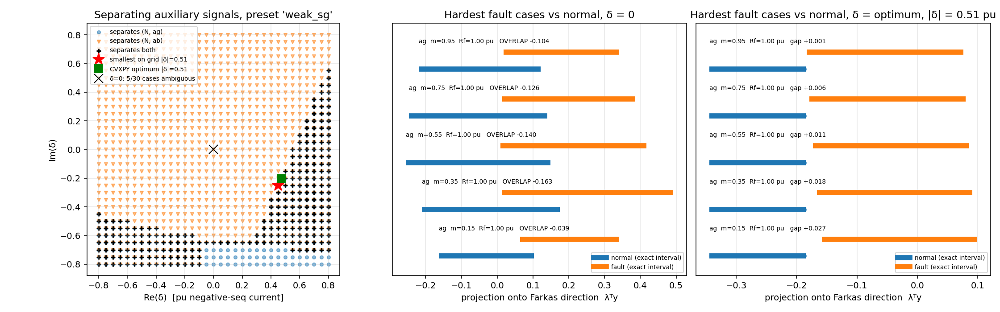
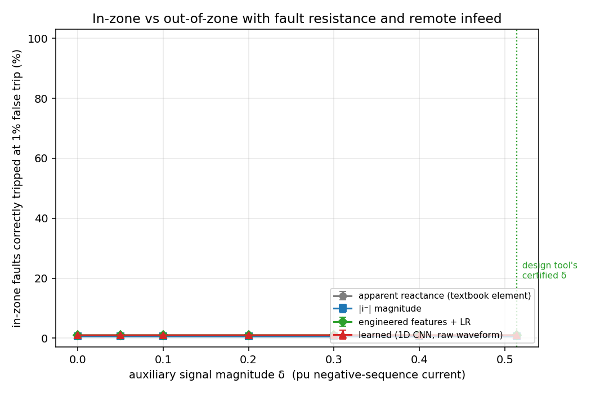
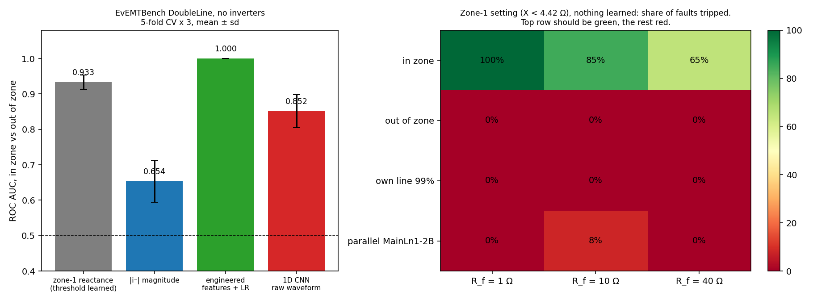
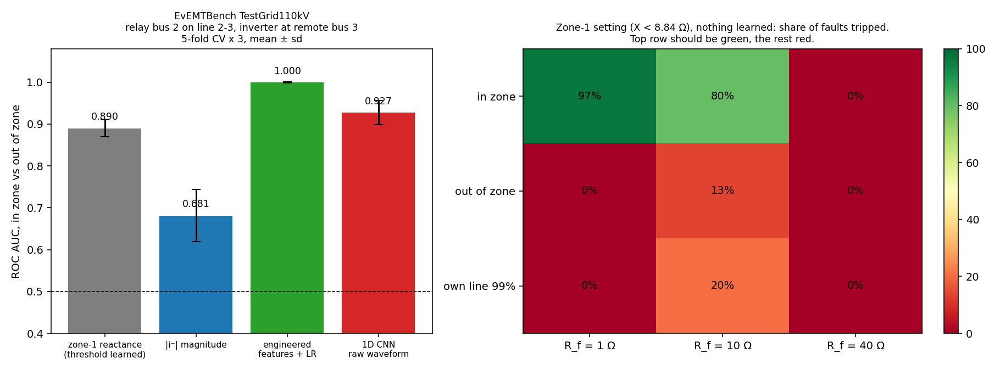
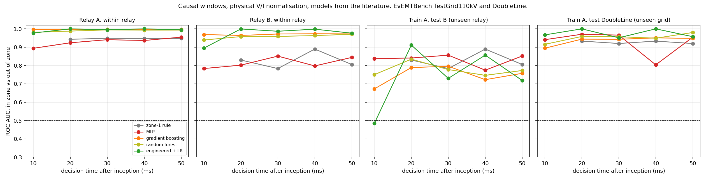

# Power-CVXPY

**Auxiliary-signal fault detection in inverter-dominated grids: design, simulation, detection, hardware.**

Senior design, NJIT Electrical and Computer Engineering, 2026–27.
Advisor (proposed): Prof. Joshua A. Taylor. Builds on his NSF project *Auxiliary Signal-Based Fault Detection in Inverter-Dominated Power Systems* (NSF 2411925, with A. Domínguez-García, UIUC).

## The problem in one paragraph

A protective relay decides "there is a fault, open the breaker." For a century it did so by watching for a large current, because synchronous generators push 5 to 7 times rated current into a fault. Solar, wind and batteries connect through inverters, and inverters cap their fault current at roughly 1.1 to 1.2 pu. In an inverter-heavy grid a fault can look almost like normal load, and conventional relays misoperate.

## Taylor's idea, and what we add

Taylor and Domínguez-García (2025, 2026) model every unknown the relay faces (fault location, fault resistance, remote-end current, measurement noise) as a bounded set, compute the full region of measurements a fault can produce, and, when that region overlaps normal operation, have the inverter inject a small **auxiliary signal** (negative-sequence current) chosen by convex optimization to be as small as possible while guaranteeing separation. Their papers are analytical. Their conclusions name EMT-simulation evaluation as the next step.

This repository is that next step, split into four parts:

| # | Part | What it delivers | Owner |
|---|------|------------------|-------|
| 1 | **Design tool** | A CVXPY tool: input a grid model, output the smallest separating auxiliary signal | TBD |
| 2 | **Simulation** | A Simulink / PSCAD test grid with SGs and inverters injecting the optimized signal; labeled fault waveforms | TBD |
| 3 | **Detection** | Relay-side detection of the signal: conventional elements and Taylor's multiple-model Kalman filter vs a learned detector; shrink the signal until each fails | Asmar Hasanova |
| 4 | **Embedded** | The detector on an edge board, decision latency measured against a one-cycle (16 ms) budget | TBD |

## What is already here (first result, 13 Sep 2026)

A toy replication of the design method on a two-bus static sequence-domain model, following the paper's modelling choices, with the convex step in CVXPY + Clarabel (the solver the paper uses).

| Preset | Sources | Relay noise | Ambiguous faults at δ = 0 | Smallest separating δ |
|---|---|---|---|---|
| `easy` | stiff SG + IBR | 0.03 | 0 / 30 | 0 |
| `weak_sg` | weak SG + IBR | 0.08 | 5 / 30 | **0.51 pu** |
| `weak_sg_noisy` | weak SG + IBR | 0.15 | 7 / 30 | **0.70 pu** |
| `all_ibr_hard` | IBR + IBR | 0.15 | 5 / 30 | **0.41 pu** |
| `weak_sg_eps12` | weak SG + IBR | 0.12 | 10 / 30 | none ≤ 0.8; ≈1.5 needed |

Three things fell out. With a stiff synchronous source no signal is needed. When the source is weak or an inverter, high-resistance line-to-ground faults become ambiguous and roughly half a per-unit of negative-sequence injection resolves them. Raise relay noise by fifty percent and the required injection exceeds what an inverter can physically deliver: the method has an edge, and mapping that edge in realistic simulation is the project.



Left: which δ separate faults from normal (black = all). Middle: the five hardest faults projected on the Farkas certificate direction at δ = 0, overlapping normal. Right: same at the optimum, separated.

Full numbers and honest caveats: [results/RESULTS.md](results/RESULTS.md).

## Second result: does the auxiliary signal actually help? (16 Sep 2026)

A waveform generator drives the same circuit family as the design tool, so the certified
signal and the measured detection rate live on one system. Two studies were run.

**Fault versus load** ([results/DETECTION.md](results/DETECTION.md)): a conventional
multivariate element solves that regime with no injection at all, so the negative was too
easy. Worth keeping as a negative result: a magnitude threshold on negative sequence is
useless there and *more signal makes it worse*, because the injected current diverts into the
fault instead of reaching the relay.

**In-zone versus out-of-zone** ([results/ZONE.md](results/ZONE.md)): the decision distance
protection is actually about, on a three-bus model with an adjacent line, fault resistance,
remote infeed, and system conditions redrawn per sample. Faults just inside the reach against
the same faults just past the remote bus.

| δ (pu) | apparent reactance | \|i⁻\| magnitude | engineered features + LR | 1D CNN |
|---|---|---|---|---|
| 0.000 | 0.952 ± 0.005 | 0.594 ± 0.020 | 0.995 ± 0.000 | 0.982 ± 0.004 |
| 0.100 | 0.943 ± 0.005 | 0.581 ± 0.018 | 0.997 ± 0.001 | 0.994 ± 0.001 |
| 0.300 | 0.908 ± 0.009 | 0.559 ± 0.015 | 0.998 ± 0.001 | 0.999 ± 0.001 |
| 0.514 | 0.863 ± 0.009 | 0.543 ± 0.014 | 0.999 ± 0.001 | 1.000 ± 0.000 |

ROC AUC, mean ± sd over three seeds, 3600 train and 1800 test waveforms per point.



Three things came out of it.

- **The auxiliary signal helps the learned detector and hurts the conventional one.** The CNN climbs from 0.982 to 1.000 AUC, its dependability at a 1 % false-trip budget from 80 % to 99 %. Over the same sweep the distance element falls monotonically from 0.952 to 0.863, far outside the seed spread. Injected negative-sequence current distorts the quantity that element is built on.
- **So the scheme cannot be dropped into an existing relay's impedance element.** Cashing in the guarantee means changing the relay, not only the inverter. Anyone proposing auxiliary signals should measure what they do to the elements already in service.
- **Engineered features are at ceiling without any injection**, at 0.995 AUC. Logistic regression on sequence magnitudes, ratios, angles and k0-compensated loop impedances beats the CNN everywhere until the signal is large. Deep learning is not the contribution here; the right quantities are.

These numbers have been corrected twice, both times by strengthening the conventional
baseline: first k0 compensation, then faulted-phase selection, found by running on real EMT
data. The downward trend survived both; the magnitudes did not. See
[results/ZONE.md](results/ZONE.md).

## Third result: real EMT data (17 Sep 2026)

First run on public electromagnetic-transient data, EvEMTBench `benchmark-DoubleLine`
(110 kV, 50 Hz, stiff grid, **no inverters**: the control arm). Relay at bus 1, zone 1 at
85 % of a 20 km line. The archive is read without unpacking by `src/evemt.py`.

- **The distance element is validated on real data.** Bolted faults are located within 1.5 %
  of the line for all five fault types.
- **The zone-1 setting, with nothing learned, is perfectly secure** (0 % out-of-zone trips, 0 %
  at 99 % of the line) and fully dependable for low-resistance faults, falling to 65 % at
  40 Ω from the reactance effect of remote infeed.
- **Learned detectors do not beat it.** CNN AUC 0.852 against 0.933. The engineered model
  scores 1.000 in distribution but calls 15.6 % of never-seen 99 % faults in zone, where the
  rule calls 0 %.
- **Running on real data exposed a bug in our element**: no faulted-phase selection, which
  had let healthy loops win. Fixed, and the synthetic zone sweep above re-run with it.

Details: [results/REAL_DOUBLELINE.md](results/REAL_DOUBLELINE.md).



## Fourth result: real EMT data with inverters (17 Sep 2026)

EvEMTBench `benchmark-TestGrid110kV`: six buses, two 30 GVA external grids, and two
grid-following inverters of 35 and 50 MVA. 2,435 simulations, read from an 8.9 GB archive by
streaming to disk.

- **The inverter current limiter is real and measured**: both inverters sit at about 1.15 to
  1.2 pu of rating during faults.
- **But the inverters are about 0.1 % of short-circuit capacity, so they change nothing.** A
  relay with a strong source behind it behaves exactly as on the no-inverter grid, with 0 %
  false trips. The inverter-dominated regime this project is about is not in the public data,
  so simulation is required.
- **The hard case does appear, from remote infeed.** A relay with a weak source behind it and a
  30 GVA grid at the far end misses every 40 Ω fault on its line and overreaches onto the next
  line 13 % of the time at 10 Ω. That is the uncertainty Taylor's bounded sets are built for,
  on real EMT data.
- **Learned detectors fail to generalise.** The engineered model, perfect in distribution,
  calls 82 % of never-seen switching events and 42 % of faults at 99 % of the line in zone. The
  physics rule calls 2 % and 7 %.

Details: [results/REAL_TESTGRID.md](results/REAL_TESTGRID.md).



## Fifth result: a fair ML comparison on the same real data (17 Sep 2026)

Causal windows of 10 to 50 ms, V/I scaled to each relay's reach, models chosen from the
literature (MLP, gradient boosting, random forest, engineered features), a realistic
measurement chain, thresholds from held-out scores, and training on one relay while testing
on another. This supersedes the learned-detector numbers in the third and fourth results.

- **The noise-free benchmark records leak the label.** Tree models predict in zone vs out of
  zone from pre-fault samples alone with AUC 1.000, from 0.01 V simulation differences. With
  0.1 % noise and a 16-bit ADC this drops to 0.48 to 0.55. Earlier perfect scores are withdrawn.
- **On the relay it was tuned on, learning beats the fixed zone-1 setting**, most clearly under
  remote infeed: at relay B, 20 ms, boosting 78 % dependability at 4 % false trips against the
  setting's 61 % at 15 %.
- **On a relay it never saw, the ranking partly survives but the trip threshold does not**:
  false trips of 13 to 100 %, against 0 to 15 % for the setting, which is defined in units of
  its own line.
- **A learned fault detector does not separate faults from switching at 20 ms** (AUC 0.62 to 0.81).

Five method errors were found and fixed along the way; all are listed in the details.

Details: [results/REAL_ML.md](results/REAL_ML.md).



## Quick start

```bash
git clone https://github.com/anxious956/Power-CVXPY.git
cd Power-CVXPY
pip install -r requirements.txt
python src/aux_signal_toy.py weak_sg        # design tool, ~40 s, no GPU
python src/sweep_delta0.py                  # which regimes need a signal, ~1 min
python src/detect.py --quick                # detector comparison, fault vs load
python src/zone_detect.py --quick           # in-zone vs out-of-zone, the main experiment
```

Each run prints the ambiguous fault cases, the grid-search minimum, the CVXPY optimum, and writes a PNG and JSON into `results/`. Presets live at the bottom of `src/aux_model.py`; copy one and change a number to run your own case.

## Repository layout

```
src/        aux_model.py      two-bus sequence model, zonotope sets, LP separation test, presets
            aux_signal_toy.py grid search + Farkas-dual optimization + figure
            sweep_delta0.py   which regimes need a signal at all
            waveforms.py      time-domain relay waveforms from the same circuit, with confusers
            detect.py         detector comparison, fault vs load
            zone_model.py     three-bus model: protected line, adjacent line, remote infeed
            zone_detect.py    detector comparison, in-zone vs out-of-zone (synthetic)
            evemt.py          EvEMTBench loader: reads the .tar.gz without unpacking, caches
            real_zone.py      in-zone vs out-of-zone on real EMT data (doubleline, testgrid_A, testgrid_B)
            real_ml.py        fair ML vs zone-1 rule: causal windows, noise, cross-relay, two stages
results/    RESULTS.md   design-tool results, figures and JSON for every preset
            DETECTION.md fault vs load study, and why that negative was too easy
            ZONE.md      in-zone vs out-of-zone, synthetic
            REAL_DOUBLELINE.md, REAL_TESTGRID.md  the same on real EMT data
            REAL_ML.md        the fair ML comparison, with the errors found and fixed
papers/     README.md reading list with links, fetch.sh to download the open-access PDFs
docs/       PLAN.md   project plan, milestones, deliverables, target venues
            TEAM_BRIEF.md   onboarding note for the team
```

## Reading order

All 18 papers in `papers/` have been read; notes are in `papers/notes/`.

1. Everyone: [`papers/notes/SYNTHESIS.md`](papers/notes/SYNTHESIS.md), then Taylor &
   Domínguez-García, *Auxiliary Signal-Based Distance Protection in Inverter-Dominated Power
   Systems* (arXiv 2311.10880). It is five pages and it is the clearest statement of the idea.
2. Then the Sandia gap analysis, the sections on what is missing.
3. Per role: see [papers/README.md](papers/README.md).

What the reading changed: three claims we might have made are already taken (incremental
negative-sequence detection, protection-aware inverter control validated on hardware, and ML
fault detection on inverter grids). What survives is that Taylor's method is the only one
offering a separation **guarantee** rather than a parameter sweep, that nobody has compared
the competing methods against each other, and that the auxiliary signal appears zero times in
~600 references of ML literature. The project is repositioned accordingly in
[`docs/PLAN.md`](docs/PLAN.md).

## Status

- [x] Toy replication of the design method, three regimes, CVXPY optimum verified
- [x] Literature collected, gap stated
- [x] Waveform generator on the same circuit, with negative-sequence confusers
- [x] First detector comparison: naive threshold vs engineered features vs CNN
- [x] Three-bus model and the in-zone vs out-of-zone experiment
- [x] Measured that the auxiliary signal improves multivariate detection, 96.0 to 99.4 %
- [ ] Error bars over seeds
- [ ] Multiple-model Kalman filter detector (Pirani et al. 2022) in the comparison
- [ ] Sequence-domain front end for the learned detector
- [x] All 18 papers read, notes and synthesis written
- [x] EvEMTBench DoubleLine loaded straight from the archive; element validated on real EMT data
- [x] Inverter grid (TestGrid110kV) run: limiter confirmed, inverters too small to matter, remote-infeed problem reproduced
- [x] Fair ML comparison on real data: causal windows, measurement noise, cross-relay test, out-of-fold thresholds
- [ ] Rule with a data-tuned reach as the stricter baseline; noise and CT saturation sweep
- [ ] Report the pre-fault label leak to the EvEMTBench authors
- [ ] Reproduce the Taylor 2023 example (|θ| vs fault location) with Clarabel
- [ ] Inverter-dominated EMT grid (Baeckeland Simulink model, or our own)
- [ ] Advisor confirmed
- [ ] Team roles assigned
- [ ] EMT simulation test grid (Simulink or PSCAD)
- [ ] Embedded latency measurement
- [ ] Conference paper (target: NAPS 2027)

## License

Not yet chosen. Code is the team's; papers in `papers/` are linked, not redistributed.
