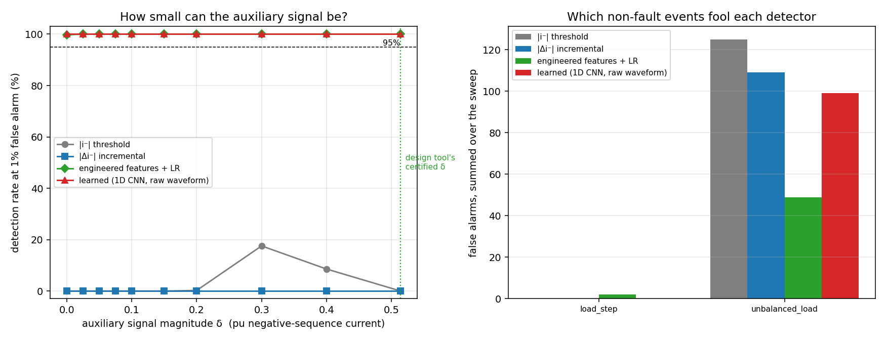

# Power-CVXPY

**Auxiliary-signal fault detection in inverter-dominated grids: design, simulation, detection, hardware.**

Senior design, NJIT Electrical and Computer Engineering, 2026–27.
Advisor (proposed): Prof. Joshua A. Taylor. Builds on his NSF project *Auxiliary Signal-Based Fault Detection in Inverter-Dominated Power Systems* (NSF 2411925, with A. Domínguez-García, UIUC).

## The problem in one paragraph

A protective relay decides "there is a fault, open the breaker." For a century it did so by watching for a large current, because synchronous generators push 5 to 7 times rated current into a fault. Solar, wind and batteries connect through inverters, and inverters cap their fault current at roughly 1.1 to 1.2 pu. In an inverter-heavy grid a fault can look almost like normal load, and conventional relays misoperate.

## Taylor's idea, and what we add

Taylor and Domínguez-García (2025, 2026) model every unknown the relay faces (fault location, fault resistance, remote-end current, measurement noise) as a bounded set, compute the full region of measurements a fault can produce, and, when that region overlaps normal operation, have the inverter inject a small **auxiliary signal** (negative-sequence current) chosen by convex optimization to be as small as possible while guaranteeing separation. Their papers are analytical. Their conclusions name EMT-simulation evaluation as the next step.

This repository is that next step, split into four parts:

| # | Part | What it delivers | Owner |
|---|------|------------------|-------|
| 1 | **Design tool** | A CVXPY tool: input a grid model, output the smallest separating auxiliary signal | TBD |
| 2 | **Simulation** | A Simulink / PSCAD test grid with SGs and inverters injecting the optimized signal; labeled fault waveforms | TBD |
| 3 | **Detection** | Relay-side detection of the signal: conventional elements and Taylor's multiple-model Kalman filter vs a learned detector; shrink the signal until each fails | Asmar Hasanova |
| 4 | **Embedded** | The detector on an edge board, decision latency measured against a one-cycle (16 ms) budget | TBD |

## What is already here (first result, 13 Sep 2026)

A toy replication of the design method on a two-bus static sequence-domain model, following the paper's modelling choices, with the convex step in CVXPY + Clarabel (the solver the paper uses).

| Preset | Sources | Relay noise | Ambiguous faults at δ = 0 | Smallest separating δ |
|---|---|---|---|---|
| `easy` | stiff SG + IBR | 0.03 | 0 / 30 | 0 |
| `weak_sg` | weak SG + IBR | 0.08 | 5 / 30 | **0.51 pu** |
| `weak_sg_noisy` | weak SG + IBR | 0.15 | 7 / 30 | **0.70 pu** |
| `all_ibr_hard` | IBR + IBR | 0.15 | 5 / 30 | **0.41 pu** |
| `weak_sg_eps12` | weak SG + IBR | 0.12 | 10 / 30 | none ≤ 0.8; ≈1.5 needed |

Three things fell out. With a stiff synchronous source no signal is needed. When the source is weak or an inverter, high-resistance line-to-ground faults become ambiguous and roughly half a per-unit of negative-sequence injection resolves them. Raise relay noise by fifty percent and the required injection exceeds what an inverter can physically deliver: the method has an edge, and mapping that edge in realistic simulation is the project.


Left: which δ separate faults from normal (black = all). Middle: the five hardest faults projected on the Farkas certificate direction at δ = 0, overlapping normal. Right: same at the optimum, separated.

Full numbers and honest caveats: [results/RESULTS.md](results/RESULTS.md).

## Second result: can the relay actually see the signal? (16 Sep 2026)

A waveform generator (`src/waveforms.py`) drives the same circuit, so the design tool's
certified δ and the detector's measured breaking point live on one system. Four detectors
compete on the ambiguous regime the design tool itself flagged, high-resistance ground faults
against a single-phase load switching on, with δ swept along the designed direction.

| δ (pu) | \|i⁻\| threshold | \|Δi⁻\| incremental | engineered features + LR | 1D CNN |
|---|---|---|---|---|
| 0.000 | 0.0 % | 0.0 % | 99.8 % | 100 % |
| 0.200 | 0.2 % | 0.0 % | 100 % | 100 % |
| 0.514 | 0.0 % | 0.0 % | 100 % | 100 % |

Three findings, one of them negative and worth keeping. A magnitude threshold on negative
sequence is useless here and *more signal does not help it*, because as δ grows the injected
current diverts into the fault and the relay sees less of it, not more. A conventional
multivariate element built from sequence ratios and angles solves the regime completely, and
the CNN matches it rather than beating it: the gain is in using the right quantities, not in
learning. And in this regime the auxiliary signal is not the binding constraint at all.

That last point says the confuser is too easy. The next iteration replaces it with the case
protection actually finds hard, an out-of-zone fault near the reach point, which is also the
decision Taylor's formulation is about. Details and caveats:
[results/DETECTION.md](results/DETECTION.md).



## Quick start

```bash
git clone https://github.com/anxious956/Power-CVXPY.git
cd Power-CVXPY
pip install -r requirements.txt
python src/aux_signal_toy.py weak_sg        # design tool, ~40 s, no GPU
python src/sweep_delta0.py                  # which regimes need a signal, ~1 min
python src/detect.py --quick                # detector comparison, ~1 min (full run ~3 min)
```

Each run prints the ambiguous fault cases, the grid-search minimum, the CVXPY optimum, and writes a PNG and JSON into `results/`. Presets live at the bottom of `src/aux_model.py`; copy one and change a number to run your own case.

## Repository layout

```
src/        aux_model.py      two-bus sequence model, zonotope sets, LP separation test, presets
            aux_signal_toy.py grid search + Farkas-dual optimization + figure
            sweep_delta0.py   which regimes need a signal at all
            waveforms.py      time-domain relay waveforms from the same circuit, with confusers
            detect.py         detector comparison and the delta sweep
results/    RESULTS.md   design-tool results, figures and JSON for every preset
            DETECTION.md detector comparison, the delta sweep and its caveats
papers/     README.md reading list with links, fetch.sh to download the open-access PDFs
docs/       PLAN.md   project plan, milestones, deliverables, target venues
            TEAM_BRIEF.md   onboarding note for the team
```

## Reading order

1. Everyone: Taylor & Domínguez-García, *Geometry of Distance Protection* (arXiv 2510.04379), Sections I, II, VI.
2. Then Pirani, Hosseinzadeh, Taylor, Sinopoli, *Optimal Active Fault Detection in Inverter-Based Grids* (arXiv 2209.06760), abstract and Section I.
3. Per role: see [papers/README.md](papers/README.md).

## Status

- [x] Toy replication of the design method, three regimes, CVXPY optimum verified
- [x] Literature collected, gap stated
- [x] Waveform generator on the same circuit, with negative-sequence confusers
- [x] First detector comparison: naive threshold vs engineered features vs CNN
- [ ] Harder confuser: out-of-zone faults at the reach boundary
- [ ] Multiple-model Kalman filter detector (Pirani et al. 2022) in the comparison
- [ ] Advisor confirmed
- [ ] Team roles assigned
- [ ] EMT simulation test grid (Simulink or PSCAD)
- [ ] Embedded latency measurement
- [ ] Conference paper (target: NAPS 2027)

## License

Not yet chosen. Code is the team's; papers in `papers/` are linked, not redistributed.
