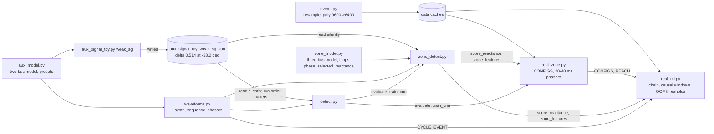

# Technical review: Power-CVXPY (auxiliary-signal fault detection in inverter-dominated grids)

**Reviewed commit:** `321e12b` (origin/main at the start of the review). Work branch: `review-fixes`
(PR #1 was merged into main by the author mid-review; later commits are on the same branch).
Companion branches with their own reports: `review-wp1` ([review/WP1_REPORT.md](https://github.com/anxious956/Power-CVXPY/blob/review-wp1/review/WP1_REPORT.md), design tool) and
`review-synth` ([review/SYNTH_REPORT.md](https://github.com/anxious956/Power-CVXPY/blob/review-synth/review/SYNTH_REPORT.md), synthetic detection pipeline). Their key numbers were re-derived independently before being used here (§5, "Verification").
Environment: Windows 11, Python 3.12.10, numpy 2.2.6, scipy 1.16.1, scikit-learn 1.9.1, cvxpy 1.9.2, torch 2.5.1+cu121, pandas 2.3.3; i5-12500H (16 threads), 15.7 GB RAM, RTX 3050 Ti 4 GB. EvEMTBench caches read from `data/` (DoubleLine `.npz` 175 MB; TestGrid110kV `.bin` 1.31 GB + `.meta.npz`); no archive was re-streamed.

## 1. Executive summary

1. **"Learning beats the zone-1 rule within a relay" holds only against a baseline that lacked standard relay features, and only for the fault classes the models were trained on.** The repo's rule has no DC-offset filter and no directional element (the sign of the loop reactance decides direction, `zone_model.py:206`). It trips 20–22 % of faults at its own bus (reverse) at every relay. Every learned model without supervision trips unseen classes: gradient boosting at relay B trips 92 % of relay-bus reverse faults, 67 % of other faults and 39 % of switching events. With a standard 32P/32Q directional element added, engineered + LR at relay B keeps 95.3 % dependability at 3/117 beyond-bus trips and 0 % reverse/switching trips. That result is real but tied to one operating point.
2. **It does not transfer.** A physical distance output with a fixed 0.85 trip is accurate within a relay (error 0.06–0.09 of the line) and trips 21–59 % of beyond-bus faults on another relay. Leaving out one fault resistance breaks the learned models too (LR 19/117 beyond-bus trips).
3. **Two leaks inflate learned results beyond the author's noise fix.** Stratified CV puts a sibling of 95–96 % of test cases in training, including bit-identical three-phase duplicates (moderate effect: relay B LR 99.7 → 95.3 % dependability under grouped folds). And `resample_poly` leaks the fault 1.1–1.4 ms backwards: models given only the 40 ms ending at inception reach AUC 0.96 (A), 0.86 (B) and 0.95 (DoubleLine). A relay-bandwidth front end removes it and costs raw-sample boosting 6–7 AUC points at relay B.
4. **The hard case at relay B is physics as well as a flaw.** 40 Ω in-zone faults appear at about 80 Ω / −16 Ω (study-model infeed factor 3.9). The rule discards them as reverse; a rule-set quadrilateral cannot reach them within load-encroachment limits; 67N/67Q detect them but do not zone-select them. This is the hardest regime in the data. These benchmark grids are synchronous-source dominated (inverters 0.14 % of short-circuit capacity), so whether an auxiliary signal helps there is untested.
5. **The synthetic headline falls.** "The signal helps the learned detector" disappears once the CNN's per-waveform normalisation is removed (AUC 0.967 → 0.9996 at δ = 0, re-checked). "It hurts the reactance element" survives (−0.086 AUC, 95 % CI [−0.096, −0.077]), mostly from mixing fault types under one reach.
6. **The design tool is not a guarantee yet.** The δ labelled "certified" in both sweeps was designed for another problem; on the zone problem no δ ≤ 1.5 pu separates at eps ≥ 0.01 (independently confirmed). The published optima are local (0.514 → 0.504 pu), have 1.25 % of eps as margin, rest on an unsound angle linearisation and violate the 1.2 pu current limit. The Taylor 2023 replication gate passes only with the paper appendix's printed, non-standard matrix form (the correct form gives peak 0.485, not 0.356).
7. **What is sound:** the author's five fixes in REAL_ML.md §7, the element core (k0, phase selection, bolted faults within 1.5 %), primary units, the reproducible measurement chain and quick-start, and the instinct in REAL_ML.md §6 ("data-driven settings, not data-driven relays").

## 2. Project understanding and architecture

**Research question (docs/PLAN.md).** Put Taylor and Domínguez-García's bounded-set auxiliary-signal design (a negative-sequence current injected by an inverter, minimised by convex optimisation so that every fault in an uncertainty set is separated from normal operation) on EMT data. Compare it head-to-head with competing detectors (distance element, incremental negative sequence, MMKF, learned), measure where the guarantee holds or breaks, and what decisions cost in milliseconds. The contribution claimed is evaluation and comparison, not a new method.

| WP | Deliverable | Code today |
|---|---|---|
| WP1 design tool | CVXPY tool: grid model in, smallest separating δ out | `aux_model.py` (two-bus sequence model, affine measurement model, LP separation test, presets), `aux_signal_toy.py` (δ-plane grid search, Farkas-dual alternating QP, figure), `sweep_delta0.py` |
| WP2 simulation | EMT grid with inverters injecting δ, labelled waveforms | not started; EvEMTBench via `evemt.py` stands in; `waveforms.py` synthesises waveforms from the phasor circuit |
| WP3 detection | detectors on one protocol, δ swept until each fails | synthetic: `waveforms.py`, `detect.py` (fault vs load), `zone_model.py` + `zone_detect.py` (in-zone vs out-of-zone); real: `real_zone.py` (first pipeline, learned numbers withdrawn by the author), `real_ml.py` (current pipeline) |
| WP4 embedded | latency against one cycle | not started |



Hidden coupling: (1) `detect.py` and `zone_detect.py` consume δ from a JSON written for a different model and problem (H1). (2) Both real-data pipelines share `score_reactance` and `zone_features`, so the element flaw (N2) and the wrong phase loop (X1) propagate into both. The fixes made in `real_ml.py` (channel scaling, OOF thresholds, logits) were never back-ported to `detect.evaluate` / `train_cnn`, which `real_zone.py` and the synthetic sweep still use (H17–H19). (3) `real_ml.phasor_view` depends on `sequence_phasors` using a window-relative DFT basis (N1). (4) `real_ml.py` imports `CONFIGS` / `REACH` from `real_zone.py`; the task definition is shared, but the windows, protocol and chain diverged.

Headline claims and their pipeline: README result 1 (design presets): WP1 toy. Result 2 (δ helps learned, hurts conventional): synthetic `zone_detect.py`. Results 3–4 (element validated, zone 1 perfectly secure, limiter measured, relay B misses 40 Ω): `real_zone.py`. Result 5 (leak, learning beats the setting, thresholds do not transfer, stage 1 fails): `real_ml.py`.

## 3. What is sound

- The five fixes in REAL_ML.md §7 are correct as implemented (`real_ml.py:148-236`, `:244-260`). The noise-free leak is reproduced: gradient boosting on the pre-fault control window scores 1.000 at zero noise and 0.49–0.56 at 0.1 % (`results/review/h25_shortcut.json`).
- Records are primary quantities (pre-fault peak 89.5–93.0 kV against 89.8 kV nominal); `V_NOM_PEAK` and the reach in primary ohms are right despite the `Usec` / `Isec` channel names (H12 refuted).
- The element core: my vectorised re-implementation reproduces `phase_selected_reactance` to < 1e-13 Ω on all three relays at 20 and 40 ms; bolted faults read m·X₁ on the faulted loop.
- The measurement chain is reproducible; the generalised chain is bit-identical at default settings (test).
- The design tool's LP and alternating QP implement the stated problem correctly; the quick-start reproduces the README optima exactly (0.5141, 0.6969, 0.4081 pu; `weak_sg_eps12` infeasible below 0.8 pu).
- "Inverters ≈ 0.1 % of short-circuit capacity" (85 MVA against two 30 GVA grids: 0.14 %) and the limiter observation (median |I₁|+|I₂| 1.07–1.18 pu during faults) hold (§7).

## 4. Findings

Severity is the effect on a headline conclusion. Effort S < 1 day, M 1–5 days, L > 1 week. "Fixed" means fixed on a review branch with before → after measured.

| ID | Category | Severity | Location | Summary | Verdict | Effort |
|---|---|---|---|---|---|---|
| N2 | BUG | Critical | `zone_model.py:206` | Sign of loop reactance used as the directional decision; relay-bus reverse faults trip 20–22 % (R0, 20 ms); relay B's 40 Ω in-zone faults discarded as reverse | CONFIRMED, fixed in ladder | S |
| H24 | METHODOLOGY | Critical | `real_ml.py:270-373` | Security never tested on classes outside training; learned models trip 39–92 % of relay-bus reverse faults, up to 39 % of switching | CONFIRMED | M |
| H8 / Q-fair | METHODOLOGY | Critical | `zone_model.py:166-207`, `real_ml.py:278-282` | Baseline lacked DC-offset filter, directional element, quadrilateral, setting study | CONFIRMED | M |
| H1 | METHODOLOGY | Critical | `zone_detect.py:163-166,230`; `detect.py:191-195,253` | "Certified δ" designed on a different model and problem; no δ ≤ 1.5 separates the zone problem at eps ≥ 0.01 | CONFIRMED | M |
| H22 | METHODOLOGY | High | `real_ml.py:286` | Stratified CV: 95–96 % of test cases have a sibling in training; three-phase siblings bit-identical | CONFIRMED, fixed | S |
| H25 | METHODOLOGY | High | `real_ml.py:376-391` | Shortcut control ends 5 ms early and skips DoubleLine; the 40 ms ending at inception gives AUC 0.96 / 0.86 / 0.95 | CONFIRMED | S |
| H30 | BUG / MODELING | High | `evemt.py:85,131`; `real_ml.py:92-95` | Non-causal resampling leaks 1.1–1.4 ms; ADC full scale ±40× pre-fault clips 13–14 close-in faults | CONFIRMED, fixed (relay front end) | M |
| H23 | MODELING | High | EvEMTBench labels | One operating point per grid; no loading, source, inverter or inception variation; learned mappings do not transfer (Q2) | CONFIRMED | L |
| H28 | METHODOLOGY | High | `real_ml.py:113,340-370` | Stage-1 label counts every fault in the grid; responsible label raises AUC 0.63–0.83 → 0.90–0.99 | CONFIRMED, fixed | S |
| H9 | METHODOLOGY | High | `real_ml.py:114-115`; `zone_detect.py:56-59` | Own-line 85–100 % band excluded and unreported; tuned reach and learned models trip 10–19 % of 99 % faults | CONFIRMED | S |
| H19 | BUG | High | `detect.py:141-144` | Per-waveform standardisation handicaps the synthetic CNN (0.967 → 0.9996 AUC) | CONFIRMED, fixed on review-synth | S |
| H5 | MODELING | High | `aux_signal_toy.py:75-80` | No inverter current limit; every preset needing δ > 0 infeasible at 1.2 pu | CONFIRMED | M |
| H6 | BUG | High | `aux_model.py:104-108` | Linearised angle uncertainty is unsound (true set up to 0.085 / 0.276 pu outside); sound δ 0.504 → 0.552, 0.691 → 1.042, 0.386 → 1.054 | CONFIRMED | M |
| H14 | BUG | High | `aux_model.py:123-129`; `aux_signal_toy.py:67` | Zero-margin separation; margin 0.45–1.25 % of eps; 10 % headroom needs 0.666 / 0.899 / 1.357 pu | CONFIRMED | S |
| H16 | DOC (paper) | High | Taylor 2023 Appendix | Fig. 3 reproduces only with the printed M = [[r, −x], [r, x]]; the correct form gives peak 0.485 | CONFIRMED | S |
| H2 | METHODOLOGY | High | `aux_model.py:31`; `waveforms.py:50` | Design eps is 111–208× the synthetic phasor noise std | CONFIRMED | S |
| H7 / N7 | MODELING | High | `aux_model.py:29`; `zone_model.py:39` | No inverter fault response in the models; EvEMTBench inverters inject 0.25–0.39 pu I₂; relay B's 40 Ω stratum is infeed physics | CONFIRMED | L |
| N1 | BUG | High | `real_ml.py:143` | `phasor_view` rotated post-fault phasors 180° at 30 / 50 ms | CONFIRMED, fixed | S |
| H10 / H20 | METHODOLOGY | High | `real_ml.py:122-145`; `zone_detect.py:82-85` | Windows anchored at true inception; anchoring at a causal starter (≈ 3 samples later) collapses raw-sample boosting (AUC 0.61–0.70, 77–95 % beyond-bus trips); phasor models unaffected | CONFIRMED (real), PARTIAL (synthetic) | S |
| H26 | METHODOLOGY | Medium | REAL_ML.md §5 | Rule and models compared at different false-trip rates; rule shown with "no spread" | CONFIRMED | S |
| H27 | METHODOLOGY | Medium | `real_ml.py:277` | No conventional baseline at 10 ms; MMKF absent | PARTIAL (half-cycle rungs added) | M |
| H29 | METHODOLOGY | Medium | `real_ml.py:411` | A↔B share one grid and simulation set; out-of-grid transfer fails | CONFIRMED | S |
| H13 | METHODOLOGY | Medium | `aux_model.py:32-33,136-142` | Guarantee only on 30 grid points; holds densely at 0.514 (0/5000), fails at the exact optimum 0.504 (5/5000) | PARTIAL | M |
| H15 | METHODOLOGY | Medium | `aux_signal_toy.py:71-86` | Alternating scheme stops at local optima (0.5141 vs 0.5040) | CONFIRMED | S |
| H3 | METHODOLOGY | Medium | `aux_model.py`, `waveforms.py:57-62`, `zone_detect.py:48-55` | Three uncertainty sets for "the same system" | CONFIRMED | S |
| H4 | METHODOLOGY | Medium | `waveforms.py:63-67` | Constant δ cancels in incremental quantities; reactance trend is not this artefact | PARTIAL | S |
| X1 | BUG | Medium | `aux_model.py:74-75,86-88`; `zone_detect.py:125` | "ab" scenario is a b–c fault; engineered features use the healthy "ab" loop | CONFIRMED | S |
| N5 | DOC | Medium | REAL_ML.md §3 | Fingerprint is 0.1–0.26 V, not 0.01 V; shortcut persists to 1e-5 relative noise on DoubleLine | CONFIRMED | S |
| N6 | DATA | Medium | EvEMTBench switching events | `cap_off`, `load_off`, `ohl_off` start from a different network state (up to 2.3 kV pre-fault offset), a stage-1 shortcut | CONFIRMED (impact not isolated) | S |
| H11 | MODELING | Medium | `zone_detect.py:70-77`; DoubleLine graph | Synthetic AG/AB only; no CT/CVT; parallel lines modelled without zero-sequence mutual coupling | CONFIRMED | L |
| H17 | BUG | Medium | `detect.py:121-132` | Polarity chosen on the test set; zone study unaffected (0/36 flips), fault-vs-load |i⁻| flips at 4/10 δ | CONFIRMED, fixed on review-synth | S |
| H18 | BUG | Low | `detect.py:73-82,173-175` | In-sample thresholds for LR / CNN: realised FAR 1.7–2.1 % against 1 % | PARTIAL, fixed on review-synth | S |
| H21 | BUG | Low | `zone_detect.py:129-141` | Raw angles and ε-ratios; AUC changes ≤ 0.0012 | PARTIAL | S |
| H12 | DOC | Low | `evemt.py:28-29` | Channel names say secondary, values are primary | REFUTED as a bug | S |
| H31 | DOC | Low | README:214-215; `detect.py:15-17` | Withdrawn 96.0 → 99.4 % still ticked; seeds exist but box unticked; docstring negatives | CONFIRMED | S |
| H32 | HYGIENE | Low | `zone_model.py:78,121`; `aux_signal_toy.py`; `requirements.txt`; `evemt.py:79-80` | Dead code, module-level script, unpinned requirements, 50 Hz default before label check, two diverged pipelines | CONFIRMED | M |
| H33 | TESTS | Medium | – | No correctness tests | FIXED: 21 + 29 + 15 tests | M |

## 5. Finding details

### Verification of delegated work
The design-tool and synthetic-pipeline findings were produced in two worktrees and re-derived here before use: **H16** (closed form |θ|min = 2/σmax(M⁻ − M_f) reproduces the agent's values for both matrix forms; the paper's Fig. 3, extracted from the PDF, has the flat 0.356 plateau for x_f ≈ 32–38 that only the printed form produces); **X1** (a bolted "ab" fault reads 0.300 / 0.600 of X₁ on the **bc** loop at m = 0.3 / 0.6, and 0.453 / 0.754 on "ab"); **H1** (with nominal network and sources, the eps = 0.08 witness pair differs by at most 0.110 pu per component on |δ| = 1.5, inside the 0.16 pu that two noise boxes absorb; the eps = 0.01 result depends on network pieces and is the agent's); **H13** (0/1722 unseparated at the published δ on my own grid); **H15** (my 0.02-step brute force finds 0.506 pu, between the agent's exact 0.5040 and the published 0.5141); **H5, H6** (by direct arithmetic); **H19** (author's CNN on author's data, δ = 0: AUC 0.9674 / 0.9686 per-waveform, 0.9996 / 0.9998 global per-channel, `src/review/h19_verify.py`).

### N2 — the zone-1 rule has no directional element (BUG, Critical)
- **Code.** `zone_model.py:206`: `fwd = [L[k].imag for k in loops if L[k].imag > 0]`; otherwise the score is 10 Ω. The sign of X is the only direction test.
- **Why it matters.** A resistive in-zone fault under remote infeed with load import reads negative X: relay B imports at −163°. A close-in reverse bus fault reads a near-zero impedance of either sign. Real relays use a separate 32P/32Q directional element and allow X < 0 inside a quadrilateral.
- **Evidence** (`src/review/n2_negative_reactance.py`, `real_zone_rerun.py`, `ladder.py`):
  - At relay B, 40 ms, 100 % of in-zone 40 Ω faults have negative X on the released loop and return the default.
  - Relay-bus reverse faults, noise-free, 20–40 ms window: the rule trips 9/45 (A), 17/45 (B) and 12/45 (DoubleLine), including 60–80 % of 1 Ω faults.
  - With the 0.1 % chain at 20 ms: 9/45, 10/45 and 9/45; 3 of 9 three-phase bus faults at each relay.
- **Fix.** Ladder rungs R2–R4 add a 3-cycle memory-polarised 32P with 32Q priority for unbalanced faults, a quadrilateral that accepts negative X, a directional sector and minimum loop current.
- **After.** 0/45 relay-bus reverse trips at every relay and decision time for R2–R4, three-phase included.
- **Directional accuracy** against study-model labels (never EMT Δ quantities), 20 ms: in-zone 100 %; beyond-bus 93–100 %; relay-bus reverse 87 % (A), 100 % (B), 93 % (DoubleLine). On reverse bus faults, 32P alone calls 33–67 % forward at A and DoubleLine (load current dominates weak reverse infeed); 32Q calls 0 %. The combined element calls 3/9 three-phase reverse bus faults forward at A and DoubleLine. Zone-1 security does not rely on these labels: R2 still trips 0/45 because of its impedance region.

### H24 — learned zone decisions are insecure outside their training classes (METHODOLOGY, Critical)
- **Code.** `real_ml.py` trains and evaluates only in-zone vs beyond/remote-bus faults. `real_zone.py` held out own-99 % and switching, but only for the engineered model.
- **Evidence** (`src/review/zone_cv.py` + `aggregate.py`; grouped 5×2, guard band, 20 ms, current front end; each fold's models scored on every held-out class). Relay B, trip rates:

| Model | Relay-bus reverse | Lines behind | Other faults | Switching |
|---|---|---|---|---|
| Gradient boosting | 92.1 % | 90.0 % | 67.0 % | 39.2 % |
| Random forest | 89.5 % | 87.1 % | 63.5 % | 33.0 % |
| Engineered + LR | 57.4 % | 45.6 % | 14.5 % | 26.0 % |
| MLP | 0.3 % | 0.1 % | 0 % | 0 % (dependability 26.9 %) |

  - Relay A: boosting 39.2 % reverse bus, 26.3 % parallel line, 9.0 % switching.
  - DoubleLine: random forest 81.0 % reverse bus, 25.0 % switching.
- **Fix measured.** The same decisions AND the standard directional element, thresholds unchanged:
  - Relay B: reverse bus, lines behind and switching fall to 0 % for boosting, forest and LR.
  - Relay A: boosting still trips 14.3 % of lines behind, 15.6 % of parallel-line faults and 9.0 % of switching events.
  - Supervision is necessary but not sufficient everywhere.

### H8 / Q-fair — the baseline ladder (see §6)

### H22 — sibling leakage in within-relay CV (METHODOLOGY, High)
- **Facts** (`results/DATASET_FACTS.md`): every (target, location, type, R_f) group has 3 members. `RepeatedStratifiedKFold` puts a sibling of 95.2 % (DoubleLine), 96.4 % (A) and 94.8 % (B) of test cases in training; three-phase siblings are identical simulations.
- **Fix.** `StratifiedGroupKFold` 5×2 with grouped inner out-of-fold thresholds; per-class rates on deduplicated units.
- **Before → after** (20 ms, own-99 % as guard band, current front end, stratified → grouped):

| Relay | Model | AUC | Dependability | Beyond-bus false trips |
|---|---|---|---|---|
| B | engineered + LR | 0.999 → 0.989 | 99.7 → 95.3 % | 7/117 → 3/117 |
| B | gradient boosting | 0.964 → 0.939 | 77.5 → 75.0 % | |
| DoubleLine | engineered + LR | 0.999 → 0.990 | 98.9 → 96.7 % | |

- **Verdict.** Real but moderate. The conclusions change more under leave-one-R_f-out: at B, LR has 19/117 beyond-bus trips (95 % UCB 22.9 %) and 56.7 % dependability at 40 Ω, and boosting 51/117.

### H25 / H30 — the resampling look-ahead is exploitable (High)
- **Code.** `evemt.py:85,131` use zero-phase `resample_poly`.
- **Evidence.**
  - Raw 9600 Hz DoubleLine records: the fault leaks 1.1–1.4 ms before inception, at 43–56 σ of the chain noise one sample before (`h30_resampling.json`).
  - Pre-fault-only gradient boosting, default chain, window ending at inception: AUC 0.967 (A), 0.856 (B), 0.953 (DoubleLine).
  - At relay A with the window ending 0.47 / 0.94 / 1.41 / 2.03 / 5 ms before inception: 0.892 / 0.703 / 0.497 / 0.519 / 0.498 (`h25_leak_edge.json`).
  - The author's control ended 5 ms early and never ran on DoubleLine.
- **Fix.** Relay front end (`src/review/frontend.py`): causal 3rd-order Butterworth at 400 Hz (assumption) and ADC full scale from CT 1000/1 and a 100 × In relay input (±141 kA, assumption).
  - On the raw records this matches causal filtering before decimation within 0.2 % in the 10 / 20 ms phasors and leaves 0.18–0.32 σ of leak.
  - The default chain's ±40 × pre-fault full scale clips 13 (DoubleLine) and 14 (A) in-zone faults at 1 % and 20 %. REAL_ML.md results at those locations are affected.
- **Before → after** (relay B, grouped, 20 ms / 10 ms):
  - Boosting AUC 0.939 → 0.883 / 0.947 → 0.876; dependability 75.0 → 68.1 % / 73.6 → 65.0 %.
  - Engineered + LR 0.989 → 0.984, 95.3 → 95.8 %.
  - Ladder R2 52.2 → 43.9 % (filter delay in the first cycle).
  - Relays A / DoubleLine and the clipping-only runs: §9.

### H28 — stage-1 label and baseline (METHODOLOGY, High)
- **Code.** `real_ml.py:113` sets `fault_any = event_type.startswith("flt")`, which covers 2,385 TestGrid episodes, of which only 975 (A) and 513 (B) are the relay's own line, remote bus or the lines beyond.
- **Evidence** (`h28_stage1.py`, grouped episode folds). MLP fault-vs-switching AUC, "any" → "responsible" label:

| Relay | AUC | In-zone pass |
|---|---|---|
| A | 0.817 → 0.958 | 56.7 → 100 % |
| B | 0.633 → 0.993 | 16.1 → 100 % |
| DoubleLine | 0.831 → 0.900 | 63.9 → 52.2 % |

- **Conventional starter** (superimposed-current start with 2nd-harmonic blocking, nothing fitted):
  - In-zone 171/180 (A), 138/180 (B), 167/180 (DoubleLine).
  - Switching 7/50 (95 % CI 5.8–26.7 %), 7/50 and 5/24 (7.1–42.2 %).
- **Budget.** A 5 % switching budget cannot be supported by 50 or 24 events (59 are needed with zero trips); REAL_ML.md's "0 % switching" means 0/10 per fold (one-sided UCB 25.9 %).

### H9 — the own-line 85–100 % band (METHODOLOGY, High)
- **Real data.** Own-line 99 % faults were neither trained on nor reported.
  - Guard-band trip rates at 20 ms (grouped): engineered + LR 19.2 % (A), 4.1 % (B), 10.0 % (DoubleLine); tuned reach T1 12.8 % (A), 6.7 % (B); R2 0 %.
  - Treating 99 % as a hard negative barely changes T1's beyond-bus trips (A 11/273 both ways).
- **Synthetic** (review-synth): with the band as don't-care, engineered + LR trips 48.6 %; as negatives, AUC drops 0.994 → 0.959.

### H1, H2, H5, H6, H13–H16, X1 — design tool
Details, commands and JSON keys: `review/WP1_REPORT.md` on `review-wp1`; the numbers are in §4 and were verified as above. Consequence: nothing in the synthetic sweeps is certified, and the design needs (i) the zone problem, (ii) a sound source set, (iii) a margin tied to a measurement-error model, (iv) the current limit, (v) a global solver, before "guarantee" can be written.

### H17–H21, H4, synthetic H9/H26 — synthetic pipeline
Details: `review/SYNTH_REPORT.md` on `review-synth`. The corrected full sweep (3 seeds) is in §9.

### N1 — phasor reference rotation (BUG, High, fixed)
- **Code.** `real_ml.phasor_view` copied the post cycle to a fixed slot while `sequence_phasors` uses a window-relative basis; at 30 / 50 ms the post phasors were rotated 180° against pre-fault, so incremental currents were post + pre.
- **Before → after.** Rule AUC at relay B, 50 ms: 0.806 → 0.891. DoubleLine 50 ms false trips: 4 % → 0 % (`check_repro.json`).
- **Note.** The fix shifts the pre-fault cycle back by t mod 20 ms, so at 30 / 50 ms it starts at −50 ms, outside the learned models' 40 ms pre-fault window. A phase-corrected DFT basis would avoid that. The review's own elements use an absolute basis with the pre-fault cycle ending at −20 ms.

### N5, N6, H23, H12, H11 — data facts
See `results/DATASET_FACTS.md`.
- N5: the fingerprint is 0.12 / 0.20 / 0.26 V peak-to-peak and survives to 1e-5 relative noise (DoubleLine control AUC 0.969).
- N6: three switching types start from a different network state.
- H23: no operating-point columns exist.
- H11: the DoubleLine "parallel" circuits are separate single-circuit types (`nlcir = 1`, own geometry, 20 vs 25 km), so there is no zero-sequence mutual coupling.

### H10 / H20 — timing
- **Synthetic** (review-synth): DC offset moves the element's median distance error 0.28 → 0.63 %; ±2 ms trigger jitter has no measurable effect.
- **Real data.** The rule's 14.8 % beyond-bus false trips at relay B, 20 ms, are first-cycle DC offset: a mimic filter gives 0.7 %.
- **Trigger-anchored evaluation:** §6 (after Q3). It collapses raw-sample boosting and leaves phasor-based models and rules intact.

### H26, H27, H29
- **H26.** Matched comparisons are in §6; the rule's rates carry deduplicated binomial bounds.
- **H27.** Half-cycle + mimic rungs at 10 ms were added (R1–R4, T2). An incremental-quantity element was evaluated (`elements_fixed.json`: dependability 31–41 %, 0 % out-of-zone). MMKF is not implemented (roadmap).
- **H29.** Cross-relay A → DoubleLine fails for every learned model with a transferred threshold or a fixed physical threshold (Q2).

### H31, H32, H33
H31 and H32 are listed with lines in §4. H33 tests: §11.

## 6. Answers to the author's questions

### Q-fair — the baseline ladder
**Frozen specification** (written before evaluation; full text in `src/review/ladder.py`):

| Rung | What it adds |
|---|---|
| R0 | Repo rule |
| R1 | + mimic filter (half-cycle DFT at 10 ms) |
| R2 | + 3-cycle memory 32P with 32Q priority for unbalanced faults; quadrilateral accepting X < 0; sector −15…115°; minimum loop current 0.2 In; resistive reach from rules (arc + 10 Ω tower, capped by load encroachment and a zone-1 R/X limit) |
| R3 | + I₂-polarised reactance line with tilt from the study's source impedances at both ends |
| R4 | + reach reduction from study-model external faults with R_f ≤ R_arc + R_tower |
| T1 | Tuned reach at 5 % on training negatives, capped at 0.9 X_line |
| T2 | Tuned quadrilateral (X_set, R_set) on the same folds as the learned models |

Settings come only from the grid graph:

| Relay | X_set (Ω) | R_set ground / phase (Ω) | Tilt T₂ (°) | Tilt range, ±25 % / ±7.5° sources (°) | R4 reach (Ω) |
|---|---|---|---|---|---|
| A | 5.53 | 24.9 / 16.6 | −2.27 | −8.7 … +3.7 | 5.53 |
| B | 8.84 | 25.4 / 25.4 | +3.73 | −2.5 … +10.5 | 8.20 |
| DoubleLine | 4.42 | 19.9 / 13.3 | −1.87 | −8.9 … +4.4 | 4.27 |

- **Load-encroachment basis.** Assumed thermal rating 1800 A (the conductor string reads "x2"; the graph has no ampacity), 0.9 pu voltage, 30° maximum load angle, both flow directions: Z_load,min = 31.8 Ω. Using 0.7 × the benchmark's own pre-fault load impedance instead would have given 120 / 92.7 / 134 Ω, 4–7 times the rule-based reach.
- **Load encroachment cannot be tested here** because benchmark loading is fixed.

**Step by step at 20 ms, current front end** (dependability; beyond-bus trips k/n with one-sided 95 % upper bound; relay-bus reverse; own-99 % guard band):

| Relay | R0 | R1 | R2 | R3 (worst over tilt range) | R4 | T1 (grouped) | T2 (grouped) |
|---|---|---|---|---|---|---|---|
| A | 78.9 %; 1/273; 9/45; 1/45 | 63.3 %; 0/273; 5/45; 0/45 | 58.3 %; 0/273 (≤1.1 %); 0/45; 0/45 | 57.8 % (≥51.1 %); 0; 0; 0 | 57.8 % | 83.9 %; 11/273 (≤6.6 %); 17.9 %; 12.8 % | 65.0 %; 0/273; 0 %; 0 % |
| B | 60.6 %; 14/117 (≤18.1 %); 10/45; 8/45 | 65.6 %; 1/117; 0/45; 0/45 | 52.2 %; 0/117 (≤2.5 %); 0/45; 0/45 | 52.8 % (≥47.2 %); 0; 0; 0 | 46.1 % | 49.2 %; 7/117 (≤10.9 %); 20.5 %; 6.7 % | 67.8 %; 3/117 (≤6.5 %); 0 %; 2.6 % |
| DoubleLine | 80.0 %; 0/195; 9/45; 1/45 | 60.0 %; 0/195; 1/45; 0/45 | 50.0 %; 0/195 (≤1.5 %); 0/45; 0/45 | 48.9 % (≥44.4 %); 0; 0; 0 | 43.9 % | 82.8 %; 10/195 (≤8.5 %); 17.9 %; 12.8 % | 61.7 %; 0/195; 0 %; 0 % |

What each step contributes:
- **R1 (mimic filter).** Removes relay B's first-cycle false trips (14/117 → 1/117) and its own-99 % trips (8/45 → 0). It costs 16–20 points at A and DoubleLine, where the unfiltered first cycle reads high-R faults closer.
- **R2 (directional quadrilateral).** Removes every reverse-bus trip, three-phase included. It trades the remaining dependability at 40 Ω, which lies outside a load-encroachment-limited reach.
- **R3 (tilted I₂ line).** Adds nothing measurable, and its worst case over plausible source impedances drops dependability by up to 6.7 points. At relay B the reading moves about 2.6 Ω per degree of tilt error at 40 Ω. This is where Taylor's bounded sets apply, and a candidate figure for the paper.
- **R4 (study reach).** Costs 0–7 points.
- **T2 (tuning).** Recovers 7–16 points at 0–3 beyond-bus trips.

**Verdict on "learning beats the rule".**
- Against R0 the learned models look better at relay B, but R0 lacked standard features.
- Against the matched rungs, at 20 ms with grouped folds and the same calibration data, engineered + LR with directional supervision reaches 95.3 % at relay B (T2: 67.8 %), both at 3/117 beyond-bus trips, with 0 % reverse and switching trips.
- So **within one relay at one operating point, a supervised learned zone decision outperforms the best conventional rung on dependability at equal measured security**. It does not transfer (Q2) and it does not extrapolate in R_f (H22). Boosting and forest remain insecure at relay A even when supervised (H24).
- **Classification: "the baseline lacked standard features" explains the security gap; a genuine within-distribution dependability gain remains for engineered + LR.**

### Q1 — is 0.1 % white noise + 16-bit realistic?
- **Class limits** used as assumptions: 5P CT ±1 % / ±60 min; 3P VT ±3 % / ±120 min (IEC 61869-2/-3/-5 as commonly tabulated; not verified against the standard text).
- **White noise.** 0.1 % white noise on 128 samples is ≈ 0.0125 % on a full-cycle phasor (0.1 % × √(2/128)). It suppresses the fingerprint (control AUC 0.49–0.56 at 1e-3; the leak persists to 1e-5 on DoubleLine and relay A and to 1e-6 on relay B) but it is not a realistic error model: per-installation ratio and phase errors do not average out.
- **CVT model.**
  - The high-C model meets class T1 (residual 5.9 % at 20 ms after a terminal short circuit); the low-C model fails T1 (11.5 % at 20 ms) and is excluded.
  - The same step-response metric applied to the sag and the terminal short circuit gives 82 % cycle-1 peak error at voltage-peak inception for both. It grows as the time step shrinks (82 → 90 → 95 %), so it is the response to an ideal voltage step, not a discretisation artefact; the phasor-level error (3.7 % at voltage zero, 19 % at voltage peak, 20 ms, 90 % sag) is the relevant quantity (`cvt_step_check.json`).
- **Sweep** (`q1_instrument.py`, relays A and B, 20 ms, grouped 5-fold, own-99 % guard band; each cell: dependability / beyond-bus trips k/n / relay-bus reverse trips).

| Point | Relay | R0 | R2 | T2 | Engineered + LR | Shortcut control AUC |
|---|---|---|---|---|---|---|
| white 0.1 % (default) | B | 60.6 % / 14 / 22.2 % | 52.2 % / 0 / 0 % | 67.8 % / 3 / 0 % | 95.0 % / 3 / 60.0 % | 0.531 |
| white 1 % | B | 60.6 % / 13 / 17.8 % | 51.1 % / 0 / 0 % | 67.8 % / 2 / 0 % | 95.0 % / 2 / 20.0 % | 0.561 |
| installation error, draw 2 | B | 57.2 % / 14 / 24.4 % | 49.4 % / 0 / 0 % | 67.2 % / 4 / 0 % | 96.1 % / 4 / 46.7 % | 0.545 |
| calibration draw 1, test draw 2 | B | 57.2 % / 14 / 24.4 % | 49.4 % / 0 / 0 % | 68.3 % / 4 / 0 % | 95.0 % / 2 / 22.2 % | 0.545 |
| CVT high-C | B | 62.2 % / 12 / 0 % | 47.2 % / 0 / 0 % | 67.8 % / 1 / 0 % | 95.0 % / 3 / 57.8 % | 0.535 |
| CT saturation, remanence 0.8 | B | 58.9 % / 14 / 22.2 % | 52.2 % / 0 / 0 % | 67.8 % / 3 / 0 % | 96.1 % / 5 / 24.4 % | 0.562 |
| relay front end | B | 63.3 % / 10 / 17.8 % | 43.9 % / 0 / 0 % | 55.0 % / 3 / 0 % | 95.6 % / 1 / 0 % | 0.573 |
| combined (draw 1 + CVT + CT 0.5 + relay front end) | B | 63.9 % / 10 / 4.4 % | 43.9 % / 0 / 0 % | 57.2 % / 3 / 0 % | 95.6 % / 2 / 0 % | 0.517 |
| white 0.1 % (default) | A | 78.9 % / 1 / 20.0 % | 58.3 % / 0 / 0 % | 66.1 % / 0 / 0 % | 98.9 % / 13 / 0 % | 0.498 |
| installation error, draw 1 | A | 82.2 % / 9 / 20.0 % | 59.4 % / 0 / 0 % | 70.6 % / 0 / 0 % | 100 % / 13 / 0 % | 0.507 |
| CVT high-C | A | 77.8 % / 0 / 11.1 % | 54.4 % / 0 / 0 % | 65.6 % / 0 / 0 % | 98.9 % / 15 / 0 % | 0.499 |
| relay front end | A | 76.1 % / 3 / 13.3 % | 50.6 % / 0 / 0 % | 61.1 % / 0 / 0 % | 98.9 % / 8 / 0 % | 0.501 |

  All points: `results/review/q1_instrument.json`.
- **Robust across every point:**
  - the rule-set directional quadrilateral R2 has 0 beyond-bus and 0 relay-bus reverse trips;
  - within one relay, engineered + LR is 40–52 points more dependable than R2 and 27–41 points more than T2;
  - the fingerprint shortcut stays suppressed (0.50–0.57).
- **Not robust:**
  - R0's beyond-bus trips at A (1 → 9 of 273 with one installation draw: a 3 % VT ratio error moves a fixed reach);
  - engineered + LR's unsupervised reverse-fault security at B (0–60 % depending on the chain point, i.e. unpredictable);
  - R2's dependability (−4 to −8 points with CVT or the relay front end).
- A calibration/test installation mismatch at class-limit error sizes did not degrade engineered + LR at this operating point.
- CVT and CT effects on zone-1 overreach did not appear at these class-T1 / remanence-0.8 settings; a low-C CVT that fails T1 was excluded, so the worst case for CVT transient overreach is not covered.

### Q2 — is a per-relay threshold fair?
- Per-relay calibration is normal practice, but here calibration and test share one operating point (H23), so it is optimistic.
- **Test of the alternative** (`q2_distance.py`): regress the fault distance in line units from normalised snapshot features and trip at a fixed 0.85.

| Setting | Relay | Dependability | Beyond-bus trips | Relay-bus reverse | Distance error (line units) |
|---|---|---|---|---|---|
| Within relay | A | 90.6 % | 0/273 | 62.2 % | 0.059 |
| Within relay | B | 93.3 % | 5/117 | 0 % | 0.089 |
| Within relay | DoubleLine | 89.4 % | 1/195 | 71.1 % | 0.067 |
| Cross relay | A → B | 92.8 % | 58/117 | | |
| Cross relay | B → A | 100 % | 152/273 | | |
| Cross relay | A → DoubleLine | 97.8 % | 35/195 | | |
| Cross relay | B → DoubleLine | 100 % | 115/195 | | |

  - Switching up to 98 %.
  - The classifiers with transferred out-of-fold thresholds do worse (up to 273/273).
  - The R2 setting on the test relay: 0 beyond-bus trips everywhere.
- **Answer.** A physical output removes the threshold-transfer excuse but not the failure. The mapping from waveforms to distance learned at one operating point does not carry to another relay or grid. The fair deployment assumption would be "calibrated on a setting-study model of the target relay across operating points", which this benchmark cannot provide.

### Q3 — what input instead of raw samples?
Setup (`q3_inputs.py`): grouped 5-fold (first repeat), own-99 % guard band, 20 ms. Each cell: AUC / dependability / beyond-bus k/n / relay-bus reverse / switching.

| Input | Model | Relay B | Relay A |
|---|---|---|---|
| raw samples (author) | MLP | 0.772 / 26.1 % / 6/117 / 0 % / 0 % | 0.944 / 61.1 % / 0/273 / 0 % / 0 % |
| raw, canonical rotation | MLP | 0.811 / 25.0 % / 2 / 15.6 % / 0 % | 0.905 / 71.1 % / 2 / 0 % / 0 % |
| raw, canonical rotation | CNN | 0.891 / 54.4 % / 4 / 33.3 % / 0 % | 0.927 / 78.3 % / 7 / 17.8 % / 0 % |
| sequence-phasor trajectories | MLP | 0.947 / 57.2 % / 0 / 0 % / 0 % | 0.979 / 89.4 % / 7 / 0 % / 0 % |
| sequence trajectories, canonical | **CNN** | **0.996 / 96.7 % / 1 / 0 % / 8.0 %** | **0.989 / 96.1 % / 0 / 0 % / 10.0 %** |
| loop-impedance trajectories, canonical | MLP | 0.805 / 26.7 % / 2 / 13.3 % / 0 % | 0.966 / 85.6 % / 0 / 64.4 % / 92.0 % |
| loop-impedance trajectories, canonical | CNN | 0.954 / 53.3 % / 0 / 60.0 % / 0 % | 0.974 / 91.7 % / 4 / 73.3 % / 92.0 % |
| loop trajectories, last frame | monotone GBM | 0.988 / 63.9 % / 0 / 53.3 % / 0 % | 0.981 / 89.4 % / 4 / 73.3 % / 96.0 % |
| engineered snapshot (author) | LR | 0.992 / 95.0 % / 3 / 60.0 % / 32.0 % | 0.997 / 98.9 % / 13 / 0 % / 2.0 % |

- **Best input: sequence-phasor trajectories referenced to the 3-cycle pre-fault V₁ memory, with their increments, into a small CNN.**
  - Highest AUC and dependability at both relays, with 0–1 beyond-bus trips.
  - 0 % relay-bus reverse trips without supervision: the V₁-memory phase reference makes the input directional.
  - It still starts on 4–5 of 50 switching events, so it needs a fault detector in front.
- **Loop-impedance trajectories** carry reach but no direction or fault information: 13–73 % reverse trips across models, and 92–96 % of switching events at relay A.
- **Canonical rotation** gives no consistent gain once quantities are referenced to V₁ memory.
- **Raw samples are worst, and data-limited.** MLP AUC at 25 / 50 / 100 % of the training data: 0.62 / 0.70 / 0.81 at B, 0.68 / 0.80 / 0.91 at A; loop trajectories 0.67 / 0.73 / 0.81 (B).
- **Relay front end** (key pairs only):
  - engineered + LR at B 95.6 %, 1/117, 0 % reverse, 6 % switching;
  - raw MLP unchanged (0.804);
  - loop-trajectory models keep their reverse and switching insecurity.
  - The sequence-trajectory CNN was not re-run on the relay front end (trimmed for compute). That is the most important open cell.

### H10 / H20 — trigger-anchored windows (METHODOLOGY, High for raw-sample models)
- **Starter** (`h10_trigger.py`): a causal superimposed-current starter fires a median 0.16 ms after inception on in-zone faults (p95 0.78–0.94 ms). It starts on 24 % (TestGrid) and 33 % (DoubleLine) of switching events.
- **Test:** models trained on windows aligned to the true inception, tested on windows anchored at that starter (a shift of about 3 samples). Grouped 5×2 folds, 20 ms.

| Model / rung | Relay | AUC | Beyond-bus false trips |
|---|---|---|---|
| Gradient boosting (raw) | B | 0.939 → 0.702 | 1.9 → 94.8 % |
| Gradient boosting (raw) | A | 0.998 → 0.614 | 2.9 → 94.6 % |
| Gradient boosting (raw) | DoubleLine | 0.990 → 0.624 | 2.4 → 77.3 % |
| Engineered + LR | B | 0.989 → 0.986 | 1.9 → 4.4 % |
| Engineered + LR | A | 0.995 → 0.999 | 4.4 → 6.5 % |
| Engineered + LR | DoubleLine | 0.990 → 0.988 | 2.4 → 5.8 % |

  - Rungs R0 and R2 change by ≤ 3 points.
- **Verdict.** Raw-sample tree models key on sample-exact alignment with an instant a relay never observes. Every raw-window result in REAL_ML.md depends on the oracle anchor.
- **Relay front end:** §9.

## 7. Claim-by-claim verdict

| # | Claim (source) | Verdict | Re-run number and pipeline |
|---|---|---|---|
| 1 | Presets table 0 / 0.514 / 0.697 / 0.408 / none ≤ 0.8 (README, RESULTS.md) | HOLDS WITH CAVEAT | Reproduced exactly (quick-start); local optima (exact 0.5040 / 0.6908 / 0.3863; eps12 1.3186), zero margin, unsound angle box, current limit violated (WP1) |
| 2 | "With a stiff SG no signal is needed" | HOLDS WITH CAVEAT | Only for the gridded two-bus toy |
| 3 | "~0.5 pu resolves high-R LG faults" | HOLDS WITH CAVEAT | With 10 % margin 0.666 pu; with a sound angle set 0.552 pu; infeasible at I_max 1.2 pu |
| 4 | "50 % more noise → injection exceeds inverter capability" (eps12) | HOLDS | Exact minimum 1.3186 pu |
| 5 | "Optimum verified against brute force" (PLAN.md) | DOES NOT HOLD | Brute force finds 0.504–0.506 < 0.514 |
| 6 | Magnitudes "in the same range as the paper's examples" | UNTESTED | No 14-bus replication; Taylor 2023 gate passes only with the printed matrix |
| 7 | Fault vs load: |i⁻| useless, more signal worse (README, DETECTION.md) | HOLDS WITH CAVEAT | True at the 1 % operating point; by AUC with train-chosen sign |i⁻| improves 0.563 → 0.980 (synth) |
| 8 | "Engineered features solve fault vs load; CNN adds nothing" | HOLDS | 98.8–100 % (quick-start) |
| 9 | Zone table: reactance 0.952 → 0.863 | HOLDS WITH CAVEAT | 0.954 → 0.868 corrected; −0.086 [−0.096, −0.077]; mostly mixed fault types under one reach; depends on excluding the 85–100 % band |
| 10 | CNN 0.982 → 1.000 | DOES NOT HOLD | Corrected CNN 0.99999 at δ = 0 (synth); verified 0.9996 |
| 11 | "Auxiliary signal helps the learned detector and hurts the conventional one" | DOES NOT HOLD (first half) | Helps: withdrawn by H19; hurts: holds with caveat |
| 12 | "Scheme cannot be dropped into an existing relay's impedance element" | UNTESTED | Synthetic three-bus only; no EMT with δ |
| 13 | "Engineered features at ceiling without injection" | HOLDS WITH CAVEAT | Within the sampled band; 0.959 with 85–100 % as negatives |
| 14 | "Deep learning is not the contribution; engineered beats CNN" | DOES NOT HOLD | Corrected CNN ahead at every δ |
| 15 | README Status "auxiliary signal improves multivariate detection 96.0 → 99.4 %" | WITHDRAWN (by author, still ticked) | README:214 |
| 16 | DoubleLine: bolted faults within 1.5 % of line | HOLDS | Element reproduced to 1e-13 Ω |
| 17 | DoubleLine zone-1 setting "perfectly secure" | DOES NOT HOLD | 12/45 reverse bus faults at 40 ms (60 % at 1 Ω) |
| 18 | DoubleLine: 65 % at 40 Ω "from the reactance effect of remote infeed" | HOLDS WITH CAVEAT | Reproduced; R_app ≈ 38 Ω, beyond rule-based R_set 19.9 Ω |
| 19 | DoubleLine: learned do not beat it (CNN 0.852, engineered 15.6 % at 99 %) | WITHDRAWN (by author) | Superseded; grouped LR 96.7 % with 10 % own-99 % trips |
| 20 | TestGrid: limiter at 1.15–1.2 pu | HOLDS WITH CAVEAT | Median |I₁|+|I₂| 1.07–1.18 pu; p95 ≈ 1.5 pu, max ≈ 2.1 pu (`ibr_limiter_check.json`) |
| 21 | Inverters ≈ 0.1 % of SC capacity, change nothing | HOLDS | 0.14 %; relay current ratios unchanged |
| 22 | Relay B "misses every 40 Ω fault" | HOLDS WITH CAVEAT | Reproduced; partly N2 (X < 0 discarded), partly infeed physics (R_app ≈ 80 Ω); 67N/67Q detect 100 % of unbalanced ones |
| 23 | Relay B "overreaches onto the next line 13 % at 10 Ω" | HOLDS WITH CAVEAT | Reproduced; 0 % with mimic + directional quadrilateral |
| 24 | TestGrid learned detectors fail to generalise (82 % switching, 42 % at 99 %) | WITHDRAWN (by author) | Grouped re-run: LR 26 % switching at B, 0 % supervised |
| 25 | Noise-free records leak the label; with the chain 0.48–0.55 | HOLDS WITH CAVEAT | Reproduced; control ended 5 ms early, the look-ahead leak gives 0.86–0.97 at inception |
| 26 | Within relay, learning beats the fixed setting (B: boosting 78 %/4 % vs 61 %/15 %) | HOLDS WITH CAVEAT | Grouped: boosting 75.0 %, 4/117; rule's 15 % was DC offset (R1 0.7 %); vs T2 67.8 %; boosting trips 92 % of reverse bus faults unsupervised |
| 27 | Cross relay: ranking partly survives, threshold does not (13–100 %) | HOLDS | Q2: also fails with a physical output (21–59 % beyond-bus) |
| 28 | Tree ensembles transfer worst | HOLDS WITH CAVEAT | Physical regressor also fails; MLP regressor B → A trips 100 % |
| 29 | Learned fault detector does not separate faults from switching (0.62–0.81) | DOES NOT HOLD | Label artefact: responsible label 0.90–0.99 |
| 30 | Rule at B 50 ms AUC 0.806 (REAL_ML.md table) | DOES NOT HOLD | N1: 0.891 |
| 31 | Pre-fault fingerprint "about 1e-7 pu (0.01 V)" | DOES NOT HOLD | 0.12–0.26 V peak-to-peak |

## 8. Dataset facts
[results/DATASET_FACTS.md](results/DATASET_FACTS.md).
- One operating point per grid, fixed inception at 1.1 s.
- Full factorial of zone cases with 3-member sibling groups; bit-identical three-phase siblings.
- Primary units.
- 42 / 90 incipient faults inside `fault_any`.
- 24 switching events on DoubleLine, 50 on TestGrid; 3 switching types start from a different pre-fault state.
- ADC clipping of 13–14 close-in faults under the default chain.
- A 1.1–1.4 ms resampling leak.

These changed the review in four ways: grouped CV with deduplication, a leak probe at the window edge, a responsibility-based stage-1 label, and the statement that operating-point robustness cannot be tested on this benchmark.

## 9. Re-run results

All tables below are generated by `src/review/tables.py` from the result JSONs. The learned-model rows come from keyed checkpoints (`aggregate.py` refuses to aggregate on a commit, config or code mismatch).

<!-- TABLES -->

## 10. Roadmap to the strongest version

Ordered by value / effort.

1. **Re-baseline the comparison (S, done here; adopt).**
   - **Goal:** every detector judged against R2 / T2 with a directional element, on grouped folds, with own-99 % as guard band and all off-line classes reported with deduplicated bounds.
   - **Experiment:** the ladder and zone_cv protocol of this review on any new data.
   - **Stop when** each class has ≥ 59 deduplicated units or its bound is reported as insufficient.
   - **Risk:** none.
2. **Design tool that deserves the word "guarantee" (M).**
   - **Goal:** δ for the zone problem (in-zone vs out-of-zone plus normal) on the three-bus model and then IEEE 14-bus, with:
     - a sound outer source set (H6);
     - noise as a box tied to CT/VT class errors (H2);
     - a margin (H14);
     - |i⁺| + |i⁻| ≤ I_max worst case over the i⁺ set (H5);
     - an IEEE 2800-style negative-sequence response as an uncertainty dimension (limiter types: circular, priority, instantaneous; SYNTHESIS.md §2);
     - a global solver (H15), then continuous (m, R_f) validation by refinement or a Lipschitz bound (H13).
   - **Gate:** Taylor 2023 with the correct complex form, stating the printed-matrix discrepancy to the author (H16).
   - **Risk:** at realistic eps no δ ≤ I_max exists (H1 already shows this for eps ≥ 0.01); that is itself a publishable edge.
3. **Inverter-dominated EMT dataset (L).**
   - **Goal:** the data this benchmark cannot provide.
   - **Grid:** the Baeckeland 14-bus Simulink model or an own PSCAD grid, label-compatible with EvEMTBench.
   - **Factors:**
     - δ magnitude and angle sweep, including δ = 0;
     - grid-forming and grid-following inverters with the three limiter types;
     - loading 30–110 % in both directions, source strength ×0.5–2, inverter set-points;
     - R_f as a continuum 0–50 Ω, point-on-wave inception uniform;
     - own-line 85–100 % band, reverse and parallel faults;
     - ≥ 60 switching events per class (inrush, capacitor, load, line energisation, motor start);
     - CT (5P20, remanence) and CVT (class T1/T2) models.
   - **Splits:** by operating point and by grid, not by simulation.
   - **Risk:** simulation effort; mitigate by asking for the Baeckeland model first (PLAN.md question 1).
4. **Learned detector done as a relay component (M).**
   - **Goal:** a learned zone or distance estimate that transfers.
   - **Design:**
     - inputs from the relay front end (sequence and loop-impedance trajectories, canonical rotation; Q3);
     - physical output (distance in line units, Q2);
     - trained on setting-study-generated or EMT data across operating points;
     - always supervised by 32P/32Q and a starter;
     - an out-of-distribution / abstain gate (e.g. distance-to-training-set on the snapshot features, calibrated on held-out operating points).
   - **Evaluation:** within-grid across operating points, out-of-grid, and the hardest stratum.
   - **Stop when** the beyond-bus bound ≤ 5 % and reverse / switching bounds ≤ 5 % on held-out operating points.
   - **Risk:** it may never beat T2 once operating points vary; that is a valid result.
5. **The hardest regime, as an open question (M).**
   - **Stratum:** high-R_f faults under strong remote infeed (relay B, 40 Ω, R_app ≈ 80 Ω). Zone 1 cannot reach it within load limits; 67N/67Q detect it without selectivity.
   - **Status:** whether an auxiliary signal or a learned detector adds value here is untested on inverter-dominated grids.
   - **Baseline any claim must beat:** POTT/DCB with 67N/67Q, which clear such faults at both ends.
   - This is a question for the author and advisor, not a result.
6. **Causal latency protocol (S–M).**
   - **Goal:** decisions at 10 / 20 ms relative to a causal starter (not true inception) through the relay front end, with inference latency measured separately on the target board.
   - **Budget:** 1 cycle = 20 ms here (50 Hz); use the 60 Hz IEEE 39-bus set when 16.7 ms matters.
7. **Conventional competitors (M).** MMKF (Pirani–Taylor 2022), an incremental-quantity element (TD21-style; phasor version here reached 31–41 % dependability), and the incremental negative-sequence admittance method, on the same protocol.
8. **What the NAPS paper can honestly claim today.**
   - (a) A reproducible evaluation protocol for zone decisions on EMT data, and the pitfalls it exposes: sibling leakage, resampling look-ahead, reverse-fault security, guard band.
   - (b) The baseline ladder showing how much of an apparent ML advantage standard relay features remove.
   - (c) The design tool's limits on the zone problem (no δ ≤ 1.5 pu at eps ≥ 0.01) and the tilt sensitivity at strong infeed.
   - **Figures:** ladder step table; held-out security per class; leak-edge curve; Q2 transfer table; δ-plane with current limit and margin.
   - **It cannot claim:** that auxiliary signals help detection on inverter-dominated grids, or that learning beats protection.

## 11. Tests added
- `tests/test_review_real.py` (21 tests, no data needed): N1 phasor reference at 20–50 ms; grouped folds never split sibling groups; stratified folds do (documents H22); default chain bit-identical to `real_ml`; CT model sanity; vectorised phase selection equals `zone_model`; bolted AG reads m·X₁; Takagi exact on a circuit-solved radial network; characterisation of the Takagi error against remote infeed and remote shunt angle on the non-homogeneous three-bus model (writes `results/review/takagi_nonhomogeneity.json`); binomial interval.
- `tests/test_wp1.py` (29, review-wp1): sequence solver KCL residuals, closed-form bolted faults, sequence↔phase round trip, separation LP on known pairs, source boxes, fault loops.
- `tests/test_synth.py` (15, review-synth): phasor recovery, train-chosen polarity, OOF thresholds, phase-selected reactance on bolted AG/BC/ABG.

```bash
python -m pytest tests/test_review_real.py -q
```

## 12. Hand-off

<!-- HANDOFF -->
