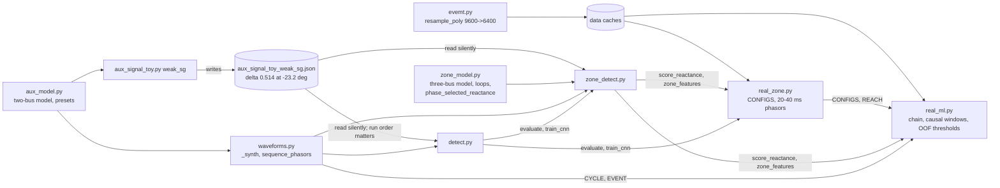

# Technical review: Power-CVXPY (auxiliary-signal fault detection in inverter-dominated grids)

**Reviewed commit:** `321e12b` (origin/main at the start of the review). Work branch: `review-fixes`
(PR #1 was merged into main by the author mid-review; later commits are on the same branch).
Companion reports, produced in separate worktrees and now merged into `main`: [review/WP1_REPORT.md](review/WP1_REPORT.md) (design tool) and
[review/SYNTH_REPORT.md](review/SYNTH_REPORT.md) (synthetic detection pipeline). Their key numbers were re-derived independently before being used here (§5, "Verification").
Environment: Windows 11, Python 3.12.10, numpy 2.2.6, scipy 1.16.1, scikit-learn 1.9.1, cvxpy 1.9.2, torch 2.5.1+cu121, pandas 2.3.3; i5-12500H (16 threads), 15.7 GB RAM, RTX 3050 Ti 4 GB. EvEMTBench caches read from `data/` (DoubleLine `.npz` 175 MB; TestGrid110kV `.bin` 1.31 GB + `.meta.npz`); no archive was re-streamed.

## 1. Executive summary

1. **"Learning beats the zone-1 rule within a relay" survives a varying operating point and a protection-grade threshold — for one detector, clearly at one relay, and not for learning as such.** On the benchmark set the repo's rule had no DC-offset filter and no directional element (`zone_model.py:206`) and tripped 20–22 % of reverse faults at its own bus; every unsupervised learned model tripped unseen classes (gradient boosting at relay B: 92 % of reverse-bus faults, 39 % of switching events); with 32P/32Q added, engineered + LR at relay B kept 95.3 % at 3/117 beyond-bus trips — at a single operating point. adapt_grid ([results/ADAPTGRID.md](results/ADAPTGRID.md)) tested that caveat over a 2.8× loading range, three grounding regimes and ~2,900 off-line faults per relay, and replaced the 5 % false-trip budget — which had hidden **36–57 % trips on faults just beyond the remote bus** (109/299 at A, 141/246 at B, engineered + LR) — with a threshold calibrated to zero off-line false trips. There the sequence-trajectory CNN keeps **94.6–99.4 % dependability at relay A** (median 98.5 % over three seeds and two splits, deterministic re-run of 27 Sep 2026) with 0–3 of 2,888 off-line trips and none of 5,474 switching events, and trips none of 1,387 reverse faults even when they are held out of its training. At relay B its zero-false-trip point is not stable (45–77 % over the same six draws, all with zero off-line trips) because that threshold is an extreme-value statistic of an unstably trained network; permitting one false trip, every draw reads 90–98 %. Engineered + LR keeps 82.7 % / 58.0 %, the settable quadrilateral T2 5.4 % / 10.1 %, and **gradient boosting collapses from 86–88 % to 11.3 % / 4.3 %** — its apparent competence was the budget. Directional supervision, not learning, is what removes the switching and reverse-bus trips for the engineered and distance detectors. **None of it survives on an inverter-rich MV feeder** (CIGRE MV, [results/CIGREMV.md](results/CIGREMV.md)): on four relays the same CNN covers 0–10.5 % at zero false trips, stable over seeds, no single-ended detector exceeds 15.8 %, the CNN trips 20–21 of 81 held-out reverse faults at one relay, and an inverter disconnecting at the remote bus trips it in the forward direction, past directional supervision (§7 rows 26, 32–33).
2. **It does not transfer.** A physical distance output with a fixed 0.85 trip is accurate within a relay (error 0.06–0.09 of the line) and trips 21–59 % of beyond-bus faults on another relay. Leaving out one fault resistance breaks the learned models too (LR 19/117 beyond-bus trips). adapt_grid confirms it at a protection-grade threshold: **no detector transfers in both directions** — engineered + LR reaches 91.1 % B → A but 43.5 % A → B, the CNN ranks well across relays but its threshold does not carry (63.7 % with 0 off-line trips B → A, 99.0 % with 105 A → B), and the distance output's ranking inverts A → B (AUC 0.17). Per-relay calibration is not optional.
3. **Two leaks inflate learned results beyond the author's noise fix.** Stratified CV puts a sibling of 95–96 % of test cases in training, including bit-identical three-phase duplicates (moderate effect: relay B LR 99.7 → 95.3 % dependability under grouped folds). And `resample_poly` leaks the fault 1.1–1.4 ms backwards: models given only the 40 ms ending at inception reach AUC 0.96 (A), 0.86 (B) and 0.95 (DoubleLine). A relay-bandwidth front end removes it and costs raw-sample boosting 6–7 AUC points at relay B.
4. **The hard case is high fault resistance, and single-ended zone 1 structurally cannot see it.** At benchmark relay B, 40 Ω in-zone faults appear at about 80 Ω / −16 Ω (study-model infeed factor 3.9) and the repo's rule discards them as reverse. What caps a quadrilateral's resistive reach is not load encroachment (25.4 Ω at relay B) but the polarising-error criterion of Kasztenny 2021 eq. (19), **8.6 Ω**. On adapt_grid's continuous fault population (in-zone median R_f 22–24 Ω) that cap means the largest settable zone-1 quadrilateral encloses only **10 of 168 in-zone faults at relay A and 28 of 207 at relay B**; R2 trips 10 of 10 and 27 of 28 of them and nothing outside — its low dependability is a property of the faults, not of the settings. 67N/67Q detect these faults without zone-selecting them, and 32P/32Q forward at **both** line ends (a POTT equivalent, no channel delay modelled) covers 97–100 % with no off-line trip. The defensible niche is therefore **single-ended, channel-free, instantaneous selectivity for high-resistance faults** — on TestGrid, which is synchronous-source dominated (inverters 0.14 % of short-circuit capacity). On the inverter-rich CIGRE MV feeder (inverters about half the fault-current rise, 2–4 Ω lines) the niche is empty: from one end, with a fundamental-frequency front end, in-zone faults are not separable from the faults just beyond the remote bus in any R_f band the data contain (near-boundary AUC 0.37–0.90, against 1.000 on TestGrid; almost no faults below 1 Ω, so bolted faults are untested), and only both-ends references work (67N/67Q at both ends 75–82 %, no off-line trip; [results/CIGREMV.md](results/CIGREMV.md)) — and item 6's finding that a compliant inverter shunts a negative-sequence injection by 3–17× bears on the CNN too, whose input is built on the same sequence quantities.
5. **The synthetic headline falls.** "The signal helps the learned detector" disappears once the CNN's per-waveform normalisation is removed (AUC 0.967 → 0.9996 at δ = 0, re-checked). "It hurts the reactance element" survives (−0.086 AUC, 95 % CI [−0.096, −0.077]), mostly from mixing fault types under one reach.
6. **The design tool now earns the word "guarantee" inside its two-bus model, and not beyond it.** The δ labelled "certified" in both original sweeps was designed for another problem (H1, still confirmed), and the published optima were local (0.514 → 0.504 pu), had 1.25 % of eps as margin and rested on an unsound angle linearisation. Re-derived in the TAC25 formulation ([results/DESIGN.md](results/DESIGN.md)) with a sound angle set, a margin, a global solve and a continuous (m, R_f) re-check, **two statements this summary used to make are withdrawn.** The 1.2 pu current limit is not "violated": it belongs *inside* the problem, where it removes realisations from the uncertainty set, and the presets are feasible at 0.16–0.26 pu — under the review's sum-rule pruning |i⁺| ≤ I_max − |δ|, which is unsound for a per-phase limiter; a sound rule gives about 0.20–0.32 pu (§7 row 3, pending a proper re-run); treating the limit as uncertain on [1.1, 2.1] — the measured inverters overshoot to p95 ≈ 1.5 pu in steady state — keeps the guarantee at about twice the signal, and what the softness costs is injectability (1.81 pu of headroom at ε = 0.08). And "no δ ≤ 1.5 pu separates at eps ≥ 0.01" is replaced: with a scalar error box the problem is feasible up to ε = 0.12 and **provably** infeasible at ε = 0.16 — the separation condition is affine in δ, so one fault case's failure polygon certifies that no δ ≤ 1.5 pu separates, and without a current limit none below 2.24 pu. The scalar box was itself the wrong error model: a structured per-channel set at the same instrument class figures needs **no signal at all** at every systematic/per-phase split in the base case, and in every strength / K₂ cell but one (share = 1, SIR ≈ 8, K₂ = 6: 0.12 pu). Two things bound all of it: the 14-bus worked example — Taylor's Geometry paper (arXiv 2510.04379), not TAC25, whose only example is single-IBR, and one that separates fault types on the relay's own line rather than in-zone from out-of-zone faults — is not reproduced, so none of this is a replication; and closing the inverter's negative-sequence path per IEEE 2800 shunts the injection by 3–17× on the toy grid (an estimated 1.6–3.7× for the characterised CIGRE inverters, bridge review), which under the scalar box destroys feasibility. The Taylor 2023 Fig. 3 gate is reproduced only by the appendix's printed, non-standard matrix (the standard complex form peaks at 0.485, not 0.354).
7. **What is sound:** the author's five fixes in REAL_ML.md §7, the element core (k0, phase selection, bolted faults within 1.5 % on DoubleLine's discrete locations), primary units, the reproducible measurement chain and quick-start, and the instinct in REAL_ML.md §6 ("data-driven settings, not data-driven relays").

## 2. Project understanding and architecture

**Research question (docs/PLAN.md).** Put Taylor and Domínguez-García's bounded-set auxiliary-signal design (a negative-sequence current injected by an inverter, minimised by convex optimisation so that every fault in an uncertainty set is separated from normal operation) on EMT data. Compare it head-to-head with competing detectors (distance element, incremental negative sequence, MMKF, learned), measure where the guarantee holds or breaks, and what decisions cost in milliseconds. The contribution claimed is evaluation and comparison, not a new method.

| WP | Deliverable | Code today |
|---|---|---|
| WP1 design tool | CVXPY tool: grid model in, smallest separating δ out | `aux_model.py` (two-bus sequence model, affine measurement model, LP separation test, presets), `aux_signal_toy.py` (δ-plane grid search, Farkas-dual alternating QP, figure), `sweep_delta0.py` |
| WP2 simulation | EMT grid with inverters injecting δ, labelled waveforms | not started; EvEMTBench via `evemt.py` stands in; `waveforms.py` synthesises waveforms from the phasor circuit |
| WP3 detection | detectors on one protocol, δ swept until each fails | synthetic: `waveforms.py`, `detect.py` (fault vs load), `zone_model.py` + `zone_detect.py` (in-zone vs out-of-zone); real: `real_zone.py` (first pipeline, learned numbers withdrawn by the author), `real_ml.py` (current pipeline) |
| WP4 embedded | latency against one cycle | not started |


```mermaid
flowchart LR
  AM[aux_model.py<br/>two-bus model, presets] --> AST[aux_signal_toy.py weak_sg]
  AST -->|writes| J[(aux_signal_toy_weak_sg.json<br/>delta 0.514 at -23.2 deg)]
  J -->|read silently; run order matters| DET[detect.py]
  J -->|read silently| ZD[zone_detect.py]
  AM --> WF[waveforms.py<br/>_synth, sequence_phasors]
  WF --> DET
  ZM[zone_model.py<br/>three-bus model, loops,<br/>phase_selected_reactance] --> ZD
  WF --> ZD
  DET -->|evaluate, train_cnn| ZD
  EV[evemt.py<br/>resample_poly 9600->6400] --> C[(data caches)]
  C --> RZ[real_zone.py<br/>CONFIGS, 20-40 ms phasors]
  ZD -->|score_reactance, zone_features| RZ
  DET -->|evaluate, train_cnn| RZ
  C --> RML[real_ml.py<br/>chain, causal windows, OOF thresholds]
  RZ -->|CONFIGS, REACH| RML
  ZD -->|score_reactance, zone_features| RML
  WF -->|CYCLE, EVENT| RML
```

Hidden coupling: (1) `detect.py` and `zone_detect.py` consume δ from a JSON written for a different model and problem (H1). (2) Both real-data pipelines share `score_reactance` and `zone_features`, so the element flaw (N2) and the wrong phase loop (X1) propagate into both. The fixes made in `real_ml.py` (channel scaling, OOF thresholds, logits) were never back-ported to `detect.evaluate` / `train_cnn`, which `real_zone.py` and the synthetic sweep still use (H17–H19). (3) `real_ml.phasor_view` depends on `sequence_phasors` using a window-relative DFT basis (N1). (4) `real_ml.py` imports `CONFIGS` / `REACH` from `real_zone.py`; the task definition is shared, but the windows, protocol and chain diverged.

Headline claims and their pipeline: README result 1 (design presets): WP1 toy. Result 2 (δ helps learned, hurts conventional): synthetic `zone_detect.py`. Results 3–4 (element validated, zone 1 perfectly secure, limiter measured, relay B misses 40 Ω): `real_zone.py`. Result 5 (leak, learning beats the setting, thresholds do not transfer, stage 1 fails): `real_ml.py`.

## 3. What is sound

- The five fixes in REAL_ML.md §7 are correct as implemented (`real_ml.py:148-236`, `:244-260`). The noise-free leak is reproduced: gradient boosting on the pre-fault control window scores 1.000 at zero noise and 0.49–0.56 at 0.1 % (`results/review/h25_shortcut.json`).
- Records are primary quantities (pre-fault peak 89.5–93.0 kV against 89.8 kV nominal); `V_NOM_PEAK` and the reach in primary ohms are right despite the `Usec` / `Isec` channel names (H12 refuted).
- The element core: my vectorised re-implementation reproduces `phase_selected_reactance` to < 1e-13 Ω on all three relays at 20 and 40 ms; bolted faults read m·X₁ on the faulted loop.
- The measurement chain is reproducible; the generalised chain is bit-identical at default settings (test).
- The design tool's LP and alternating QP implement the stated problem correctly; the quick-start reproduces the README optima exactly (0.5141, 0.6969, 0.4081 pu; `weak_sg_eps12` infeasible below 0.8 pu).
- "Inverters ≈ 0.1 % of short-circuit capacity" (85 MVA against two 30 GVA grids: 0.14 %) and the limiter observation (median |I₁|+|I₂| 1.07–1.18 pu during faults) hold (§7).

## 4. Findings

Severity is the effect on a headline conclusion. Effort S < 1 day, M 1–5 days, L > 1 week. "Fixed" means fixed on a review branch with before → after measured.

| ID | Category | Severity | Location | Summary | Verdict | Effort |
|---|---|---|---|---|---|---|
| N2 | BUG | Critical | `zone_model.py:206` | Sign of loop reactance used as the directional decision; relay-bus reverse faults trip 20–22 % (R0, 20 ms); relay B's 40 Ω in-zone faults discarded as reverse | CONFIRMED, fixed in ladder | S |
| H24 | METHODOLOGY | Critical | `real_ml.py:270-373` | Security never tested on classes outside training; learned models trip 39–92 % of relay-bus reverse faults, up to 39 % of switching | CONFIRMED | M |
| H8 / Q-fair | METHODOLOGY | Critical | `zone_model.py:166-207`, `real_ml.py:278-282` | Baseline lacked DC-offset filter, directional element, quadrilateral, setting study | CONFIRMED | M |
| H1 | METHODOLOGY | Critical | `zone_detect.py:163-166,230`; `detect.py:191-195,253` | "Certified δ" designed on a different model and problem; no δ ≤ 1.5 separates the zone problem at eps ≥ 0.01 | CONFIRMED (the δ misuse); the infeasibility is **re-derived, moved, and now PROVED at eps = 0.16**: the separation condition is affine in δ (checked against the nonlinear solver to 2.1e-14), so each fault case's failure set is a convex polygon, and one AG fault at 35 % of the line covers every \|δ\| ≤ **2.24 pu** — 28 supporting hyperplanes, 11 s, against 728 s for the grid search ([results/DESIGN.md](results/DESIGN.md) §2.1). Theorem 1 still cannot do it (§2 there). At eps = 0.12 it stays a search result, bracketed to [1.363, 1.42] pu | M |
| H22 | METHODOLOGY | High | `real_ml.py:286` | Stratified CV: 95–96 % of test cases have a sibling in training; three-phase siblings bit-identical | CONFIRMED, fixed | S |
| H25 | METHODOLOGY | High | `real_ml.py:376-391` | Shortcut control ends 5 ms early and skips DoubleLine; the 40 ms ending at inception gives AUC 0.96 / 0.86 / 0.95 | CONFIRMED | S |
| H30 | BUG / MODELING | High | `evemt.py:85,131`; `real_ml.py:92-95` | Non-causal resampling leaks 1.1–1.4 ms; ADC full scale ±40× pre-fault clips 13–14 close-in faults | CONFIRMED, fixed (relay front end) | M |
| H23 | MODELING | High | EvEMTBench labels | One operating point per grid; no loading, source, inverter or inception variation; learned mappings do not transfer (Q2) | CONFIRMED | L **Tested on adapt_grid** ([results/ADAPTGRID.md](results/ADAPTGRID.md)): across a 2.8× loading range, within one grid, learned dependability *does* transfer (99–100 % under leave-one-loading-quartile-out); what does not transfer is security on next-line faults, and cross-relay transfer still fails for all but the sequence-trajectory CNN |
| H28 | METHODOLOGY | High | `real_ml.py:113,340-370` | Stage-1 label counts every fault in the grid; responsible label raises AUC 0.63–0.83 → 0.90–0.99 | CONFIRMED, fixed | S |
| H9 | METHODOLOGY | High | `real_ml.py:114-115`; `zone_detect.py:56-59` | Own-line 85–100 % band excluded and unreported; tuned reach and learned models trip 10–19 % of 99 % faults | CONFIRMED | S |
| H19 | BUG | High | `detect.py:141-144` | Per-waveform standardisation handicaps the synthetic CNN (0.967 → 0.9996 AUC) | CONFIRMED, fixed (merged) | S |
| H5 | MODELING | High | `aux_signal_toy.py:75-80` | No inverter current limit; ~~every preset needing δ > 0 infeasible at 1.2 pu~~ | **PARTLY WITHDRAWN.** The limit was missing, but imposing it as an outer check on the design was the wrong correction. Inside the problem (per-phase limit rows, B5) the presets are **feasible at 0.16–0.26 pu** ([results/DESIGN.md](results/DESIGN.md) §3). And the limit no longer has to be assumed hard: treated as an uncertain parameter on [1.1, 2.1] and pruned at the loosest bound, the guarantee holds whatever the limiter does, at 0.56 pu instead of 0.28 at eps = 0.08 (§3.1 there) | M |
| H6 | BUG | High | `aux_model.py:104-108` | Linearised angle uncertainty is unsound (true set up to 0.085 / 0.276 pu outside); sound δ 0.504 → 0.552, 0.691 → 1.042, 0.386 → 1.054 | CONFIRMED | M |
| H14 | BUG | High | `aux_model.py:123-129`; `aux_signal_toy.py:67` | Zero-margin separation; margin 0.45–1.25 % of eps; 10 % headroom needs 0.666 / 0.899 / 1.357 pu | CONFIRMED | S |
| H16 | DOC (paper) | High | Taylor 2023 Appendix | Fig. 3 reproduces only with the printed M = [[r, −x], [r, x]]; the correct form gives peak 0.485 | CONFIRMED | S |
| H2 | METHODOLOGY | High | `aux_model.py:31`; `waveforms.py:50` | Design eps is 111–208× the synthetic phasor noise std; **and the scalar-eps replacement is wrong too** — instrument error is per-channel, systematic per installation, multiplicative, and shared between the two hypotheses. With a structured set at the same class figures δ = 0 separates everything, so the eps = 0.12 boundary dissolves rather than moves; the systematic/per-phase split has no citation, but a sensitivity sweep shows the result holds at every split from all-systematic to all-per-phase ([results/DESIGN.md](results/DESIGN.md) §4.1.1) | CONFIRMED but **against the wrong error model**: white noise averages down over a 128-sample DFT, per-installation ratio and phase errors do not. Against fault-condition instrument errors eps = 0.08–0.16 pu is defensible ([results/DESIGN.md](results/DESIGN.md) §4.1) | S |
| H7 / N7 | MODELING | High | `aux_model.py:29`; `zone_model.py:39` | No inverter fault response in the models; EvEMTBench inverters inject 0.25–0.39 pu I₂; relay B's 40 Ω stratum is infeed physics | CONFIRMED, and **half closed on the design side**: the inverter now carries an IEEE 2800-style negative-sequence response at the measured limiter angles, which **shunts the injected signal by 3–17×** and reverses the IBR-share axis ([results/DESIGN.md](results/DESIGN.md) §4.4). The EMT models still carry no inverter fault response | L |
| N1 | BUG | High | `real_ml.py:143` | `phasor_view` rotated post-fault phasors 180° at 30 / 50 ms | CONFIRMED, fixed | S |
| H10 / H20 | METHODOLOGY | High | `real_ml.py:122-145`; `zone_detect.py:82-85` | Windows anchored at true inception; anchoring at a causal starter (≈ 3 samples later) collapses raw-sample boosting (AUC 0.61–0.70, 77–95 % beyond-bus trips); phasor models unaffected | CONFIRMED (real), PARTIAL (synthetic) | S |
| H26 | METHODOLOGY | Medium | REAL_ML.md §5 | Rule and models compared at different false-trip rates; rule shown with "no spread" | CONFIRMED | S |
| H27 | METHODOLOGY | Medium | `real_ml.py:277` | No conventional baseline at 10 ms; MMKF absent | PARTIAL (half-cycle rungs added) | M |
| H29 | METHODOLOGY | Medium | `real_ml.py:411` | A↔B share one grid and simulation set; out-of-grid transfer fails | CONFIRMED | S |
| H13 | METHODOLOGY | Medium | `aux_model.py:32-33,136-142` | Guarantee only on 30 grid points; holds densely at 0.514 (0/5000), fails at the exact optimum 0.504 (5/5000) | PARTIAL | M |
| H15 | METHODOLOGY | Medium | `aux_signal_toy.py:71-86` | Alternating scheme stops at local optima (0.5141 vs 0.5040) | CONFIRMED | S |
| H3 | METHODOLOGY | Medium | `aux_model.py`, `waveforms.py:57-62`, `zone_detect.py:48-55` | Three uncertainty sets for "the same system" | CONFIRMED | S |
| H4 | METHODOLOGY | Medium | `waveforms.py:63-67` | Constant δ cancels in incremental quantities; reactance trend is not this artefact | PARTIAL | S |
| X1 | BUG | Medium | `aux_model.py:74-75,86-88`; `zone_detect.py:125` | "ab" scenario is a b–c fault; engineered features use the healthy "ab" loop | CONFIRMED | S |
| N5 | DOC | Medium | REAL_ML.md §3 | Fingerprint is 0.1–0.26 V, not 0.01 V; shortcut persists to 1e-5 relative noise on DoubleLine | CONFIRMED | S |
| N6 | DATA | Medium | EvEMTBench switching events | `cap_off`, `load_off`, `ohl_off` start from a different network state (up to 2.3 kV pre-fault offset), a stage-1 shortcut | CONFIRMED (impact not isolated) | S |
| H11 | MODELING | Medium | `zone_detect.py:70-77`; DoubleLine graph | Synthetic AG/AB only; no CT/CVT; parallel lines modelled without zero-sequence mutual coupling | CONFIRMED | L |
| H17 | BUG | Medium | `detect.py:121-132` | Polarity chosen on the test set; zone study unaffected (0/36 flips), fault-vs-load |i⁻| flips at 4/10 δ | CONFIRMED, fixed (merged) | S |
| H18 | BUG | Low | `detect.py:73-82,173-175` | In-sample thresholds for LR / CNN: realised FAR 1.7–2.1 % against 1 % | PARTIAL, fixed (merged) | S |
| H21 | BUG | Low | `zone_detect.py:129-141` | Raw angles and ε-ratios; AUC changes ≤ 0.0012 | PARTIAL | S |
| H12 | DOC | Low | `evemt.py:28-29` | Channel names say secondary, values are primary | REFUTED as a bug | S |
| H31 | DOC | Low | README:214-215; `detect.py:15-17` | Withdrawn 96.0 → 99.4 % still ticked; seeds exist but box unticked; docstring negatives | CONFIRMED | S |
| H32 | HYGIENE | Low | `zone_model.py:78,121`; `aux_signal_toy.py`; `requirements.txt`; `evemt.py:79-80` | Dead code, module-level script, unpinned requirements, 50 Hz default before label check, two diverged pipelines | CONFIRMED | M |
| H33 | TESTS | Medium | – | No correctness tests | FIXED: 21 + 29 + 15 tests | M |

## 5. Finding details

### Verification of delegated work
The design-tool and synthetic-pipeline findings were produced in two worktrees and re-derived here before use: **H16** (closed form |θ|min = 2/σmax(M⁻ − M_f) reproduces the agent's values for both matrix forms; the paper's Fig. 3, extracted from the PDF, has the flat 0.356 plateau for x_f ≈ 32–38 that only the printed form produces); **X1** (a bolted "ab" fault reads 0.300 / 0.600 of X₁ on the **bc** loop at m = 0.3 / 0.6, and 0.453 / 0.754 on "ab"); **H1** (with nominal network and sources, the eps = 0.08 witness pair differs by at most 0.110 pu per component on |δ| = 1.5, inside the 0.16 pu that two noise boxes absorb; the eps = 0.01 result depends on network pieces and is the agent's); **H13** (0/1722 unseparated at the published δ on my own grid); **H15** (my 0.02-step brute force finds 0.506 pu, between the agent's exact 0.5040 and the published 0.5141); **H5, H6** (by direct arithmetic); **H19** (author's CNN on author's data, δ = 0: AUC 0.9674 / 0.9686 per-waveform, 0.9996 / 0.9998 global per-channel, `src/review/h19_verify.py`).

### N2 — the zone-1 rule has no directional element (BUG, Critical)
- **Code.** `zone_model.py:206`: `fwd = [L[k].imag for k in loops if L[k].imag > 0]`; otherwise the score is 10 Ω. The sign of X is the only direction test.
- **Why it matters.** A resistive in-zone fault under remote infeed with load import reads negative X: relay B imports at −163°. A close-in reverse bus fault reads a near-zero impedance of either sign. Real relays use a separate 32P/32Q directional element and allow X < 0 inside a quadrilateral.
- **Evidence** (`src/review/n2_negative_reactance.py`, `real_zone_rerun.py`, `ladder.py`):
  - At relay B, 40 ms, 100 % of in-zone 40 Ω faults have negative X on the released loop and return the default.
  - Relay-bus reverse faults, noise-free, 20–40 ms window: the rule trips 9/45 (A), 17/45 (B) and 12/45 (DoubleLine), including 60–80 % of 1 Ω faults.
  - With the 0.1 % chain at 20 ms: 9/45, 10/45 and 9/45; 3 of 9 three-phase bus faults at each relay.
- **Fix.** Ladder rungs R2–R4 add a 3-cycle memory-polarised 32P with 32Q priority for unbalanced faults, a quadrilateral that accepts negative X, a directional sector and minimum loop current.
- **After.** 0/45 relay-bus reverse trips at every relay and decision time for R2–R4, three-phase included.
- **Directional accuracy** against study-model labels (never EMT Δ quantities), 20 ms: in-zone 100 %; beyond-bus 93–100 %; relay-bus reverse 87 % (A), 100 % (B), 93 % (DoubleLine). On reverse bus faults, 32P alone calls 33–67 % forward at A and DoubleLine (load current dominates weak reverse infeed); 32Q calls 0 %. The combined element calls 3/9 three-phase reverse bus faults forward at A and DoubleLine. Zone-1 security does not rely on these labels: R2 still trips 0/45 because of its impedance region.

### H24 — learned zone decisions are insecure outside their training classes (METHODOLOGY, Critical)
- **Code.** `real_ml.py` trains and evaluates only in-zone vs beyond/remote-bus faults. `real_zone.py` held out own-99 % and switching, but only for the engineered model.
- **Evidence** (`src/review/zone_cv.py` + `aggregate.py`; grouped 5×2, guard band, 20 ms, current front end; each fold's models scored on every held-out class). Relay B, trip rates:

| Model | Relay-bus reverse | Lines behind | Other faults | Switching |
|---|---|---|---|---|
| Gradient boosting | 92.1 % | 90.0 % | 67.0 % | 39.2 % |
| Random forest | 89.5 % | 87.1 % | 63.5 % | 33.0 % |
| Engineered + LR | 57.4 % | 45.6 % | 14.5 % | 26.0 % |
| MLP | 0.3 % | 0.1 % | 0 % | 0 % (dependability 26.9 %) |

  - Relay A: boosting 39.2 % reverse bus, 26.3 % parallel line, 9.0 % switching.
  - DoubleLine: random forest 81.0 % reverse bus, 25.0 % switching.
- **Fix measured.** The same decisions AND the standard directional element, thresholds unchanged:
  - Relay B: reverse bus, lines behind and switching fall to 0 % for boosting, forest and LR.
  - Relay A: boosting still trips 14.3 % of lines behind, 15.6 % of parallel-line faults and 9.0 % of switching events.
  - Supervision is necessary but not sufficient everywhere.

### H8 / Q-fair — the baseline ladder (see §6)

### H22 — sibling leakage in within-relay CV (METHODOLOGY, High)
- **Facts** (`results/DATASET_FACTS.md`): every (target, location, type, R_f) group has 3 members. `RepeatedStratifiedKFold` puts a sibling of 95.2 % (DoubleLine), 96.4 % (A) and 94.8 % (B) of test cases in training; three-phase siblings are identical simulations.
- **Fix.** `StratifiedGroupKFold` 5×2 with grouped inner out-of-fold thresholds; per-class rates on deduplicated units.
- **Before → after** (20 ms, own-99 % as guard band, current front end, stratified → grouped):

| Relay | Model | AUC | Dependability | Beyond-bus false trips |
|---|---|---|---|---|
| B | engineered + LR | 0.999 → 0.989 | 99.7 → 95.3 % | 7/117 → 3/117 |
| B | gradient boosting | 0.964 → 0.939 | 77.5 → 75.0 % | |
| DoubleLine | engineered + LR | 0.999 → 0.990 | 98.9 → 96.7 % | |

- **Verdict.** Real but moderate. The conclusions change more under leave-one-R_f-out: at B, LR has 19/117 beyond-bus trips (95 % UCB 22.9 %) and 56.7 % dependability at 40 Ω, and boosting 51/117.

### H25 / H30 — the resampling look-ahead is exploitable (High)
- **Code.** `evemt.py:85,131` use zero-phase `resample_poly`.
- **Evidence.**
  - Raw 9600 Hz DoubleLine records: the fault leaks 1.1–1.4 ms before inception, at 43–56 σ of the chain noise one sample before (`h30_resampling.json`).
  - Pre-fault-only gradient boosting, default chain, window ending at inception: AUC 0.967 (A), 0.856 (B), 0.953 (DoubleLine).
  - At relay A with the window ending 0.47 / 0.94 / 1.41 / 2.03 / 5 ms before inception: 0.892 / 0.703 / 0.497 / 0.519 / 0.498 (`h25_leak_edge.json`).
  - The author's control ended 5 ms early and never ran on DoubleLine.
- **Fix.** Relay front end (`src/review/frontend.py`): causal 3rd-order Butterworth at 400 Hz (assumption) and ADC full scale from CT 1000/1 and a 100 × In relay input (±141 kA, assumption).
  - On the raw records this matches causal filtering before decimation within 0.2 % in the 10 / 20 ms phasors and leaves 0.18–0.32 σ of leak.
  - The default chain's ±40 × pre-fault full scale clips 13 (DoubleLine) and 14 (A) in-zone faults at 1 % and 20 %. REAL_ML.md results at those locations are affected.
- **Before → after** (relay B, grouped, 20 ms / 10 ms):
  - Boosting AUC 0.939 → 0.883 / 0.947 → 0.876; dependability 75.0 → 68.1 % / 73.6 → 65.0 %.
  - Engineered + LR 0.989 → 0.984, 95.3 → 95.8 %.
  - Ladder R2 52.2 → 43.9 % (filter delay in the first cycle).
  - Relay A: boosting AUC 0.998 → 0.982, dependability 96.9 → 91.9 %; engineered + LR 98.3 → 98.6 %.
  - DoubleLine: boosting 0.990 → 0.990, 93.3 → 92.2 %.
  - **Clipping isolated** (CT-based full scale only, no filter): at most 2.2 points. A boosting 96.9 → 94.7 %, LR 98.3 → 98.9 %; DoubleLine LR 96.7 → 96.7 %.
  - All in [results/review/TABLES.md](results/review/TABLES.md).

### H28 — stage-1 label and baseline (METHODOLOGY, High)
- **Code.** `real_ml.py:113` sets `fault_any = event_type.startswith("flt")`, which covers 2,385 TestGrid episodes, of which only 975 (A) and 513 (B) are the relay's own line, remote bus or the lines beyond.
- **Evidence** (`h28_stage1.py`, grouped episode folds). MLP fault-vs-switching AUC, "any" → "responsible" label:

| Relay | AUC | In-zone pass |
|---|---|---|
| A | 0.817 → 0.958 | 56.7 → 100 % |
| B | 0.633 → 0.993 | 16.1 → 100 % |
| DoubleLine | 0.831 → 0.900 | 63.9 → 52.2 % |

- **Conventional starter** (superimposed-current start with 2nd-harmonic blocking, nothing fitted):
  - In-zone 171/180 (A), 138/180 (B), 167/180 (DoubleLine).
  - Switching 7/50 (95 % CI 5.8–26.7 %), 7/50 and 5/24 (7.1–42.2 %).
- **Budget.** A 5 % switching budget cannot be supported by 50 or 24 events (59 are needed with zero trips); REAL_ML.md's "0 % switching" means 0/10 per fold (one-sided UCB 25.9 %).

### H9 — the own-line 85–100 % band (METHODOLOGY, High)
- **Real data.** Own-line 99 % faults were neither trained on nor reported.
  - Guard-band trip rates at 20 ms (grouped): engineered + LR 19.2 % (A), 4.1 % (B), 10.0 % (DoubleLine); tuned reach T1 12.8 % (A), 6.7 % (B); R2 0 %.
  - Treating 99 % as a hard negative barely changes T1's beyond-bus trips (A 11/273 both ways).
- **Synthetic** ([review/SYNTH_REPORT.md](review/SYNTH_REPORT.md)): with the band as don't-care, engineered + LR trips 48.6 %; as negatives, AUC drops 0.994 → 0.959.

### H1, H2, H5, H6, H13–H16, X1 — design tool
Details, commands and JSON keys: [review/WP1_REPORT.md](review/WP1_REPORT.md); the numbers are in §4 and were verified as above. Consequence: nothing in the synthetic sweeps is certified, and the design needs (i) the zone problem, (ii) a sound source set, (iii) a margin tied to a measurement-error model, (iv) the current limit, (v) a global solver, before "guarantee" can be written.

### H17–H21, H4, synthetic H9/H26 — synthetic pipeline
Details: [review/SYNTH_REPORT.md](review/SYNTH_REPORT.md). The corrected full sweep (3 seeds) is in §9.

### N1 — phasor reference rotation (BUG, High, fixed)
- **Code.** `real_ml.phasor_view` copied the post cycle to a fixed slot while `sequence_phasors` uses a window-relative basis; at 30 / 50 ms the post phasors were rotated 180° against pre-fault, so incremental currents were post + pre.
- **Before → after.** Rule AUC at relay B, 50 ms: 0.806 → 0.891. DoubleLine 50 ms false trips: 4 % → 0 % (`check_repro.json`).
- **Note.** The fix shifts the pre-fault cycle back by t mod 20 ms, so at 30 / 50 ms it starts at −50 ms, outside the learned models' 40 ms pre-fault window. A phase-corrected DFT basis would avoid that. The review's own elements use an absolute basis with the pre-fault cycle ending at −20 ms.

### N5, N6, H23, H12, H11 — data facts
See `results/DATASET_FACTS.md`.
- N5: the fingerprint is 0.12 / 0.20 / 0.26 V peak-to-peak and survives to 1e-5 relative noise (DoubleLine control AUC 0.969).
- N6: three switching types start from a different network state.
- H23: no operating-point columns exist.
- H11: the DoubleLine "parallel" circuits are separate single-circuit types (`nlcir = 1`, own geometry, 20 vs 25 km), so there is no zero-sequence mutual coupling.

### H10 / H20 — timing
- **Synthetic** ([review/SYNTH_REPORT.md](review/SYNTH_REPORT.md)): DC offset moves the element's median distance error 0.28 → 0.63 %; ±2 ms trigger jitter has no measurable effect.
- **Real data.** The rule's 14.8 % beyond-bus false trips at relay B, 20 ms, are first-cycle DC offset: a mimic filter gives 0.7 %.
- **Trigger-anchored evaluation:** §6 (after Q3). It collapses raw-sample boosting and leaves phasor-based models and rules intact.

### H26, H27, H29
- **H26.** Matched comparisons are in §6; the rule's rates carry deduplicated binomial bounds.
- **H27.** Half-cycle + mimic rungs at 10 ms were added (R1–R4, T2). An incremental-quantity element was evaluated (`elements_fixed.json`: dependability 31–41 %, 0 % out-of-zone). MMKF is not implemented (roadmap).
- **H29.** Cross-relay A → DoubleLine fails for every learned model with a transferred threshold or a fixed physical threshold (Q2).

### H31, H32, H33
H31 and H32 are listed with lines in §4. H33 tests: §11.

## 6. Answers to the author's questions

### Q-fair — the baseline ladder
**Frozen specification** (written before evaluation; full text in `src/review/ladder.py`):

| Rung | What it adds |
|---|---|
| R0 | Repo rule |
| R1 | + mimic filter (half-cycle DFT at 10 ms) |
| R2 | + 3-cycle memory 32P with 32Q priority for unbalanced faults; quadrilateral accepting X < 0; sector −15…115°; minimum loop current 0.2 In; resistive reach from rules (arc + 10 Ω tower, capped by load encroachment and a zone-1 R/X limit) |
| R3 | + I₂-polarised reactance line with tilt from the study's source impedances at both ends |
| R4 | + reach reduction from study-model external faults with R_f ≤ R_arc + R_tower |
| T1 | Tuned reach at 5 % on training negatives, capped at 0.9 X_line |
| T2 | Tuned quadrilateral (X_set, R_set) on the same folds as the learned models |

Settings come only from the grid graph:

| Relay | X_set (Ω) | R_set ground / phase (Ω) | Tilt T₂ (°) | Tilt range, ±25 % / ±7.5° sources (°) | R4 reach (Ω) |
|---|---|---|---|---|---|
| A | 5.53 | ~~24.9 / 16.6~~ → **6.5 / 6.5** | −2.27 | −8.7 … +3.7 | 5.53 |
| B | 8.84 | ~~25.4 / 25.4~~ → **8.6 / 8.6** | +3.73 | −2.5 … +10.5 | 8.20 |
| DoubleLine | 4.42 | ~~19.9 / 13.3~~ → **5.1 / 5.1** | −1.87 | −8.9 … +4.4 | 4.27 |

> **Resistive reach, corrected.** The original R_set was capped only by load encroachment and an R/X
> rule. It violated a third limit the review did not have: Kasztenny 2021 §III.I eq. (19) caps the
> resistive reach against the reactive reach given the **polarising phase error**,
> m₀ < 1 − 2·r_B·sin(Θ/2), i.e. **R_set ≤ |Z1L|(1 − m₀) / (2 sin(Θ/2))**. Θ is taken from this
> review's own measured tilt band: R2/T2 have an untilted reactance line so the whole
> non-homogeneity angle is uncompensated (**8.7–10.5°**), R3/R4 tilt by the nominal so only the
> residual matters (6.4–7.0°). One shared setting, so the larger Θ binds. At relays **A and
> DoubleLine the securely-settable reach is below the arc-plus-tower coverage the element is
> supposed to provide** (6.5 vs 6.7 Ω, 5.1 vs 6.6 Ω). Keeping the old R_set instead would require
> cutting the reach to 41–56 % of the line.
> Generated tables: [results/review/TABLES.md](results/review/TABLES.md); JSONs `ladder_polcap*.json`
> (corrected) beside `ladder*.json` (legacy, reproducible with `LADDER_RSET=legacy`).

- **Load-encroachment basis.** Assumed thermal rating 1800 A (the conductor string reads "x2"; the graph has no ampacity), 0.9 pu voltage, 30° maximum load angle, both flow directions: Z_load,min = 31.8 Ω. Using 0.7 × the benchmark's own pre-fault load impedance instead would have given 120 / 92.7 / 134 Ω, 4–7 times the rule-based reach. **This is no longer the binding cap** — the polarising-error limit is 3–4× tighter — so the sensitivity to the ampacity assumption is retired.
- **Load encroachment cannot be tested here** because benchmark loading is fixed.
- **T2 was not a settable rung before.** Recording what the tuned quadrilateral actually chose shows
  it selected **R_set = 75–102 Ω at every fold, the top of its own grid**, i.e. 3–4× beyond even the
  load-encroachment cap of 25.4 Ω. Its 67.8 % at relay B was a grid-boundary artefact of a setting no
  engineer could apply. The R_set grid is now absolute and identical in both modes, truncated at the
  criterion in the corrected run, where T2 sits exactly at the cap.

**Step by step at 20 ms, current front end** (dependability; beyond-bus trips k/n with one-sided 95 % upper bound; relay-bus reverse; own-99 % guard band):

**Corrected settings** (`ladder_polcap.json`; the legacy row is in `ladder.json` and in TABLES.md):

| Relay | R0 | R1 | R2 | R3 (worst over tilt range) | R4 | T1 (grouped) | T2 (grouped) |
|---|---|---|---|---|---|---|---|
| A | 78.9 %; 1/273; 9/45; 1/45 | 63.3 %; 0/273; 5/45; 0/45 | **37.8 %**; 0/273; 0/45; 0/45 | **37.2 %** (≥35.0 %); 0; 0; 0 | **37.2 %** | 83.9 %; 11/273 (≤6.6 %); 17.9 %; 12.8 % | **37.8 %**; 0/273; 0 %; 0 % |
| B | 60.6 %; 14/117 (≤18.1 %); 10/45; 8/45 | 65.6 %; 1/117; 0/45; 0/45 | **35.0 %**; 0/117; 0/45; 0/45 | **35.6 %** (≥32.8 %); 0; 0; 0 | **35.6 %** | 49.2 %; 7/117 (≤10.9 %); 20.5 %; 6.7 % | **31.7 %**; 0/117; 0 %; 0 % |
| DoubleLine | 80.0 %; 0/195; 9/45; 1/45 | 60.0 %; 0/195; 1/45; 0/45 | **31.1 %**; 0/195; 0/45; 0/45 | **30.6 %** (≥28.3 %); 0; 0; 0 | **30.6 %** | 82.8 %; 10/195 (≤8.5 %); 17.9 %; 12.8 % | **31.7 %**; 0/195; 0 %; 0 % |

R0, R1 and T1 do not use R_set and are unchanged — that is the correctness check on the change.
Legacy values for the quadrilateral rungs were R2 58.3 / 52.2 / 50.0 % and T2 65.0 / 67.8 / 61.7 %.

What each step contributes:
- **R1 (mimic filter).** Removes relay B's first-cycle false trips (14/117 → 1/117) and its own-99 % trips (8/45 → 0). It costs 16–20 points at A and DoubleLine, where the unfiltered first cycle reads high-R faults closer.
- **R2 (directional quadrilateral).** Removes every reverse-bus trip, three-phase included. It costs 20–25 points of dependability, and **dependability at 40 Ω goes to 0 % at every relay** once the resistive reach respects the polarising-error limit. Zone 1, set securely, does not reach resistive faults on this line at all.
- **R3 (tilted I₂ line).** Adds nothing measurable, and its worst case over plausible source impedances drops dependability by a further 2–3 points. At relay B the reading moves about 2.6 Ω per degree of tilt error at 40 Ω. This is where Taylor's bounded sets apply, and a candidate figure for the paper. It is also the mechanism behind the corrected R_set: the same tilt uncertainty that costs R3 dependability is the Θ that caps the resistive reach.
- **R4 (study reach).** Now costs nothing (the reach was already the binding limit, not R_set).
- **T2 (tuning).** **Recovers nothing.** It sits exactly at the resistive-reach cap at every relay, so the tuned rung and the rule-based rung coincide to within a point. Tuning had value only while it was free to choose an unsettable R_set.

**Verdict on "learning beats the rule".**
- Against R0 the learned models look better at relay B, but R0 lacked standard features.
- Against the matched rungs, at 20 ms with grouped folds and the same calibration data, engineered + LR with directional supervision reaches 95.3 % at relay B; the best **securely settable** conventional rung is **31.7 %** (T2 = R2 at the cap), not the 67.8 % reported before, because that 67.8 % used R_set = 101.6 Ω.
- So the *measured* gap is much larger than the review first reported. **But the comparison is now visibly asymmetric, and that is the more important point.** The conventional rung is held to a written security criterion that costs it every 40 Ω fault; the learned model is held to no such criterion, and Q1 shows what happens when it is probed — a realistic calibration/service instrument mismatch takes engineered + LR from 1.9 % to 39.7 % beyond-bus trips at relay A, where the rule-based rungs stay at 0 %.
- **Classification, restated: "the baseline lacked standard features" explains the original security gap; the remaining dependability gap is real within distribution but is measured against a baseline constrained by a security rule the learned model is never asked to satisfy.** A like-for-like comparison needs a security criterion imposed on the learned decision too, which is §10 item 4's abstain gate.

### Q1 — is 0.1 % white noise + 16-bit realistic?

> **Regime, added after the SEL reading ([`results/review/sir.json`](results/review/sir.json)).**
> Every zone-1 security concern in the settings literature is a **high-SIR** phenomenon, and the
> mechanism is exact: the operating signal a remote-bus fault leaves is (1 − m₁)/(SIR + 1) per unit
> of nominal, and any voltage error adds directly to it (Kasztenny 2021 §IV). **These relays are
> not in that regime.** By Kasztenny's own voltage-based definition (eqs. 30a/30b) the SIR is
> **1.04 (B), 1.37 (A), 1.28 (DoubleLine)** for ground faults — a strong system, against the SIR 4–5
> where the weak-system discussion begins and the 10–30 of its worked examples. (The impedance-ratio
> figure |Z_S|/|Z1L| is 0.52–0.69; `papers/notes/E_practitioner_settings.md` §0 quoted that one and
> should read 1.0–1.7.) The margin left is 5.6–7.4 % of nominal, against 2.5 % at SIR 5 and 1.4 % at
> SIR 10. **So the conclusions below are "at SIR ≈ 1–1.7", not general.**
>
> That is not the whole explanation, though, and the quantified version is better than the hand-wave.
> Applying Kasztenny & Chowdhury 2023 eq. (6) — the CCVT residual at 20 ms scaled by the voltage
> change at a remote-bus fault, against that margin — the **high-C CVT is secure with only 1.5–2.5×
> headroom** (error 3.0–3.7 % against a 5.6–7.4 % margin), and the **low-C CVT fails the criterion at
> 4 of 6 relay/loop combinations** (5.8–7.2 %). Q1's null result is explained by a modest margin, not
> by the regime being irrelevant. Full table: [results/review/TABLES.md](results/review/TABLES.md).

- **Class limits** ~~used as assumptions: 5P CT ±1 % / ±60 min; 3P VT ±3 % / ±120 min~~ **corrected.**
  Those are accuracy-class limits near rated current, i.e. metering-range figures. For fault
  conditions Kasztenny 2021 §III.A–B gives **VT 3–6 %** ratio error and **CT 5–10 %**, and eq. (9b)
  says the two **add** in the impedance, |δZ| = |δV| + |δI|. The CT figure was too small by 5–10×.
  Both bands are now swept (`fault-condition installation error` points). The effect lands where
  that paper predicts — on dependability, because a CT reading low makes zone 1 underreach:
  R0 78.9 → 63.9–69.4 % at A, R2 37.8 → 28.9–36.1 %, T2 38.3 → 27.2–38.9 %. Security is untouched:
  R2 and T2 hold 0 % beyond-bus trips at all 15 points on both relays.
- **White noise.** 0.1 % white noise on 128 samples is ≈ 0.0125 % on a full-cycle phasor (0.1 % × √(2/128)). It suppresses the fingerprint (control AUC 0.49–0.56 at 1e-3; the leak persists to 1e-5 on DoubleLine and relay A and to 1e-6 on relay B) but it is not a realistic error model: per-installation ratio and phase errors do not average out.
- **CVT model.**
  - The high-C model meets class T1 (residual 5.9 % at 20 ms after a terminal short circuit); the low-C model fails T1 (11.5 % at 20 ms) and ~~is excluded~~ **is now included**. It produces **no zone-1 overreach here**: R2 and T2 stay at 0 % beyond-bus trips, and R0's beyond-bus trips actually fall (B 14.8 → 1.5 %). That does not contradict the criterion above — it is point-on-wave. The modelled residual at 20 ms is 11.5 % at voltage-zero inception but 1.6 % at voltage-peak, and **EvEMTBench has one fixed inception per case**, so the sweep samples a single angle. The criterion flags the variant, the one available inception does not exercise it, and the worst case for CVT transient overreach therefore remains uncovered — now for a stated reason rather than because the case was left out.
  - The same step-response metric applied to the sag and the terminal short circuit gives 82 % cycle-1 peak error at voltage-peak inception for both. It grows as the time step shrinks (82 → 90 → 95 %), so it is the response to an ideal voltage step, not a discretisation artefact; the phasor-level error (3.7 % at voltage zero, 19 % at voltage peak, 20 ms, 90 % sag) is the relevant quantity (`cvt_step_check.json`).
- **Sweep** (`q1_instrument.py`, relays A and B, 20 ms, grouped 5-fold, own-99 % guard band; each cell: dependability / beyond-bus trips k/n / relay-bus reverse trips).

| Point | Relay | R0 | R2 | T2 | Engineered + LR | Shortcut control AUC |
|---|---|---|---|---|---|---|
| white 0.1 % (default) | B | 60.6 % / 14 / 22.2 % | 52.2 % / 0 / 0 % | 67.8 % / 3 / 0 % | 95.0 % / 3 / 60.0 % | 0.531 |
| white 1 % | B | 60.6 % / 13 / 17.8 % | 51.1 % / 0 / 0 % | 67.8 % / 2 / 0 % | 95.0 % / 2 / 20.0 % | 0.561 |
| installation error, draw 2 | B | 57.2 % / 14 / 24.4 % | 49.4 % / 0 / 0 % | 67.2 % / 4 / 0 % | 96.1 % / 4 / 46.7 % | 0.545 |
| calibration draw 1, test draw 2 | B | 57.2 % / 14 / 24.4 % | 49.4 % / 0 / 0 % | 68.3 % / 4 / 0 % | 95.0 % / 2 / 22.2 % | 0.545 |
| CVT high-C | B | 62.2 % / 12 / 0 % | 47.2 % / 0 / 0 % | 67.8 % / 1 / 0 % | 95.0 % / 3 / 57.8 % | 0.535 |
| CT saturation, remanence 0.8 | B | 58.9 % / 14 / 22.2 % | 52.2 % / 0 / 0 % | 67.8 % / 3 / 0 % | 96.1 % / 5 / 24.4 % | 0.562 |
| relay front end | B | 63.3 % / 10 / 17.8 % | 43.9 % / 0 / 0 % | 55.0 % / 3 / 0 % | 95.6 % / 1 / 0 % | 0.573 |
| combined (draw 1 + CVT + CT 0.5 + relay front end) | B | 63.9 % / 10 / 4.4 % | 43.9 % / 0 / 0 % | 57.2 % / 3 / 0 % | 95.6 % / 2 / 0 % | 0.517 |
| white 0.1 % (default) | A | 78.9 % / 1 / 20.0 % | 58.3 % / 0 / 0 % | 66.1 % / 0 / 0 % | 98.9 % / 13 / 0 % | 0.498 |
| installation error, draw 1 | A | 82.2 % / 9 / 20.0 % | 59.4 % / 0 / 0 % | 70.6 % / 0 / 0 % | 100 % / 13 / 0 % | 0.507 |
| CVT high-C | A | 77.8 % / 0 / 11.1 % | 54.4 % / 0 / 0 % | 65.6 % / 0 / 0 % | 98.9 % / 15 / 0 % | 0.499 |
| relay front end | A | 76.1 % / 3 / 13.3 % | 50.6 % / 0 / 0 % | 61.1 % / 0 / 0 % | 98.9 % / 8 / 0 % | 0.501 |

  All points: `results/review/q1_instrument.json`.
- **Robust across every point:**
  - the rule-set directional quadrilateral R2 has 0 beyond-bus and 0 relay-bus reverse trips;
  - within one relay, engineered + LR is 40–52 points more dependable than R2 and 27–41 points more than T2;
  - the fingerprint shortcut stays suppressed (0.50–0.57).
- **Not robust:**
  - R0's beyond-bus trips at A (1 → 9 of 273 with one installation draw: a 3 % VT ratio error moves a fixed reach);
  - engineered + LR's unsupervised reverse-fault security at B (0–60 % depending on the chain point, i.e. unpredictable);
  - R2's dependability (−4 to −8 points with CVT or the relay front end, and a further −6 to −9 with fault-condition CT error).
- ~~A calibration/test installation mismatch at class-limit error sizes did not degrade engineered + LR at this operating point.~~
  **It does at realistic error sizes, and this is the largest single change in the re-run.** Training on **Settled on adapt_grid** ([results/ADAPTGRID.md](results/ADAPTGRID.md) Q5): with training data spanning loading 210–596 MW the same test moves engineered + LR from 4.7 % to 4.2 % off-line trips at A and 5.0 % to 4.7 % at B — inside its own confidence band. The 39.7 % was a single-operating-point artefact: the model had learned the one pre-fault state as a feature, and a 5–10 % ratio error on it looked like a new operating point.
  installation draw 1 and testing on draw 2 takes engineered + LR at relay A from **1.9 % to 39.7 %
  beyond-bus trips**. The rule-based rungs are unaffected (0 % throughout). The learned model's
  threshold does not survive a realistic change of instrument transformer between calibration and
  service — the Q2 threshold-transfer failure again, arriving through the instrument chain rather
  than through a different relay. The original conclusion held only because the CT band was 5–10×
  too narrow.
- CVT and CT effects on zone-1 overreach did not appear at these settings, **including with the
  low-C CVT that fails class T1**. The worst case is still not covered, but for a different reason
  than before: not because the variant was excluded, but because the benchmark offers one inception
  angle and the CVT transient is strongly point-on-wave dependent (see the CVT bullet above).

### Q2 — is a per-relay threshold fair?
- Per-relay calibration is normal practice, but here calibration and test share one operating point (H23), so it is optimistic.
- **Test of the alternative** (`q2_distance.py`): regress the fault distance in line units from normalised snapshot features and trip at a fixed 0.85.

| Setting | Relay | Dependability | Beyond-bus trips | Relay-bus reverse | Distance error (line units) |
|---|---|---|---|---|---|
| Within relay | A | 90.6 % | 0/273 | 62.2 % | 0.059 |
| Within relay | B | 93.3 % | 5/117 | 0 % | 0.089 |
| Within relay | DoubleLine | 89.4 % | 1/195 | 71.1 % | 0.067 |
| Cross relay | A → B | 92.8 % | 58/117 | | |
| Cross relay | B → A | 100 % | 152/273 | | |
| Cross relay | A → DoubleLine | 97.8 % | 35/195 | | |
| Cross relay | B → DoubleLine | 100 % | 115/195 | | |

  - Switching up to 98 %.
  - The classifiers with transferred out-of-fold thresholds do worse (up to 273/273).
  - The R2 setting on the test relay: 0 beyond-bus trips everywhere.
- **Answer.** A physical output removes the threshold-transfer excuse but not the failure. The mapping from waveforms to distance learned at one operating point does not carry to another relay or grid. The fair deployment assumption would be "calibrated on a setting-study model of the target relay across operating points", which this benchmark cannot provide.

### Q3 — what input instead of raw samples?
Setup (`q3_inputs.py`): grouped 5-fold (first repeat), own-99 % guard band, 20 ms. Each cell: AUC / dependability / beyond-bus k/n / relay-bus reverse / switching.

| Input | Model | Relay B | Relay A |
|---|---|---|---|
| raw samples (author) | MLP | 0.772 / 26.1 % / 6/117 / 0 % / 0 % | 0.944 / 61.1 % / 0/273 / 0 % / 0 % |
| raw, canonical rotation | MLP | 0.811 / 25.0 % / 2 / 15.6 % / 0 % | 0.905 / 71.1 % / 2 / 0 % / 0 % |
| raw, canonical rotation | CNN | 0.891 / 54.4 % / 4 / 33.3 % / 0 % | 0.927 / 78.3 % / 7 / 17.8 % / 0 % |
| sequence-phasor trajectories | MLP | 0.947 / 57.2 % / 0 / 0 % / 0 % | 0.979 / 89.4 % / 7 / 0 % / 0 % |
| sequence trajectories, canonical | **CNN** | **0.996 / 96.7 % / 1 / 0 % / 8.0 %** | **0.989 / 96.1 % / 0 / 0 % / 10.0 %** |
| loop-impedance trajectories, canonical | MLP | 0.805 / 26.7 % / 2 / 13.3 % / 0 % | 0.966 / 85.6 % / 0 / 64.4 % / 92.0 % |
| loop-impedance trajectories, canonical | CNN | 0.954 / 53.3 % / 0 / 60.0 % / 0 % | 0.974 / 91.7 % / 4 / 73.3 % / 92.0 % |
| loop trajectories, last frame | monotone GBM | 0.988 / 63.9 % / 0 / 53.3 % / 0 % | 0.981 / 89.4 % / 4 / 73.3 % / 96.0 % |
| engineered snapshot (author) | LR | 0.992 / 95.0 % / 3 / 60.0 % / 32.0 % | 0.997 / 98.9 % / 13 / 0 % / 2.0 % |

- **Best input: sequence-phasor trajectories referenced to the 3-cycle pre-fault V₁ memory, with their increments, into a small CNN.**
  - Highest AUC and dependability at both relays, with 0–1 beyond-bus trips.
  - 0 % relay-bus reverse trips without supervision: the V₁-memory phase reference makes the input directional.
  - It still starts on 4–5 of 50 switching events, so it needs a fault detector in front.
- **Loop-impedance trajectories** carry reach but no direction or fault information: 13–73 % reverse trips across models, and 92–96 % of switching events at relay A.
- **Canonical rotation** gives no consistent gain once quantities are referenced to V₁ memory.
- **Raw samples are worst, and data-limited.** MLP AUC at 25 / 50 / 100 % of the training data: 0.62 / 0.70 / 0.81 at B, 0.68 / 0.80 / 0.91 at A; loop trajectories 0.67 / 0.73 / 0.81 (B).
- **Relay front end** (key pairs only):
  - engineered + LR at B 95.6 %, 1/117, 0 % reverse, 6 % switching;
  - raw MLP unchanged (0.804);
  - loop-trajectory models keep their reverse and switching insecurity.
  - The sequence-trajectory CNN was not re-run on the relay front end (trimmed for compute). That is the most important open cell. **Answered on adapt_grid** ([results/ADAPTGRID.md](results/ADAPTGRID.md) Q4): it holds at relay A, and at relay B the zero-false-trip point is unstable.

### H10 / H20 — trigger-anchored windows (METHODOLOGY, High for raw-sample models)
- **Starter** (`h10_trigger.py`): a causal superimposed-current starter fires a median 0.16 ms after inception on in-zone faults (p95 0.78–0.94 ms). It starts on 24 % (TestGrid) and 33 % (DoubleLine) of switching events.
- **Test:** models trained on windows aligned to the true inception, tested on windows anchored at that starter (a shift of about 3 samples). Grouped 5×2 folds, 20 ms.

| Model / rung | Relay | AUC | Beyond-bus false trips |
|---|---|---|---|
| Gradient boosting (raw) | B | 0.939 → 0.702 | 1.9 → 94.8 % |
| Gradient boosting (raw) | A | 0.998 → 0.614 | 2.9 → 94.6 % |
| Gradient boosting (raw) | DoubleLine | 0.990 → 0.624 | 2.4 → 77.3 % |
| Engineered + LR | B | 0.989 → 0.986 | 1.9 → 4.4 % |
| Engineered + LR | A | 0.995 → 0.999 | 4.4 → 6.5 % |
| Engineered + LR | DoubleLine | 0.990 → 0.988 | 2.4 → 5.8 % |

  - Rungs R0 and R2 change by ≤ 3 points.
- **Verdict.** Raw-sample tree models key on sample-exact alignment with an instant a relay never observes. Every raw-window result in REAL_ML.md depends on the oracle anchor.
- **Relay front end** (it does not remove the effect, so this is not only the resampling leak):
  - boosting AUC 0.883 → 0.613 (B), 0.982 → 0.706 (A), 0.990 → 0.693 (DoubleLine), with 89–93 % beyond-bus trips;
  - engineered + LR 0.984 → 0.951 at B (1.5 → 9.6 % beyond-bus trips);
  - R2 secure throughout (`h10_trigger.json`).

## 7. Claim-by-claim verdict

| # | Claim (source) | Verdict | Re-run number and pipeline |
|---|---|---|---|
| 1 | Presets table 0 / 0.514 / 0.697 / 0.408 / none ≤ 0.8 (README, RESULTS.md) | HOLDS WITH CAVEAT | Reproduced exactly (quick-start); local optima (exact 0.5040 / 0.6908 / 0.3863; eps12 1.3186), zero margin, unsound angle box, current limit violated (WP1) |
| 2 | "With a stiff SG no signal is needed" | HOLDS WITH CAVEAT | Only for the gridded two-bus toy |
| 3 | "~0.5 pu resolves high-R LG faults" | HOLDS WITH CAVEAT, **"infeasible" withdrawn** | With 10 % margin 0.666 pu; with a sound angle set 0.552 pu; ~~infeasible at I_max 1.2 pu~~ — **0.28 pu and feasible** once the current limit is inside the problem rather than an outer check ([results/DESIGN.md](results/DESIGN.md) §3) **Caveat (bridge review, 28 Sep 2026), resolved by B5 (5 Oct 2026):** the in-problem limit was the sum rule |i⁺| ≤ I_max − |δ|, which is not TAC25's (1b) and is unsound for a per-phase limiter. With the exact per-phase rows (`src/review/tac25_limit_presets.py`, `results/review_wp1/tac25_limit_presets.json`) the minima stay 0.26 / 0.26 / 0.16 pu (weak_sg / noisy / all_ibr_hard), all holding on 462 continuous points. The scratch 0.32 / 0.32 / 0.20 came from the looser bounding disc. TAC25 as written (‖i⁺‖ ≤ 1.2) gives 0.50 / 0.52 / 0.36. Injecting them on top of every modelled i⁺ needs 1.38–1.76 pu per phase |
| 4 | "50 % more noise → injection exceeds inverter capability" (eps12) | **HOLDS: no certified design at I_max ≤ 1.2** (B5, 5 Oct 2026) | Exact minimum 1.3186 pu unconstrained. "Infeasible outright at I_max ≤ 1.2" rested on the unsound sum-rule pruning (row 3), and the scratch "feasible at ≈ 0.76 pu" on the bounding disc, whose 0.74 pu answer is not realisable per phase. With exact per-phase rows the smallest design-point answer, 0.72 pu, fails the continuous re-check (5 of 462 on the preset; 43 of 462 in the feasibility map), so there is no certified design at 1.2 pu; at 1.3 pu 0.72 holds. Injecting it would need 1.92 pu per phase ([results/DESIGN.md](results/DESIGN.md) §3, §4.1) |
| 5 | "Optimum verified against brute force" (PLAN.md) | DOES NOT HOLD | Brute force finds 0.504–0.506 < 0.514 |
| 6 | Magnitudes "in the same range as the paper's examples" | UNTESTED, **still** | No 14-bus replication — the example is in Taylor's Geometry paper (arXiv 2510.04379 §IV-C, §VI-D; separates fault types on the own line), not TAC25; it needs a general multi-bus sequence solver, Minkowski aggregation and the line data of the Baeckeland thesis (Table 3.1, not in the repo), which was out of scope ([results/DESIGN.md](results/DESIGN.md) §1). Taylor 2023 gate passes only with the printed matrix |
| 7 | Fault vs load: |i⁻| useless, more signal worse (README, DETECTION.md) | HOLDS WITH CAVEAT | True at the 1 % operating point; by AUC with train-chosen sign |i⁻| improves 0.563 → 0.980 (synth) |
| 8 | "Engineered features solve fault vs load; CNN adds nothing" | HOLDS | 98.8–100 % (quick-start) |
| 9 | Zone table: reactance 0.952 → 0.863 | HOLDS WITH CAVEAT | 0.954 → 0.868 corrected; −0.086 [−0.096, −0.077]; mostly mixed fault types under one reach; depends on excluding the 85–100 % band |
| 10 | CNN 0.982 → 1.000 | DOES NOT HOLD | Corrected CNN 0.99999 at δ = 0 (synth); verified 0.9996 |
| 11 | "Auxiliary signal helps the learned detector and hurts the conventional one" | DOES NOT HOLD (first half) | Helps: withdrawn by H19; hurts: holds with caveat |
| 12 | "Scheme cannot be dropped into an existing relay's impedance element" | UNTESTED | Synthetic three-bus only; no EMT with δ |
| 13 | "Engineered features at ceiling without injection" | HOLDS WITH CAVEAT | Within the sampled band; 0.959 with 85–100 % as negatives |
| 14 | "Deep learning is not the contribution; engineered beats CNN" | DOES NOT HOLD | Corrected CNN ahead at every δ |
| 15 | README Status "auxiliary signal improves multivariate detection 96.0 → 99.4 %" | WITHDRAWN (by author, still ticked) | README:214 |
| 16 | DoubleLine: bolted faults within 1.5 % of line | HOLDS | Element reproduced to 1e-13 Ω |
| 17 | DoubleLine zone-1 setting "perfectly secure" | DOES NOT HOLD | 12/45 reverse bus faults at 40 ms (60 % at 1 Ω) |
| 18 | DoubleLine: 65 % at 40 Ω "from the reactance effect of remote infeed" | HOLDS WITH CAVEAT | Reproduced; R_app ≈ 38 Ω, beyond rule-based R_set 19.9 Ω — and beyond the **securely settable 5.1 Ω** once the polarising-error criterion is applied (§6 Q-fair), so dependability at 40 Ω is 0 % for every quadrilateral rung |
| 19 | DoubleLine: learned do not beat it (CNN 0.852, engineered 15.6 % at 99 %) | WITHDRAWN (by author) | Superseded; grouped LR 96.7 % with 10 % own-99 % trips |
| 20 | TestGrid: limiter at 1.15–1.2 pu | HOLDS WITH CAVEAT | Median |I₁|+|I₂| 1.07–1.18 pu; p95 ≈ 1.5 pu, max ≈ 2.1 pu (`ibr_limiter_check.json`) |
| 21 | Inverters ≈ 0.1 % of SC capacity, change nothing | HOLDS | 0.14 %; relay current ratios unchanged |
| 22 | Relay B "misses every 40 Ω fault" | **HOLDS** (caveat withdrawn) | Reproduced; partly N2 (X < 0 discarded), partly infeed physics (R_app ≈ 80 Ω). The caveat was that a better-set quadrilateral might reach them; it cannot. The securely settable R_set is 8.6 Ω against R_app ≈ 80 Ω, and **every** rung R2–R4 and T2 now has 0 % dependability at 40 Ω on **all three** relays. 67N/67Q still detect 100 % of the unbalanced ones without zone-selecting them |
| 23 | Relay B "overreaches onto the next line 13 % at 10 Ω" | HOLDS WITH CAVEAT | Reproduced; 0 % with mimic + directional quadrilateral, and still 0 % with the corrected resistive reach |
| 24 | TestGrid learned detectors fail to generalise (82 % switching, 42 % at 99 %) | WITHDRAWN (by author) | Grouped re-run: LR 26 % switching at B, 0 % supervised |
| 25 | Noise-free records leak the label; with the chain 0.48–0.55 | HOLDS WITH CAVEAT | Reproduced; control ended 5 ms early, the look-ahead leak gives 0.86–0.97 at inception |
| 26 | Within relay, learning beats the fixed setting (B: boosting 78 %/4 % vs 61 %/15 %) | HOLDS AT A PROTECTION-GRADE SETTING **for two of four learned models**, **narrowed by adaptgrid**, **DOES NOT HOLD on the CIGRE MV feeder** (see the end of this row) | Benchmark: grouped boosting 75.0 %, 4/117; T2 corrected to 31.7 % (the old 67.8 % used an unsettable R_set). **adapt_grid** ([results/ADAPTGRID.md](results/ADAPTGRID.md) Q1–Q2): the settable T2 covers 5–10 % of in-zone faults with 0 false trips; engineered + LR and the CNN cover 99–100 % **and keep it under leave-one-loading-quartile-out** — but at their 5 % overall false-trip budget they trip **36–57 % of faults just beyond the remote bus** (0 for T2). At a threshold calibrated to **zero** off-line false trips the sequence-trajectory CNN keeps **94.6–99.4 % (A)** over three seeds and two splits, median 98.5 %, with **0–3 off-line trips in 2,888** and **0 of 5,474 switching trips in every run** (≤0.055 %), and 45–77 % at B where the training draw sets the threshold (90–98 % at one permitted trip); the engineered model keeps 82.7 % and 58.0 %, against T2's 5.4 % and 10.1 % — but **gradient boosting collapses to 11.3 % and 4.3 %**, so the claim holds for the detector, not for learning as such. It is also confined to faults no settable quadrilateral encloses (6 % and 14 % of in-zone faults lie inside one), and a both-ends directional comparison covers 97–100 % with no false trip at all. **CIGRE MV** ([results/CIGREMV.md](results/CIGREMV.md)): on four relays of an inverter-rich 20 kV grid (three on cables, one on an overhead line; R1/R3 on corrected labels, row 41) the same CNN covers **0–10.5 %** at zero false trips, stable over three seeds and both splits, and no single-ended detector exceeds 15.8 %; only both-ends references work (67N/67Q both ends 75–82 %, 0 off-line trips). The claim is a property of the grid, not of the method |
| 26b | Fault location: the learned distance output is the better locator | **WITHDRAWN as stated.** On the faults locators are specified for — bolted, R_f ≤ 1 Ω — the reactance element is within **6.9 % (A) and 5.6 % (B)** of line length and the Q2 regressor is no better at A and 2.5× worse at B. The regressor only wins above 40 Ω and at infeed above 3, where the reactance element reads a 4,006 % error and Takagi 174 % ([results/ADAPTGRID.md](results/ADAPTGRID.md) §4). Location is a solved relay function; the contribution is zone selectivity in that corner, not location accuracy |
| 27 | Cross relay: ranking partly survives, threshold does not (13–100 %) | HOLDS, **and no detector transfers both ways** | Q2: also fails with a physical output (21–59 % beyond-bus). **adapt_grid** (ADAPTGRID.md Q3): still true for LR (32 % off-line B → A with the carried threshold) and boosting (73–89 %), and the physical output is now the *worst* transferer (AUC 0.17 A → B, 96 % off-line); and at a carried **zero-false-trip** threshold neither survivor transfers both ways: engineered + LR reaches 91.1 % B → A (1/2888 off-line) but 43.5 % A → B, while the sequence-trajectory CNN keeps 99.0 % A → B only at 105/2845 off-line trips and is safe B → A (0/2888) at 63.7 %. A per-relay calibration step is therefore not optional on this data |
| 28 | Tree ensembles transfer worst | HOLDS | Physical regressor also fails; MLP regressor B → A trips 100 %. Confirmed on adapt_grid: boosting AUC 0.46–0.58 cross-relay, 73–89 % off-line trips |
| 29 | Learned fault detector does not separate faults from switching (0.62–0.81) | DOES NOT HOLD | Label artefact: responsible label 0.90–0.99 |
| 30 | Rule at B 50 ms AUC 0.806 (REAL_ML.md table) | DOES NOT HOLD | N1: 0.891 |
| 31 | Pre-fault fingerprint "about 1e-7 pu (0.01 V)" | DOES NOT HOLD | 0.12–0.26 V peak-to-peak |

Rows 32 onward are this review's own claims and hypotheses (results/ADAPTGRID.md, results/CIGREMV.md),
kept here so that what was later narrowed or refuted is not only in the document that tested it.

| # | Claim or hypothesis (source) | Verdict | Evidence |
|---|---|---|---|
| 32 | "Never shown a reverse fault, the CNN trips none" (ADAPTGRID.md, 0 of 1,387) | HOLDS ON TESTGRID, **DOES NOT HOLD at CIGRE R4** | Reverse faults held out of training: R4 trips 20–21 of 81 relay-bus faults (0 when they are trained on); R1–R3 unchanged ([results/cigremv/TABLES.md](results/cigremv/TABLES.md) F) |
| 33 | "Directional supervision does the security work" for switching trips (ADAPTGRID.md Q2) | **DOES NOT HOLD for an inverter trip** | CIGRE R2: all 85 CNN switching trips at zero false trips are the bus-3 inverter disconnecting (85 of 227 such events), and 32P/32Q calls all 85 forward, so supervision removes none (TABLES J, `cigremv/diagnostics.json`); a passive superimposed negative-sequence admittance element (Opoku et al. 2025) calls all 227 bus-3 inverter disconnections forward at R2 as well (row 44) |
| 34 | Hypothesis: relay B's zero-false-trip instability is a pre-fault flow-direction transfer failure | **REFUTED** | Flow angle spans 1.3° over the whole set (ADAPTGRID.md "Why relay B's answer moves"); the threshold is set by two bolted remote-bus faults scoring 9.5 and 6.0 against ≤ 1.2 for every other off-line fault (`cigremv_diagnostics.py`) |
| 35 | Hypothesis: the CIGRE collapse is high R_f hiding the fault location | **NOT TESTABLE at low R_f on this data; within one R_f band the separation is weak everywhere** | Near-boundary AUC 0.37–0.90 in every R_f band against 1.000 on TestGrid (TABLES I, corrected labels). But 5 Ω is already 1.3–2.4 |Z1L| on these lines, the median in-zone R_f is 6–11.5 |Z1L|, and there are only 3 / 3 / 13 / 8 in-zone faults below 5 Ω and 0 / 0 / 5 / 2 below 1 Ω (corrected labels), so "even bolted faults" cannot be claimed. The claim is narrowed to the fundamental-frequency front end: a scratch check found boundary information in the 0.4–3.2 kHz content at R1/R2/R4 (CIGREMV.md §3, review/bridge/LEAD_REVIEW.md) |
| 36 | Hypothesis: the CIGRE collapse of the conventional rows is the study-model error in their settings (0.24–0.69 abs(Z1L) at R1/R3) | **REFUTED** | T2, tuned on the data and independent of the study model, covers 0–9.2 % (CIGREMV.md §3); X_set and R_set each scaled 0.8–1.2 keep R2 at 0–9.2 % with 0–1 off-line trips (`cigremv/quick_checks.json`) |
| 37 | Hypothesis (Q22 H2): an inverter at its limit during a fault leaves no room for an auxiliary signal | **0.4 pu fits at a design angle; 0.7 pu mostly does not; 1 pu does not** (first version withdrawn: it read only the any-angle bound) | Output kept, R1/R3 in-zone (corrected labels), 20 / 40 ms: 0.4 pu at every angle 0 / 15–17 %, at one design angle 38–39 / 77–78 %, at the best angle per fault 82–83 / 89–100 %; 0.7 pu at one design angle 8–11 / 21–33 %; 1 pu ≤ 8 %. Static: the inverter's own response to δ is not modelled (`cigremv/ibr_headroom.json`, CIGREMV.md §3) |
| 38 | Hypothesis: the CIGRE collapse is the small number of in-zone faults (72–85 against 168–207) | **REFUTED as sufficient; a contributing factor where the boundary is tight** | TestGrid CNN trained with 72 in-zone faults, three draws: relay A 100 % kept and 99–100 % of never-seen in-zone faults, 0–1 off-line trips (full size 94.6–99.4 %); relay B 37.5–43.1 % kept, 43–64 % never-seen (full size 61.4–77.3 %) — still 4–40× the CIGRE 0–10.5 % (`adaptgrid/subsample_relayfe_cnn.json`, CIGREMV.md §3) |
| 39 | "A both-ends comparison covers 97–100 % with no false trip" (ADAPTGRID.md) and 75–99 % on CIGRE (CIGREMV.md) | **HOLDS for a trip at 20 + d ms; DOES NOT HOLD for a 20 ms trip over a channel of delay d** | With the remote element read at 20 − d ms and keyed on its fault detector, the POTT-equivalent trips up to 13–772 off-line faults per relay at d = 5–15 ms on CIGRE and 48–179 at TestGrid B; 67N/67Q both ends stays at 0–5 but falls to 43.4 % at R4, d = 15 ms (`cigremv/quick_checks.json`, CIGREMV.md quick checks) |
| 40 | "67N/67Q at both ends: no off-line trip" (CIGREMV.md, ADAPTGRID.md) | **HOLDS with adequately sized CTs** | 5P20-like CT: unchanged. Undersized CT (Vsat 100 V) with 80 % remanence: 25–30 off-line trips on CIGRE feeder 1 (4 at R3), 34 / 62 on TestGrid A / B; R2 and the POTT-equivalent move by ≤ 7 (`cigremv/quick_checks.json`) |
| 41 | Every CIGRE R1 / R3 number in CIGREMV.md (zone labels) | **FIXED AND RE-RUN (29 Sep 2026); conclusions unchanged** | The zone was labelled from the line's first graph node, not from the relay: mirrored for relays at a line's second node. R1: 22 labels change (11 "in-zone" faults were 85–100 % from the relay), R3: 15. Found by the bridge review; confirmed by comparing both line ends on the same faults (relay-minus-remote voltage dip against location: −0.64 / −0.58 before, relay end of R2 / R4 / TestGrid +0.49 to +0.83). Fixed (`loc_rel`), R2 / R4 / TestGrid masks identical; `tests/test_location_orientation.py`; re-run `src/review/run_cigremv_fix.bat` (log `logs/run_cigremv_fix.log`). Re-run: R1 / R3 single-ended detectors 0–3.5 % at zero false trips (were 0–2.4 %), CNN 0.0 / 1.2 % and 0–2.4 % over seeds and splits; 67N/67Q both ends 81.9 / 76.5 % (were 77.8 / 77.4 %), POTT-equivalent 90.3 / 81.2 %; near-boundary AUC 0.51–0.90 / 0.57–0.77, in-zone faults above every off-line score 0/72 and 4/85 (CIGREMV.md, TABLES A, E, I) |
| 42 | Hypothesis (bridge): an injection the inverter can supply makes the CIGRE zone boundary separable from one end | **REFUTED in the study model** (screening, optimistic for δ) | B1 (`src/review/b1_delta_screen.py`, `results/cigremv/b1_delta_screen.json`), ε = 0.01 pu per channel, direct solves on a |δ| × angle grid, weighted by the EMT in-zone faults: separable 9.2 / 50.2 / 8.4 / 33.0 % without δ, 13.5 / 54.1 / 10.4 / 37.3 % with δ ≤ 0.4 pu, 21.3 / 60.6 / 16.7 / 46.4 % with δ ≤ 1.2 pu (R1–R4). Every cell with ≥ 5 EMT in-zone faults either separates without δ or needs > 1.2 pu for its hardest fault: stop rule of review/bridge/LEAD_REVIEW.md D met at R1–R3, and at R4 in substance (its two exceptions need no δ). Optimistic: per-fault angle, instrument ε only, static model; the model calls 50 % of R2's in-zone faults separable at δ = 0 where the single-ended EMT detectors reach ≤ 8.3 % at zero false trips (CIGREMV.md §3) |
| 43 | "Auxiliary-signal fault detection: only Taylor's line" and "learned detection of an injected signal: not found" (papers/README.md J, 16 Sep 2026) | **NARROWED** | Injections designed or fixed for protection exist outside Taylor's line. Saleh, Allam & Mehrizi-Sani, IEEE TPWRD 36(4), 2021, choose a binary harmonic pattern by integer programming so relays see different patterns for forward and reverse faults; the model is nominal and the grid islanded. Yang, Dyśko & Egea-Àlvarez, IJEPES 158, 2024, inject a fixed 0.3 pu of I2 for 80 ms to find the faulted section; islanded, with single-line-to-ground faults detected only to about 4–7 Ω. IEEE 2800 requires I2 injection. Mohammadhassani et al., ISIE 2021, learn direction from injected harmonics with an SVM. What stays specific to Taylor's line is the set-based design with a separation guarantee under the current budget (papers/README.md K; papers/notes/G2_control_remedies.md, G3_injection_distribution.md) |
| 44 | "The directional element is wrong in both directions at the inverter buses" (CIGREMV.md failure mode 2), and the idea that follows from it, that a designed injection is needed for direction there (Q&A 27–28) | **NARROWED: true of 32P/32Q; passive superimposed-quantity elements settle direction in the first cycle, for unbalanced and three-phase faults** | `src/review/opoku_direction.py`, `results/cigremv/opoku_direction.json`, same phasors as 32P/32Q, 20 ms. Opoku, Dimitrovski & Ferrari 2025's ΔY2 element for unbalanced faults: in-zone 58/58 at R1 and 60/60 at R3; relay-bus and lines-behind faults 0/58 and 0/131 at R1, 0/62 and 0/72 at R3, against 6, 17, 4 and 3 for 32P/32Q. Our positive-sequence extension ΔY1 (same sector, 5 % voltage detector) for three-phase faults: every in-zone three-phase fault at R1 and R3 is in the forward sector. Combined with the post-hoc rule "forward if either says so": in-zone 72/72, 85/85, 71/72, 76/76 at R1–R4; reverse 0, 0, 3 and 0 (32P/32Q 23, 16, 2, 0); TestGrid A 35/387 reverse (32P/32Q 189). The safer rule ("ΔY2 when enabled, else ΔY1") gives 0 reverse errors at R1, R3 and R4 and 1 at R2, but misses 6/25 three-phase faults at R3. The model agrees (`b1_direction_screen.py`): forward and reverse three-phase faults are never closer than 2ε at δ = 0, ε ≤ 0.02. Open: the bus-3 inverter disconnecting (forward 227/227 at R2, 123/227 at R4), HV inrush (needs a harmonic restraint), first-cycle only (by 40 ms the elements degrade), and inverters that suppress I2 (not in the data) |
| 45 | Hypothesis: standard supervision tells the remote inverter's trip from a forward fault (CIGREMV.md failure mode 1) | **ONLY WITHOUT MARGIN** | `src/review/inverter_trip_supervision.py`, `results/cigremv/inverter_trip_supervision.json`, "ΔY2 or ΔY1" direction, 20 ms. The trip is a real forward step at R2/R4: |ΔV1| 9–11 % and 3.5–4.6 %, |ΔI1| 0.57–0.74 In, some I2. Post-event |I1| is 0.09–0.20 IMAX, against 0.227 and 0.226 IMAX for the weakest in-zone faults. |I1| ≥ I_load (the largest load current with the inverter offline, from the load flow, 0.229 IMAX) blocks all trips and keeps 69/72 and 75/76 in-zone faults. With the usual 1.2 margin it keeps only 60/72 and 58/76. Zero sequence loses all LL and three-phase faults (41/72, 36/76). SEL's PSV50, adapted, blocks only 71/227 and 0/123 trips and loses three-phase faults. An injection cannot help: the tripping inverter is the only source on feeder 1. The remedy is an inverter-status signal (CIGREMV.md §3) |
| 46 | "With inverters that suppress I2, a designed injection is what direction at the inverter buses would need" (CIGREMV.md §3 caveat and §4, Q&A 29–31, the meeting deck's "where δ could matter") | **NARROWED: a negative-sequence current is needed, but a V2-referenced one (IEEE 2800's direction) with enough gain at small V2, not a δ fixed in advance** | `src/review/i2_suppressed_direction.py`, `results/cigremv/i2_suppressed_direction.json`, B1 study model, LG/LL/LLG, "ΔY2 when enabled, else ΔY1". Control (recorded secant y2): forward 95.5, 100, 91.4, 100 % at R1–R4, reverse ≤ 2.4 %. I2 = 0: forward 74.2 % at R1 and 51.9 % at R3 (ΔY2 enabled for 29 % and 0 % of forward faults), 32.1 % of R4's reverse faults called forward; R2 unaffected. δ from the feeder inverter fixed in its V1 frame (0.05–0.4 pu, 12 angles, best chosen per relay after the fact): never ≥ 99 % forward with ≤ 1 % reverse at R1, R3, R4; best 90.1 / 68.0 % forward at R1 / R3, 9.9 % reverse at R4; larger δ is worse, and δ ≥ 0.1 pu calls 30–46 % of R2's and R4's reverse faults forward. δ leading V2 by 90°, 0.1 pu with k = 5 below 0.02 pu: ≥ 99.6 % forward, ≤ 0.8 % reverse at all four; with k = 2 below 0.05 pu it equals IEEE 2800 k = 2 (R1 94.2 %, R3 87.4 %, R4 3.2 % reverse); IEEE 2800 k = 6: ≥ 99.7 % forward, 0 reverse. A fixed magnitude with no knee is undefined as V2 → 0 and does not converge for 22 % (0.1 pu) to 67 % (0.4 pu) of R4's faults, those with the smallest |V2|, so it is not used. Static model, no EMT check |
| 47 | Hypothesis: an injected δ helps the zone-1 reach decision more on longer lines (docs/notes/SORULAR_CEVAPLAR.md Q34) | **NOT SUPPORTED in the study model up to 3× line length (coarse screen)** | `src/review/b1_long_lines.py --coarse`, `results/cigremv/b1_long_lines_coarse.json`: B1 with the protected line and the lines beyond it 2× and 3× longer (10× is out: the 20 kV pre-fault load flow does not converge). EMT-weighted in-zone faults separable without δ rise from 19–54 % at 1× to 32–81 % at 3×; the points added by 0.4 pu stay at 1–11 at every length (R1 +3.1 → +7.8, R2 +3.3 → +5.2, R3 +2.5 → +3.1, R4 +5.8 → +11.2), and by 1.2 pu at 6–19 with no common trend. Longer lines help the passive measurement more than δ. Coarse grid (overstates separability without δ, understates δ, alike at every length); static model; 20 kV only |

## 8. Dataset facts
[results/DATASET_FACTS.md](results/DATASET_FACTS.md).
- One operating point per grid, fixed inception at 1.1 s.
- Full factorial of zone cases with 3-member sibling groups; bit-identical three-phase siblings.
- Primary units.
- 42 / 90 incipient faults inside `fault_any`.
- 24 switching events on DoubleLine, 50 on TestGrid; 3 switching types start from a different pre-fault state.
- ADC clipping of 13–14 close-in faults under the default chain.
- A 1.1–1.4 ms resampling leak.

These changed the review in four ways: grouped CV with deduplication, a leak probe at the window edge, a responsibility-based stage-1 label, and the statement that operating-point robustness cannot be tested on this benchmark.

## 9. Re-run results

**Full tables:** [results/review/TABLES.md](results/review/TABLES.md), generated by `src/review/tables.py` from the result JSONs; no number re-typed. Learned-model rows come from 29 keyed checkpoint runs, all complete, aggregated by `aggregate.py`, which refuses on a commit, config or code mismatch.

It contains:
- **Conventional ladder, current and relay front ends.** R0–R4, T1/T2 and the 67N/67Q reference at 10, 20, 30, 50 ms, per relay. Columns: dependability, dependability at 40 Ω, beyond-bus k/n with upper bound, own-99 % guard band, relay-bus reverse, lines behind, parallel, switching.
- **Learned models, current front end.** 10 / 20 / 50 ms; stratified, grouped, leave-one-location-out and leave-one-R_f-out at 20 ms. Columns: AUC ± sd, dependability with 95 % grouped-bootstrap CI, per-class held-out rates, and the same decision with directional supervision.
- **Learned models, relay front end** (10 and 20 ms) **and CT full scale only** (20 ms, A and DoubleLine).
- **Learned models with own-99 % as a hard negative** (20 ms, grouped), to show the effect of that choice.

Other re-runs:

| Re-run | Where |
|---|---|
| Synthetic zone sweep, corrected (3 seeds, AUC ± sd, dependability at 1 % FAR, realised FAR) | [review/SYNTH_REPORT.md](review/SYNTH_REPORT.md) and `results/review_synth/` |
| Design presets (exact global optima, margin, sound angle box, current limit) | [review/WP1_REPORT.md](review/WP1_REPORT.md) and `results/review_wp1/` |
| Zone-1 setting tables of REAL_TESTGRID.md / REAL_DOUBLELINE.md, fixed element | `results/review/real_zone_rerun.json` |
| Q1 sweep | `results/review/q1_instrument.json` |
| Q2 | `results/review/q2_distance.json` |
| Q3 | `results/review/q3_inputs.json` |
| H28 | `results/review/h28_stage1.json` |
| H10 | `results/review/h10_trigger.json` |
| H25 | `results/review/h25_shortcut.json`, `h25_leak_edge.json` |
| H30 | `results/review/h30_resampling.json`, `h30_relay_frontend.json` |
| CVT | `results/review/cvt_class_check.json`, `cvt_step_check.json` |
| Limiter | `results/review/ibr_limiter_check.json` |

## 10. Roadmap to the strongest version

Ordered by value / effort.

1. **Re-baseline the comparison (S, done here; adopt).**
   - **Goal:** every detector judged against R2 / T2 with a directional element, on grouped folds, with own-99 % as guard band and all off-line classes reported with deduplicated bounds.
   - **Experiment:** the ladder and zone_cv protocol of this review on any new data.
   - **Stop when** each class has ≥ 59 deduplicated units or its bound is reported as insufficient.
   - **Risk:** none.
   - **Validity domain of this ladder — a constraint on carrying it forward.** R2's directional
     element is **memory-polarised (32P with 32Q priority)** and R3's reactance line is
     **I₂-polarised**. Kasztenny 2022 §II.C and §X say to avoid *both* near inverter-based sources:
     I₂ polarisation needs the negative-sequence network to be homogeneous and the source behind the
     relay to have an inductive negative-sequence impedance, and an IBR provides neither; memory
     polarisation needs source inertia the IBR does not have. The same paper (§IX, point 10) says the
     converse too — near synchronous sources its IBR-suitable design "may perform worse" than these.
     **So this ladder is correct for EvEMTBench, which is synchronous-source dominated (inverters
     0.14 % of short-circuit capacity), and is the wrong baseline for the inverter-dominated data of
     item 3.** Carrying it forward unchanged would repeat H8's unfair-baseline error in the opposite
     direction. An IBR-grid ladder must instead use, from Kasztenny 2022 §§III–VII:
     - an **offset (non-directional) quadrilateral on apparent impedance**, reactance line polarised
       by the **loop current** with a permanent downward security tilt, reverse reach 10–30 % of the line;
     - **voltage-based (undervoltage) faulted-loop selection**, not sequence-current selection;
     - directional supervision from a **32G** zero-sequence element (permissive, ground loops), a
       **32WI** weak-infeed reverse-blocking element (phase loops, overcurrent-supervised by
       1.25·I_FWD(max) < 50WI < 0.8·I_REV(min)), and/or an **incremental-quantity TD32** element;
     - zone 1 **enabled only for a 2–3 cycle window** after fault detection, because a low-inertia
       source drifts in frequency and drags the apparent impedance around a circle of radius |I_Y/I_X|
       at 360°·Δf per second — so the R3 tilt, a constant here, becomes time-varying within the fault.
     Not implemented in this session. It should be added to `ladder.py` as a rung R5 *before* any
     inverter-dominated data arrives, so the comparison is fair from the first run.
2. **Design tool that deserves the word "guarantee" (M) — largely done; see
   [results/DESIGN.md](results/DESIGN.md).**
   - **Done in the TAC25 formulation:** sound outer source set (H6); a margin in measurement units
     (H14, ρ = 0.1 costs 29 % more signal); the current limit **inside** the problem rather than as
     an outer check (H5, which reverses it); noise tied to the corrected CT/VT fault-condition
     figures (H2); a global polar solve over the δ-plane (H15, reproduces the exact optima to the
     grid step); continuous (m, R_f) validation by dense refinement (H13, 462 points, 0 unseparated
     at every feasible cell).
   - **The correction that mattered.** `|i⁺| + |i⁻| ≤ I_max worst case over the i⁺ set` — the way
     this item was written, and what H5 did — is the wrong reading. It demands headroom against a
     realisation that cannot occur while δ is being injected. TAC25's (1b) restricts what can be
     *observed*, which shrinks the uncertainty and **reduces** the required signal.
   - **Still open.**
     - The **IEEE 14-bus replication** (the gate below). Not built; it needs a general multi-bus
       sequence solver and Minkowski aggregation, so nothing here is a replication. (Correction, 28 Sep
       2026: the 14-bus example is in the Geometry paper, arXiv 2510.04379, not TAC25, and it separates
       fault types on the relay's own line; review/bridge/LEAD_REVIEW.md.)
     - ~~An IEEE 2800-style negative-sequence response as an uncertainty dimension.~~ **Done**
       (DESIGN.md §4.4): a finite shunt of magnitude K₂ at the measured virtual-impedance angles
       −0.5° / +36.2° / −51.6°. It shunts the injected signal by 3–17× and **reverses** the IBR-share
       axis — the old "an inverter at the relay end needs no signal" was the open circuit talking.
     - ~~A certified lower bound.~~ **Done at eps = 0.16** (DESIGN.md §2.1): the failure set of each
       fault case is convex in δ, so finitely many supporting hyperplanes certify "no δ ≤ R". The
       certificate is a sufficient condition and does not apply where the current-limit pruning would
       be vacuous; at eps = 0.12 the answer stays a search result, bracketed to a 0.06 pu window.
   - **Gate:** Taylor 2023 with the correct complex form, stating the printed-matrix discrepancy to
     the author (H16) — **passed**; draft note in `docs/notes/taylor_matrix_note.md`. The 14-bus
     example — **not passed**, and it bounds the scope of every design number published so far.
   - **Risk, re-stated twice.** The old risk was "at realistic eps no δ ≤ I_max exists"; the map moved
     that boundary to eps ≈ 0.12–0.16 pu and put the design on it. Both halves of that have now moved
     again, in opposite directions, and the pair is the finding:
     - the **soft limiter is no longer a threat to the guarantee**. Treating I_max as uncertain on
       [1.1, 2.1] and pruning at the loosest bound keeps every feasible cell at eps ≤ 0.12, at about
       twice the signal (DESIGN.md §3.1). What the softness does threaten is **injectability**: the
       robust δ needs a true limit of 1.81 pu at eps = 0.08 and 2.37 pu at eps = 0.12, against a
       measured p95 of 1.5. That is an inverter-rating question, not an analysis question.
     - the **scalar-eps axis was the wrong axis**. A structured per-channel error set at the same
       class figures needs no signal at all (§4.1.1), while an IEEE 2800-compliant negative-sequence
       path destroys feasibility under the old box (§4.4). The instrument model is the stronger effect
       here, so the honest statement is that the design's feasibility is decided by how instrument
       error is modelled, and that modelling has to be argued before any boundary is published.
   - **Still open.** The 14-bus gate; and the interaction above measured on something other than the
     two-bus model.
3. **Inverter-dominated EMT dataset (L).**
   - **Goal:** the data this benchmark cannot provide.
   - **Grid:** the Baeckeland 14-bus Simulink model or an own PSCAD grid, label-compatible with EvEMTBench.
   - **Factors:**
     - δ magnitude and angle sweep, including δ = 0;
     - grid-forming and grid-following inverters with the three limiter types;
     - loading 30–110 % in both directions, source strength ×0.5–2, inverter set-points;
     - R_f as a continuum 0–50 Ω, point-on-wave inception uniform;
     - own-line 85–100 % band, reverse and parallel faults;
     - ≥ 60 switching events per class (inrush, capacitor, load, line energisation, motor start);
     - CT (5P20, remanence) and CVT (class T1/T2) models.
   - **Splits:** by operating point and by grid, not by simulation.
   - **Risk:** simulation effort; mitigate by asking for the Baeckeland model first (PLAN.md question 1).
4. **Learned detector done as a relay component (M).**
   - **Goal:** a learned zone or distance estimate that transfers.
   - **Design:**
     - inputs from the relay front end (sequence and loop-impedance trajectories, canonical rotation; Q3);
     - physical output (distance in line units, Q2);
     - trained on setting-study-generated or EMT data across operating points;
     - always supervised by 32P/32Q and a starter;
     - an out-of-distribution / abstain gate (e.g. distance-to-training-set on the snapshot features, calibrated on held-out operating points).
   - **Evaluation:** within-grid across operating points, out-of-grid, and the hardest stratum.
   - **Stop when** the beyond-bus bound ≤ 5 % and reverse / switching bounds ≤ 5 % on held-out operating points.
   - **Risk:** it may never beat T2 once operating points vary; that is a valid result.
5. **The hardest regime, as an open question (M).**
   - **Stratum:** high-R_f faults under strong remote infeed (relay B, 40 Ω, R_app ≈ 80 Ω). Zone 1
     cannot reach it within load limits; 67N/67Q detect it without selectivity.
   - **Corrected, and the stratum is further out of reach than this item first said.** The binding
     limit is not load encroachment (25.4 Ω at relay B) but the polarising-error criterion
     (**8.6 Ω**, §6 Q-fair). Against an apparent resistance of ≈ 80 Ω that is nearly an order of
     magnitude, not a factor of three. And the consequence is no longer confined to 40 Ω: with the
     corrected setting, **dependability at 40 Ω is 0 % at every relay and every rung R2–R4 and T2**.
     At relays A and DoubleLine the securely-settable reach does not even cover an arcing ground
     fault at the reach point (short by 0.2 and 1.6 Ω). The honest statement is therefore stronger
     than before: **a zone-1 quadrilateral on these lines cannot cover resistive faults at all once
     its resistive reach respects the polarising uncertainty this review measured.**
   - **Status:** whether an auxiliary signal or a learned detector adds value here is untested on inverter-dominated grids.
   - **Baseline any claim must beat:** POTT/DCB with 67N/67Q, which clear such faults at both ends.
   - This is a question for the author and advisor, not a result.
6. **Causal latency protocol (S–M).**
   - **Goal:** decisions at 10 / 20 ms relative to a causal starter (not true inception) through the relay front end, with inference latency measured separately on the target board.
   - **Budget:** 1 cycle = 20 ms here (50 Hz); use the 60 Hz IEEE 39-bus set when 16.7 ms matters.
7. **Conventional competitors (M).** MMKF (Pirani–Taylor 2022), an incremental-quantity element (TD21-style; phasor version here reached 31–41 % dependability), and the incremental negative-sequence admittance method, on the same protocol.
8. **What the NAPS paper can honestly claim today.**
   - (a) A reproducible evaluation protocol for zone decisions on EMT data, and the pitfalls it exposes: sibling leakage, resampling look-ahead, reverse-fault security, guard band — and **reporting at a protection-grade operating point** (zero off-line false trips, with binomial bounds and seed spread) rather than a 5 % budget, which reorders the detectors (item 9).
   - (b) The baseline ladder showing how much of an apparent ML advantage standard relay features remove.
   - (c) The design tool in the TAC25 formulation, within its two-bus model: the current limit belongs inside the problem; infeasibility at ε = 0.16 is proved by a convexity certificate rather than a grid search; and feasibility turns on the instrument-error model — a scalar box puts the boundary near ε = 0.12, a structured per-channel set removes it ([results/DESIGN.md](results/DESIGN.md)). Plus the tilt sensitivity at strong infeed.
   - (d) On adapt_grid, a single-ended learned detector covers most of the high-R_f in-zone faults that no settable zone-1 quadrilateral can enclose, at zero off-line false trips — convincingly at one relay of two, and short of what a two-ended scheme with a channel achieves (item 9).
   - (e) The closest published method (Hasan et al. 2026, hierarchical linear SVM, confidential data) re-implemented on the same data and protocol: 80–93 % dependable with its own rule but 4–28 off-line trips per ~2,900; 9–58 % at zero false trips (74 % with tuned C at relay A, 50 ms), against the CNN's 94.6–99.4 % (A) and 45–77 % (B). Its direction stage is the weak link on a meshed grid (72–91 %) ([results/ADAPTGRID.md](results/ADAPTGRID.md), "The closest published method on this data").
   - **Figures:** ladder step table; held-out security per class; leak-edge curve; Q2 transfer table; δ-plane with current limit and margin; protection-grade table with seed spread.
   - **It cannot claim:** that auxiliary signals help detection on inverter-dominated grids, that learning as such beats protection, or that any of these results holds where inverters carry a material share of the fault current.

9. **What adapt_grid-TestGrid110kV settled, and what it did not** ([results/ADAPTGRID.md](results/ADAPTGRID.md), [results/ADAPTGRID_FACTS.md](results/ADAPTGRID_FACTS.md)).
   - **Settled.** (a) The rule-set directional quadrilateral R2 is perfectly secure across a 2.8× loading
     range, three grounding regimes and a random inception (0 of 2,888 / 2,845 off-line faults, 0 of
     5,474 switching events, bounds ≤ 0.1 %), and at a settable resistive reach it covers 6–13 % of
     in-zone faults on a set whose in-zone median R_f is 24.2 Ω (A) / 22.6 Ω (B) — and that is a property of the fault population,
     not of the settings: the **largest settable zone-1 quadrilateral encloses only 10 of 168 in-zone
     faults at A and 28 of 207 at B**, and R2 trips 10 of 10 and 27 of 28 of them and nothing outside. (b) Learned dependability transfers across loading
     bands within one grid (H23's "learned mappings do not transfer" was about a different axis). (c) The
     instrument-mismatch fragility of §6 Q1 was a single-operating-point artefact; it is gone. (d) The
     pre-fault fingerprint and the exploitable look-ahead (H25/H30) do not exist on this set (AUC 0.52–0.54).
     (e) The Q3 CNN is **the best detector in the study at a deployable threshold, with the spread
     quoted**: re-run deterministically (27 Sep 2026, `src/torch_det.py`, test rows scored by the
     inner-fold nets that set the threshold), over three seeds and two splits at relay A it keeps
     **94.6-99.4 % dependability** (median 98.5 %) with **0-3 off-line trips in 2,888** and **0 of 5,474
     switching trips in every run** (upper bound 0.055 %, about 1 in 1,800), needing no directional
     supervision — and with relay-bus and behind-the-relay faults removed from its training it trips
     **none of 1,387** of them at either relay (ADAPTGRID.md, "Reverse faults held out of training").
     In every run a threshold with zero off-line trips and >= 99.4 % dependability exists. The earlier
     single-net figures (90.5-100 %, 0-22 trips) were GPU draws that a fixed seed did not fix.
     (e2) **At relay B the zero-false-trip point is not a stable quantity.** Six deterministic draws
     span 45-77 %, all with zero off-line trips, and the published run's two splits (45.4 % grouped,
     83.6 % loqo) come out the other way round on the same seed (70.0 %, 45.4 %). The threshold is the
     largest out-of-fold score among ~2,845 training negatives; per-fold dependability tracks it (93-95 %
     at the lowest thresholds, 29 % at the highest); failures shift as a whole distribution, with the
     high-R_f faults lost first, and the pre-fault flow direction is constant to 1.3 degrees, so there
     is no operating-point transfer failure to find. Learning curves show no overfitting at 40 epochs
     but an unstable optimisation whose 40-epoch snapshot feeds that threshold. At **one** permitted
     false trip every draw reads 90-98 %. Protection-grade operating points on a few thousand negatives
     should be reported as <=k-in-N with a binomial bound, not as a zero count. (f) Gradient boosting is the casualty of the 5 % convention: 86-88 % at the budget, **11.3 %
     and 4.3 % at zero false trips**, and it does not transfer between relays at all (AUC 0.46-0.58).
   - **Changed.** The 5 % false-trip budget is a research convention and had to go. Read at a
     **protection-grade operating point** — threshold calibrated at zero false trips on the training
     negatives — the engineered model keeps **82.7 % (A) and 58.0 % (B)** dependability with **0 and 1**
     off-line trips in ~2,900, and every conventional rung collapses (T1 3.0 / 0.0 %, T2 5.4 / 10.1 %).
     At 5 % the same model reads 100 % but trips **109 of 299 and 141 of 246** faults just beyond the
     remote bus; the zero-false-trip threshold removes them at a cost of 17 and 41 points. Item 1's
     protocol must calibrate at zero false trips and report security **per class**, with the next-line
     class as the binding one, before "learning beats the rule" is written anywhere. **Supervision, not
     learning, does the security work**: 32P/32Q takes relay B's engineered model from 56 switching and
     16 incipient trips to none, and the Q2 output at A from 125 off-line trips to 27, so supervised and
     unsupervised rows are now reported side by side everywhere. It is not a general reverse-fault
     blocker, though: at relay A 32P/32Q declares 41 of 188 relay-bus faults (all at R_f >= 15 Ω) and
     148 of 199 faults on the line behind forward, against 0 of 1,000 at relay B; it removes the
     supervised detectors' reverse trips only because they do not trip those faults.
     A **communication-assisted reference** was added because the high-R_f stratum is where the claim
     lives: 32P/32Q forward at **both line ends** covers 97–100 % of in-zone faults with **0** off-line
     trips at both relays. The project's defensible niche is therefore **single-ended, instantaneous,
     channel-free selectivity for high-resistance faults**, and item 1 should say so in those words. The physical distance output (item 4's design) is the
     least overreaching detector within a relay and the worst across relays; item 4 should keep the
     output and add the V₁-memory reference of the CNN input.
   - **What Part 2's inverter result implies for this one.** The design follow-up closed the inverter's
     negative-sequence path as IEEE 2800 requires and found that a compliant inverter **shunts a
     negative-sequence injection by a factor of 3 to 17**, reversing the IBR-share axis of the
     feasibility map ([results/DESIGN.md](results/DESIGN.md) §4.4). The CNN result here was measured on
     grids where inverters are **0.14 % of short-circuit capacity**, so every fault it sees is fed by
     synchronous machines, and its input is the V₁-memory-referenced sequence trajectory — which is
     built on the same negative- and positive-sequence quantities that a compliant inverter reshapes.
     The two results are therefore not independent: the mechanism that spoils the designed injection is
     the mechanism that would move the CNN's input distribution. **Nothing here licenses the claim that
     the CNN holds in an inverter-dominated grid.** What would have to be tested, in order: (1) the
     same zone task on records where inverters carry a material share of the fault current, with the
     limiter type as a declared variable, since the measured virtual-impedance angles are −0.5°,
     +36.2° and −51.6° rather than the −90° the memory-polarised reference assumes; (2) whether the
     V₁ memory reference itself survives, because an inverter-dominated source has no rotor to hold
     that memory; (3) the zero-false-trip threshold re-estimated there, since this study shows that
     threshold is the least stable part of the result even on synchronous grids.
   - **Not settled, because the data cannot.** Source strength is fixed (SIR ≤ 1.4), so the weak-system
     and CVT questions of §6 Q1 stand as before; inverters are still 0.14 % of short-circuit capacity, so
     nothing about inverter-dominated behaviour or an auxiliary signal was tested; the relay is still
     ideal on the instrument side. ADAPTGRID.md §5 lists these plainly.

## 11. Tests added
- `tests/test_review_real.py` (21 tests, no data needed): N1 phasor reference at 20–50 ms; grouped folds never split sibling groups; stratified folds do (documents H22); default chain bit-identical to `real_ml`; CT model sanity; vectorised phase selection equals `zone_model`; bolted AG reads m·X₁; Takagi exact on a circuit-solved radial network; characterisation of the Takagi error against remote infeed and remote shunt angle on the non-homogeneous three-bus model (writes `results/review/takagi_nonhomogeneity.json`); binomial interval.
- `tests/test_wp1.py` (29): sequence solver KCL residuals, closed-form bolted faults, sequence↔phase round trip, separation LP on known pairs, source boxes, fault loops.
- `tests/test_synth.py` (15): phasor recovery, train-chosen polarity, OOF thresholds, phase-selected reactance on bolted AG/BC/ABG.
- `tests/test_tac25.py` (13, no data needed): the Kasztenny eq. (19) resistive-reach cap inverts the criterion and tightens with the polarising error; TAC25 Lemma 2's bracket holds against an independent solve of P⁰_S in both noise geometries; the Theorem 1 bound never exceeds the exact optimum and is vacuous on box uncertainty (documenting DESIGN.md §2); the circumscribed current-limit polygon contains the disc; the global polar solve lands on the exact optimum to the grid step; the limit inside the problem never needs more signal than no limit, relaxes monotonically towards the unconstrained answer as I_max grows, and is never cheaper than H5's outer reading; a margin never makes the design cheaper.

```bash
python -m pytest tests/test_review_real.py -q
```

## 12. Hand-off

**Status: all three review branches are merged into `main`. Nothing is left on a branch.**

| Origin branch | Content | Where it is now |
|---|---|---|
| `review-fixes` | Real-data review, REVIEW.md, the ladder, the re-run JSONs | merged (PR #1, then PR #2) |
| `review-wp1` | Design tool, 14 commits | merged: [review/WP1_REPORT.md](review/WP1_REPORT.md), `results/review_wp1/`, `src/review/wp1_*.py`, `tests/test_wp1.py` |
| `review-synth` | Synthetic pipeline, 19 commits | merged: [review/SYNTH_REPORT.md](review/SYNTH_REPORT.md), `results/review_synth/`, `tests/test_synth.py`, and the `detect.py` / `zone_detect.py` / `zone_model.py` fixes themselves |

One conflict was resolved when landing `review-synth`: `src/review/common.py` existed on both
sides as two different modules. The real-data machinery keeps the name; the synthetic-pipeline
helper is now `src/review/synth_common.py`. No reviewed code was dropped.

Data, caches, checkpoints and logs are not committed (`logs/` is git-ignored).

**Reproduce** (from the repo root, with the EvEMTBench caches in `data/`). Wall-clock times were measured on the shared laptop above, with several jobs running in parallel.

| Command | What | Time |
|---|---|---|
| `python src/dataset_facts.py` | fact sheet | ~2 min |
| `python src/review/check_repro.py` | N1, rule reproduction | 18 s |
| `python src/review/elements_fixed.py` | fixed element variants | ~3 min |
| `python src/review/n2_negative_reactance.py` | N2 diagnostic | ~3 min |
| `python src/review/ladder.py` | ladder, current front end | ~10 min |
| `python src/review/frontend.py ladder --variant relay` (and `--variant clip-only`) | ladder, other front ends | ~10 min each |
| `python src/review/real_zone_rerun.py` | REAL_TESTGRID / DOUBLELINE corrections | ~3 min |
| `bash logs/run_zone_cv.sh <relay>`: `zone_cv.py <relay> --times 20 --splits grouped stratified lorfo lolo`; then `--times 10 50 --splits grouped`; then `--times 20 --splits grouped --own99 negative` | learned models, checkpointed | B 46 min, A 74 min, DoubleLine 57 min |
| `python src/review/frontend.py zone_cv <relay> --times 20 10 --splits grouped` | relay front end | B 12, A 16, DoubleLine 13 min |
| `python src/review/frontend.py zone_cv <relay> --times 20 --splits grouped --variant clip-only` | A, DoubleLine | 7–8 min |
| `python src/review/aggregate.py`, then `python src/review/tables.py` | summary and tables | < 1 min |
| `python src/review/q1_instrument.py` | Q1 | 11 min after trimming |
| `python src/review/q2_distance.py` | Q2 | 28 min |
| `python src/review/q3_inputs.py` | Q3 | 15 min |
| `python src/review/h28_stage1.py` | H28 | 19 min |
| `python src/review/h10_trigger.py` | H10 | 40 min |
| `python src/review/h25_shortcut.py` | H25 | 15 min |
| `python src/review/h25_leak_edge.py` | H25 edge | ~8 min |
| `python src/review/h30_resampling.py`, `h30_relay_frontend.py` | H30 (raw DoubleLine CSVs) | < 1 min |
| `python src/review/cvt_class_check.py`, `cvt_step_check.py` | CVT | < 1 min |
| `python src/review/ibr_limiter_check.py` | limiter | ~1 min |
| `python src/review/wp1_verify.py` | independent H13 / H15 checks | 6 min |
| `python src/review/sir_check.py` | SIR and the CCVT transient margin | < 1 min |
| `LADDER_RSET=legacy python src/review/ladder.py` | ladder with the pre-note-E R_set | ~30 s |
| `python src/review/tac25_theorem1.py` | TAC25 Theorem 1 bound and its gate | ~5 s |
| `python src/review/tac25_map.py` | design feasibility map (checkpointed) | ~10 min |
| `python src/review/h19_verify.py` | independent H19 check | ~3 min |
| `python -m pytest tests/test_review_real.py -q` | tests | 3–16 s |

**Not done or not covered.**
- MMKF and the incremental negative-sequence admittance detector (H27).
- The sequence-trajectory CNN on the relay front end on the benchmark set (Q3); answered on adapt_grid instead (ADAPTGRID.md Q4).
- A CVT variant that fails class T1 (the worst case for transient overreach).
- The 14-bus design replication (still; the Geometry paper's example, not TAC25's; [results/DESIGN.md](results/DESIGN.md) §1).
- A negative-sequence source model for the IBR, without which the design tool's "IBR share" axis is
  an artefact (DESIGN.md §4.3).
- A rung R5 for inverter-dominated grids (§10 item 1), needed before the ladder is carried to WP2.
- A certified lower bound on |δ|: TAC25 Theorem 1 does not provide one for box-bounded uncertainty
  (DESIGN.md §2), so every "no δ exists" here is exhaustion at a stated grid.
- The AUC of zone detectors along a newly designed δ direction.
- ~~The low-level fixes on `review-wp1` / `review-synth` are on those branches and not merged.~~ **Done:** both branches are merged into `main`, so `detect.evaluate`, `train_cnn`, the `zone_features` loop and the sin/cos angles now carry their fixes in the main line.

**Not verified against primary sources.** Vendor directional-sector defaults; conductor ampacity;
relay input range; arc and tower-footing values. All are stated as assumptions where used.
~~IEC 61869 class limits~~ — the class limits themselves are still not read from the standard text,
but they are no longer the figures used: the instrument errors in Q1 now come from Kasztenny 2021
§III.A–B for **fault** conditions (VT 3–6 %, CT 5–10 %), and the CCVT transient classes are used
only through the measured residuals in `cvt_class_check.json`. ~~conductor ampacity~~ is no longer
load-bearing either: load encroachment has stopped being the binding cap on the resistive reach
(§6 Q-fair).

**Checked since** against six SEL practitioner papers, in
[papers/notes/E_practitioner_settings.md](papers/notes/E_practitioner_settings.md). Nothing was
re-run. In brief: the steady-state error budget and the IEC 61869-5 CCVT transient classes are
**verified**; arc resistance, tower footing, conductor ampacity and vendor sector defaults are
**still open**; and three items are **contradicted** —
(a) the quadrilateral's resistive reach is 2–3× outside the security limit that Kasztenny 2021
eq. (19) sets for the polarising phase error this review itself measured, which makes relay B's
40 Ω stratum further out of zone-1 reach than §10 item 5 states, not closer;
(b) the Q1 CT assumption of ±1 % is a metering-range figure, against 5–10 % expected during
faults, so §6 Q1's instrument-error sizes are too small;
(c) the `lowC` CVT is not a worst case — it pairs low capacitance with the benign passive
ferroresonance-suppression circuit, where the active one is what aggravates the transient.
The same note records that these benchmark relays sit at **SIR ≈ 0.5**, so Q1 exercised the
instrument chain outside the weak-system regime that the zone-1 security literature is about, and
that rungs R2/R3 use memory and negative-sequence polarisation, which Kasztenny 2022 says to avoid
near inverter-based sources — correct for these synchronous-dominated grids, wrong for WP2's.

No run is in progress.
