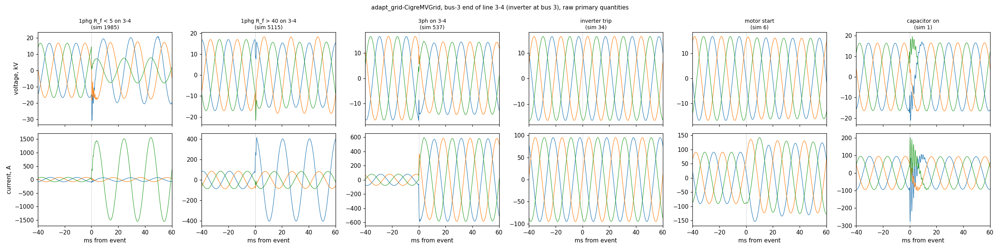

# adapt_grid-CigreMVGrid: fact sheet

Generated by `src/review/cigremv_facts.py` from `results/CIGREMV_FACTS.json` (commit 7dc8f46); no number typed by hand. Read before choosing relays or fixing a protocol on this grid.

## Data

- **9906 simulations, 45 cubicles**, 20 kV, 50 Hz, cache `adapt_grid-CigreMVGrid_cache.meta.npz`.
- **Integrity:** 0 records with non-finite samples, 0 all-zero cubicle records, inception window fits 9906 of 9906.
- **Siblings:** 2393 unique (target, location, type, R_f) keys for 2393 short circuits; 0 identical pre-fault cycles at the substation.
- **Inception point on wave** (phase a): p25/p50/p75 = 90/181/271 deg.
- **Loading:** total P 9.1–20.9 MW (×2.30) over 12 loads.
- **Grounding:** {'resistive': 3325, 'solid': 3317, 'resonant': 3264}.
- **Fault resistance (short circuits):** p5 2.7 Ω, median 25.3 Ω, max 50.0 Ω — near-bolted faults are rare.
- **Fault targets:** 2310 on lines, 2023 on buses; missing from the graph: none.
- **Events:** {'flt_1phg_incipient_w_arc': 528, 'flt_3ph_shc': 510, 'switch_ohl_off': 509, 'switch_cable_on': 493, 'switch_ibr_trip': 493, 'flt_2ph_shc': 490, 'flt_1phg_incipient': 479, 'flt_1phg_hif': 477, 'flt_1phg_shc': 476, 'switch_ohl_on': 473, 'switch_cap_on': 471, 'switch_inrushHV': 468, 'flt_1phg_shc_w_arc': 464, 'switch_inrushLV': 460, 'switch_motor_start': 457, 'flt_1phg_hif_w_arc': 456, 'switch_load_on': 455, 'flt_2phg_shc': 453, 'switch_load_off': 451, 'switch_cap_off': 423, 'switch_cable_off': 420}.

## Grid

- Inverters: {'Bus14IBR': {'Sn_MVA': 15.0, 'Imax_pu': 1.2, 'P_FLAG': 2.0, 'Q_FLAG': 2.0, 'IqV_FLAG': 1.0}, 'Bus3IBR': {'Sn_MVA': 15.0, 'Imax_pu': 1.2, 'P_FLAG': 2.0, 'Q_FLAG': 2.0, 'IqV_FLAG': 1.0}}.
- External grid: {'Bus0': {'bustp': 'PV', 'snss': 10000.0, 'rntxn': 0.10000000149011612, 'x0tx1': 1.0, 'r0tx0': 0.10000000149011612}}.
- Line-end cubicles with (almost) no pre-fault current (open ties): `Cub_2\pex_MainBus14_MainLn8-14`.

| line | buses | length km | Z1 (Ω) |
|---|---|---|---|
| MainLn1-2 | MainBus1 – MainBus2 | 2.82 | 1.41 + j2.02 |
| MainLn10-11 | MainBus10 – MainBus11 | 0.33 | 0.17 + j0.24 |
| MainLn12-13 | MainBus12 – MainBus13 | 4.89 | 2.32 + j2.48 |
| MainLn13-14 | MainBus13 – MainBus14 | 2.99 | 1.42 + j1.52 |
| MainLn2-3 | MainBus2 – MainBus3 | 4.42 | 2.21 + j3.16 |
| MainLn3-4 | MainBus3 – MainBus4 | 0.61 | 0.31 + j0.44 |
| MainLn3-8 | MainBus3 – MainBus8 | 1.30 | 0.65 + j0.93 |
| MainLn4-11 | MainBus11 – MainBus4 | 0.49 | 0.25 + j0.35 |
| MainLn4-5 | MainBus4 – MainBus5 | 0.56 | 0.28 + j0.40 |
| MainLn5-6 | MainBus5 – MainBus6 | 1.54 | 0.77 + j1.10 |
| MainLn6-7 | MainBus6 – MainBus7 | 0.24 | 0.12 + j0.17 |
| MainLn7-8 | MainBus7 – MainBus8 | 1.67 | 0.84 + j1.20 |
| MainLn8-14 | MainBus14 – MainBus8 | 2.00 | 0.95 + j1.02 |
| MainLn8-9 | MainBus8 – MainBus9 | 0.32 | 0.16 + j0.23 |
| MainLn9-10 | MainBus10 – MainBus9 | 0.77 | 0.39 + j0.55 |

## Sources

Inverter share of the fault-current rise (largest-phase rise of the fundamental current (post window ending t ms after inception against the cycle ending 20 ms before it), inverters / (inverters + 110/20 kV transformers)):

| | median | p10 | p90 |
|---|---|---|---|
| 20ms | 52.3 % | 20.0 % | 80.8 % |
| 40ms | 22.7 % | 0.1 % | 67.3 % |

## Candidate relays

| candidate | line | length km | pos | own 85–100 % | off-line | reverse bus / lines | pos R_f <5/5–15/15–40/>40 | H25 AUC (40 ms at inception) | SIR, R_f ≤ 5 (n, median) | inverter share, own-line faults 20/40 ms |
|---|---|---|---|---|---|---|---|---|---|---|
| cigre_1-2_b1 | MainLn1-2 | 2.82 | 76 | 16 | 2301 | 81 / 0 | 8/15/38/15 | 0.40 | 5, 0.24 | 23 / 10 % |
| cigre_2-3_b2 | MainLn2-3 | 4.42 | 72 | 11 | 2310 | 85 / 92 | 3/22/37/10 | 0.47 | 7, 0.83 | 44 / 22 % |
| cigre_2-3_b3 | MainLn2-3 | 4.42 | 72 | 11 | 2310 | 76 / 156 | 3/22/37/10 | 0.48 | 5, 0.90 | 44 / 22 % |
| cigre_3-4_b3 | MainLn3-4 | 0.61 | 70 | 10 | 2313 | 76 / 159 | 4/12/34/20 | 0.45 | 6, 1.69 | 54 / 24 % |
| cigre_3-4_b4 | MainLn3-4 | 0.61 | 70 | 10 | 2313 | 87 / 178 | 4/12/34/20 | 0.44 | 7, 10.88 | 54 / 24 % |
| cigre_3-8_b3 | MainLn3-8 | 1.30 | 64 | 12 | 2317 | 76 / 163 | 6/14/34/10 | 0.48 | 6, 2.00 | 52 / 30 % |
| cigre_4-5_b4 | MainLn4-5 | 0.56 | 66 | 9 | 2318 | 87 / 183 | 8/13/35/10 | 0.52 | 9, 1.63 | 55 / 28 % |
| cigre_12-13_b12 | MainLn12-13 | 4.89 | 57 | 16 | 2320 | 82 / 0 | 6/9/32/10 | 0.53 | 4, 0.25 | 48 / 24 % |
| cigre_13-14_b13 | MainLn13-14 | 2.99 | 84 | 8 | 2301 | 88 / 73 | 12/19/36/17 | 0.40 | 4, 0.84 | 58 / 25 % |
| cigre_13-14_b14 | MainLn13-14 | 2.99 | 84 | 8 | 2301 | 75 / 93 | 12/19/36/17 | 0.43 | 4, 2.55 | 58 / 25 % |

