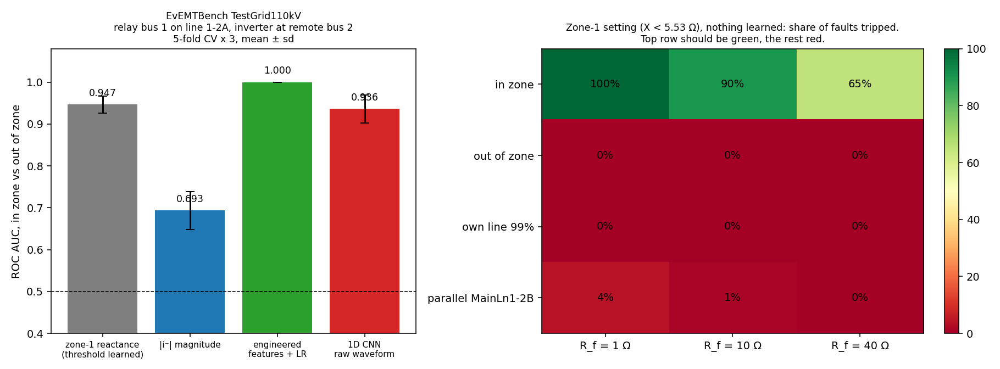

# Real EMT data with inverters: EvEMTBench `benchmark-TestGrid110kV`

> **Review correction (branch `review-fixes`, see [REVIEW.md](../REVIEW.md) N2).** The zone-1 setting
> numbers below were produced by `zone_model.phase_selected_reactance`, which discards every released loop
> with negative reactance (`zone_model.py:206`) and has no directional element. Re-run with the same
> 20-40 ms phasor window on the same noise-free records (`src/review/real_zone_rerun.py`,
> [review/real_zone_rerun.json](review/real_zone_rerun.json)): the table reproduces exactly, but the
> explanation does not hold. At relay B **100 % of in-zone 40 ohm faults read negative reactance** on the
> faulted loop (median R about 80 ohm, X about -16 ohm at 50 ms) and are thrown away as "reverse"; the claim
> "misses every 40 ohm fault on its line" is a property of that element, not of the reactance effect alone.
> A mimic filter, a separate negative-sequence/memory-polarised directional element and a quadrilateral set
> from rules (rung R2) gives relay B: dependability 55.0 %, out-of-zone trips 0 % (was 4.4 %, 13.3 % at
> 10 ohm), own line 99 % 0 % (was 6.7 %), reverse faults 0 % (was 3.1 %), switching 0 % (was 2 %). The 40 ohm
> faults remain untripped by zone 1 because they appear at about 80 ohm, beyond the ~25 ohm resistive reach
> that load-encroachment rules allow (assumed 1800 A thermal rating); that is a coverage limit of zone 1,
> not an overlap problem. Relay A: the repo rule trips 4.4 % of reverse faults (10 % at 1 ohm); R2 0 %.
> The learned-detector numbers below are superseded by REAL_ML.md and by the grouped re-run in REVIEW.md.

> **Correction, 17 Sep 2026.** The learned-detector numbers below (engineered model, CNN) were obtained on noise-free records with 80 ms windows and in-sample thresholds. The noise-free records let models read the label from pre-fault samples, so the in-distribution 1.000 scores are not valid. The zone-1 setting results are unaffected. See [REAL_ML.md](REAL_ML.md).

17 Sep 2026. Code: `src/evemt.py` (disk-streaming loader), `src/real_zone.py`.
Run: `python src/real_zone.py testgrid_A` and `testgrid_B`.
Companion control arm, no inverters: [REAL_DOUBLELINE.md](REAL_DOUBLELINE.md).

## The grid, read from the archive

110 kV, 50 Hz, six buses, nine lines. 2,435 simulations. Everything below is read from the
archive's grid graph and labels, not assumed.

| Source or load | Where | Size |
|---|---|---|
| External grid 1 | bus 1, via 500 MVA 380/110 kV transformer | **30 GVA** short-circuit power |
| External grid 3 | bus 3, same | **30 GVA** |
| Inverter 2 (grid-following) | bus 2 | **35 MVA**, I_base 259.8 A, limit 1.2 pu |
| Inverter 3 (grid-following) | bus 3 | **50 MVA**, I_base 371.1 A, limit 1.2 pu |
| Loads | buses 2, 5, 6 | 150, 150, 100 MW |

Faults on every line and bus; locations 1, 20, 50, 80, 99 %; resistances 1, 10, 40 Ω; five
fault types; three phase selections. 50 non-fault switching events.

## The inverter limiter is real, and measured

Measured at each inverter's own terminals during faults:

| Inverter | Prefault current | Fault peak / prefault peak (median) | In pu of rating |
|---|---|---|---|
| Bus 2, 35 MVA | 210 A (0.81 pu) | 1.46× | ≈ **1.18 pu** |
| Bus 3, 50 MVA | 290 A (0.78 pu) | 1.47× | ≈ **1.15 pu** |

Both sit on the 1.2 pu limit, as the grid codes intend. The 95th percentile is about 2×
prefault and the maximum about 2.6×, from the sub-cycle transient before the limiter acts.

## But the inverters are too small to matter

Two 30 GVA external grids against 35 and 50 MVA of inverters: the inverters are **about 0.1 %
of the short-circuit capacity**. The relay current during in-zone faults at relay A rises to
**11.8×** prefault, against **11.4×** on the no-inverter grid. The protection problem the whole
project is about, an inverter-dominated grid where fault current barely rises, **is not present
in this dataset.**

## Results

Two relays. Zone 1 at 85 % of each line. In zone: own line at 1, 20, 50, 80 %. Out of zone:
lines leaving the remote bus at 1 and 20 %, plus the remote bus. Held out: own line at 99 %,
the parallel line, switching events.

### Relay A: bus 1 on line 1-2A (25 km), inverter at the remote bus

Strong source behind the relay (external grid 1). Behaves like the no-inverter grid.

| Zone-1 setting, nothing learned | 1 Ω | 10 Ω | 40 Ω |
|---|---|---|---|
| In zone (dependability) | 100 % | 90 % | 65 % |
| Out of zone (false trip) | 0 % | 0 % | 0 % |
| Own line 99 % | 0 % | 0 % | 0 % |

| Cross-validated | ROC AUC | Dependability at 5 % false trip |
|---|---|---|
| Zone-1 reactance | 0.947 ± 0.020 | 88.3 ± 5.2 % |
| Negative-sequence magnitude | 0.693 ± 0.045 | 32.6 ± 7.1 % |
| Engineered features + LR | 1.000 ± 0.000 | 100 % |
| 1D CNN | 0.936 ± 0.033 | 77.0 ± 9.2 % |

### Relay B: bus 2 on line 2-3, external grid and inverter at the remote bus

No external grid behind the relay, a 30 GVA grid at the far end. **This is the hard case**, and
it is hard because of strong remote infeed, not because of the inverter.

| Zone-1 setting, nothing learned | 1 Ω | 10 Ω | 40 Ω |
|---|---|---|---|
| In zone (dependability) | 96.7 % | 80 % | **0 %** |
| Out of zone (false trip) | 0 % | **13.3 %** | 0 % |

Overall: dependability 58.9 %, out-of-zone false trips 4.4 %, own line at 99 % tripped 6.7 %.
Relay current during in-zone faults rises only **4.6×** prefault.

| Cross-validated | ROC AUC | Dependability at 5 % false trip |
|---|---|---|
| Zone-1 reactance | 0.890 ± 0.021 | 61.3 ± 7.4 % |
| Negative-sequence magnitude | 0.681 ± 0.063 | 28.1 ± 5.1 % |
| Engineered features + LR | 1.000 ± 0.001 | 100 % |
| 1D CNN | 0.927 ± 0.029 | 81.3 ± 7.5 % |

Held out, fraction called in zone:

| | Own line 99 % | Switching events |
|---|---|---|
| Zone-1 setting | 6.7 % | **2 %** |
| Engineered model | 42.2 % | **82 %** |

## What it says

**1. The textbook problem is real in real EMT data.** At relay B every 40 Ω fault on the
protected line is missed, and at 10 Ω the element overreaches onto the next line 13 % of the
time. A weak source behind the relay and a strong source at the far end make the fault
resistance look like reactance. This is the reactance effect of remote infeed, and it is
exactly the uncertainty Taylor's bounded sets are built to handle. It is caused here by a
remote external grid, not an inverter.

**2. The inverter problem is not in this public data.** The limiter works as specified, but
inverters at 0.1 % of short-circuit capacity change nothing the relay sees. To test Taylor's
setting, and his auxiliary signal, we need an inverter-dominated grid. EvEMTBench does not
provide one in its benchmark sets. That makes simulation (ours, or the Baeckeland Simulink
model with five grid-forming inverters) necessary, not optional.

**3. Learned detectors do not generalise, and on this point the evidence is now strong.**
Inside the training distribution the engineered model scores a perfect 1.000 at both relays.
Outside it, at relay B, it calls 42 % of faults at 99 % of the line in zone, and **82 % of
switching events** in zone, where the physics rule calls 7 % and 2 %. The CNN beats the rule
on AUC at relay B (0.927 against 0.890) but not on the rule's real strength, security. A
fair caveat: in a real relay a fault detector would gate the distance zone, so switching
events would rarely reach it. The point stands that a learned zone decision extrapolates
badly to what it has not seen.

**4. The in-distribution 1.000 is still not a result.** Benchmark sets use fixed grid
parameters, so with loop impedances in the feature vector the classes are close to a lookup.

## What this changes for the project

- **Keep:** the distance element (validated on real data, within 1.5 % of the line), and the
  honest baseline it provides.
- **Drop:** any claim that machine learning outperforms protection logic. On real data it
  does not, and it fails badly on unseen cases.
- **Add:** relay B as a real, public, reproducible instance of the remote-infeed problem that
  Taylor's sets address. His characteristic can be tested on it directly, without inverters.
- **Needed:** an inverter-dominated EMT grid. Ask Prof. Taylor for the Baeckeland Simulink
  model first; otherwise build one.

## Caveats

- 50 Hz, fixed benchmark parameters, grid-following inverters only, no grid-forming.
- 180 in-zone cases per relay; the CNN numbers are a floor.
- The inverter-pu figure uses instantaneous peaks over one to three cycles after inception, so
  it includes some DC offset; the median still lands at the limit.
- 50 switching events cannot support a strong security claim either way beyond the contrast
  reported.
